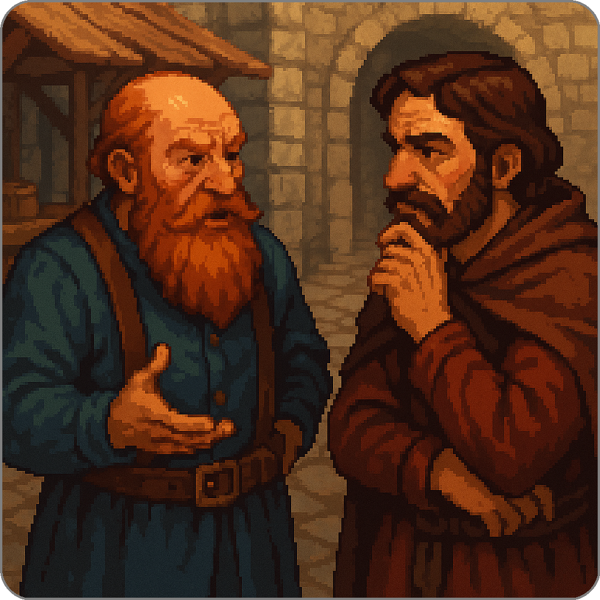

# Summoner Agent Library

<p align="center">

</p>

## Table of Contents

* [SDK setup](#sdk-setup)

  * [Initial Installation](#initial-installation)
  * [Reinstalling the Summoner SDK](#reinstalling-the-summoner-sdk)

* [Agent Format and Desktop App Compatibility](#agent-format-and-desktop-app-compatibility)

  * [Repository Structure](#repository-structure)
  * [Required Structure for Agent Folders](#required-structure-for-agent-folders)

* [Running an Agent](#running-an-agent)  

  * [Activate the Virtual Environment](#activate-the-virtual-environment)  
  * [Launch the Summoner Server](#launch-the-summoner-server)  
  * [Run the Agent](#run-the-agent)  

* [Agent Collection](#agent-collection)

  * [Legend](#legend)
  * [Core Messaging Agents](#core-messaging-agents)
  * [Chat Agents](#chat-agents)
  * [Feedback Agents](#feedback-agents)
  * [Security and Handshake Agents](#security-and-handshake-agents)
  * [Negotiation Agents](#negotiation-agents)
  * [Connector Agents](#connector-agents)
  * [API Agents 🚧](#api-agents)
  * [Code Exchange Agents 🚧](#code-exchange-agents)


## SDK Setup
<details>
<summary><b>(Click to expand)</b> This section outlines how to install the Summoner SDK and how to reset it if the repository has been updated. More information on how to build the SDK and manage its folders is explained in the <a href="README_template.md">template's README</a> from which this repository was cloned.</summary>


### Initial Installation

To install the Summoner SDK:

```bash
git clone https://github.com/Summoner-Network/summoner-agents.git
cd summoner-agents
source build_sdk.sh setup
```

This will:

* Create a Python virtual environment in `./venv`
* Install the `summoner` SDK and its dependencies

> 📝 **Note:**
> If you open a new terminal later, remember to activate the environment:
>
> ```bash
> source venv/bin/activate
> ```

### Reinstalling the Summoner SDK

If the SDK core codebase or any of its modules have been updated, you can reset and reinstall everything with one command:

```bash
# From your project root:
bash build_sdk.sh reset

# Or, if you typically source the script:
source build_sdk.sh reset
```

This will:

1. Remove the existing virtual environment
2. Recreate it and install the latest SDK version
3. Rebuild any native components or dependencies

> 💡 **Tip:**
> If you're using a shell other than bash (e.g., zsh or fish), make sure to **source** the script:
>
> ```bash
> source build_sdk.sh reset
> ```

</details>

## Agent Format and Desktop App Compatibility

<details>
<summary><b>(Click to expand)</b> This repository contains a collection of agent examples designed to run within the Summoner framework. These agents are organized in a structured and standardized format to ensure compatibility with the Summoner desktop application.</summary>

### Repository Structure

* Agent examples are located in the `agents/` directory.
* Supporting materials such as API adapters or shared tools are located in `api_library/`.

Each subdirectory within `agents/` must follow a specific structure to be recognized and imported correctly by the desktop application (see the [Required Structure for Agent Folders](#required-structure-for-agent-folders) section below).

### Required Structure for Agent Folders

Each folder inside `agents/` **must** comply with the following **strict formatting rules**:

#### ✅ **Mandatory Requirements**

* The folder name **must** follow the naming pattern:

  ```
  agent_<name>
  ```

* The folder **must contain** a file named `agent.py` which includes the agent's entry point:

  ```python
  agent.run()  # should be called within an asyncio context
  ```

* All imports from the Summoner SDK should follow one of the two forms:

  ```python
  from summoner.<module_name> import <function_or_class>
  # or
  import summoner
  ```

* The folder **must include** a `requirements.txt` file:

  * This file will be used by the desktop app to install the agent's dependencies.
  * If running agents locally from this repository, the SDK must first be installed using:

    ```bash
    source build_sdk.sh setup
    ```
  * Then install agent dependencies using:

    ```bash
    pip install -r agents/agent_<name>/requirements.txt
    ```

#### 🟡 **Optional Guidelines**

* The folder **may include** any additional Python files or resources needed by `agent.py`. There are no restrictions on file layout beyond the rules listed above.


Here is a well-structured and clear section you can add to your README to explain how to run an agent. It separates environment setup, server launch, and agent execution, while noting where agent-specific overrides might apply:
</details>

## Running an Agent

<details>
<summary><b>(Click to expand)</b> To run an agent within the Summoner framework, follow these steps. This involves launching a server and then starting the agent process.</summary>

### Activate the Virtual Environment

If you have opened a new terminal, make sure to activate the virtual environment that was created during the SDK installation:

```bash
source venv/bin/activate  # For POSIX systems (Linux/macOS)
```

> 📝 **Note:**
> If you have not installed the SDK yet, run:
>
> ```bash
> source build_sdk.sh setup
> ```

### Launch the Summoner Server

The Summoner server is defined in the root file `server.py`. It can be run using either default or custom configurations.

#### Run with Default Config:

```bash
python server.py
```

#### Run with Custom Config:

Configuration files are located in the `configs/` directory. Some agents may require a specific server configuration — refer to the README file inside the agent's folder for details.

```bash
python server.py --config configs/<specific_config>.json
```


### Run the Agent

Once the server is running, you can launch an agent. Most agents are located in folders under `agents/` and follow the naming pattern `agent_<name>`.

#### Run with Default Behavior:

```bash
python agents/agent_<name>/agent.py
```

#### Run with Custom Agent Config:

Some agents require additional configuration (e.g., socket parameters, logging, backpressure behavior). These are usually stored in a file like `<specific_config>.json` in the `configs/` folder.

```bash
python agents/agent_<name>/agent.py --config configs/<specific_config>.json
```

> 💡 **Tip:**
> Always consult the README inside the agent's folder for any overrides, environment variables, or preconditions specific to that agent.
</details>

## Agent Collection

### Legend

| Column          | Description                                                               |
| --------------- | ------------------------------------------------------------------------- |
| **Agent Name**  | Name or identifier of the agent.                                          |
| **Description** | Brief summary of the agent's functionality.                               |
| **Level**       | Difficulty level (e.g. Level 1 = Beginner).                               |
| **Application** | Primary use case (e.g. messaging, orchestration, negotiation).            |
| **Features**    | Key Summoner SDK capability demonstrated (e.g. `core`, `aurora`).         |
| **DB**          | ✅ if the agent uses a persistent or in-memory database (`asqlite`, etc.). |
| **Queue**       | ✅ if the agent relies on asynchronous queues (`asyncio.Queue`, etc.).     |
| **Flows**       | ✅ if the agent follows a modular, trigger-driven flow structure.          |
| **Logs**        | ✅ if the agent demonstrates information logging via its `logger` attribute.  |
| **Hooks**       | ✅ if the agent defines hooks for pre/postprocessing of messages.          |
| **Temp.**       | ✅ if the agent is designed to serve as a reusable template.               |
| **Comp.**       | ✅ if the agent is composable within a larger multi-agent system.          |


### Core Messaging Agents

<details>
<summary><b>(Click to expand)</b> Agents of <b>level 1 and 2</b> introducing core messaging primitives like <code>@send</code>, <code>@receive</code>, and <code>@hook</code>.</summary>
<br>

<div style="display: flex; justify-content: center;">
<table style="border-collapse: collapse; width: 95%; text-align: center;">
    <thead>
    <tr>
        <th style="width: 10%; text-align: center;">Agent Name</th>
        <th style="width: 33%; text-align: center;">Description</th>
        <th style="width: 12%; text-align: center;">Level</th>
        <th style="width: 12%; text-align: center;">Features</th>
        <th style="width: 12%; text-align: center;">Applications</th>
        <th style="width: 3%; text-align: center;">DB</th>
        <th style="width: 3%; text-align: center;">Queue</th>
        <th style="width: 3%; text-align: center;">Flows</th>
        <th style="width: 3%; text-align: center;">Logs</th>
        <th style="width: 3%; text-align: center;">Hooks</th>
        <th style="width: 3%; text-align: center;">Temp.</th>
        <th style="width: 3%; text-align: center;">Comp.</th>
    </tr>
    </thead>
    <tbody>
    <tr>
        <td> <code><strong><a href="agents/agent_SendAgent_0/">SendAgent_0</a></strong></code></td>
        <td style="font-size: 0.8em;">Demonstrates the use of <code>@send</code></td>
        <td></td>
        <td><code>core</code></td>
        <td></td>
        <td>✗</td><td>✗</td><td>✗</td><td>✗</td><td>✗</td><td>✅</td><td>✅</td>
    </tr>
    <tr>
        <td> <code><strong><a href="agents/agent_SendAgent_1/">SendAgent_1</a></strong></code></td>
        <td style="font-size: 0.8em;">Demonstrates the use of <code>@send</code> and <code>@hook</code> with <code>Direction.SEND</code></td>
        <td></td>
        <td><code>core</code> <code>DID</code></td>
        <td></td>
        <td>✗</td><td>✗</td><td>✗</td><td>✅</td><td>✅</td><td>✅</td><td>✅</td>
    </tr>
    <tr>
        <td><code><strong><a href="agents/agent_RecvAgent_0/">RecvAgent_0</a></strong></code></td>
        <td style="font-size: 0.8em;">Demonstrates the use of <code>@receive</code></td>
        <td></td>
         <td><code>core</code></td>
        <td></td>
        <td>✅</td><td>✗</td><td>✗</td><td>✅</td><td>✗</td><td>✅</td><td>✅</td>
    </tr>
    <tr>
        <td><code><strong><a href="agents/agent_RecvAgent_1/">RecvAgent_1</a></strong></code></td>
        <td style="font-size: 0.8em;">Demonstrates the use of <code>@receive</code> and <code>@hook</code> with <code>Direction.RECEIVE</code></td>
        <td></td>
         <td><code>core</code></td>
        <td></td>
        <td>✅</td><td>✗</td><td>✗</td><td>✅</td><td>✅</td><td>✅</td><td>✅</td>
    </tr>
    <tr>
        <td><code><strong><a href="agents/agent_RecvAgent_2/">RecvAgent_2</a></strong></code></td>
        <td style="font-size: 0.8em;">Demonstrates the use of <code>@receive</code> and <code>@hook</code> to implement validation, banning, and message filtering</td>
        <td></td>
         <td><code>core</code> <code>validation</code> <code>reputation</code></td>
        <td></td>
        <td>✅</td><td>✗</td><td>✗</td><td>✅</td><td>✅</td><td>✅</td><td>✅</td>
    </tr>
    <tr>
        <td><code><strong><a href="agents/agent_EchoAgent_0/">EchoAgent_0</a></strong></code></td>
        <td style="font-size: 0.8em;">Combines both  <code>@send</code> and <code>@receive</code></td>
        <td></td>
         <td><code>core</code></td>
        <td></td>
        <td>✗</td><td>✅</td><td>✗</td><td>✅</td><td>✅</td><td>✅</td><td>✅</td>
    </tr>
    <tr>
        <td><code><strong><a href="agents/agent_EchoAgent_1/">EchoAgent_1</a></strong></code></td>
        <td style="font-size: 0.8em;">Combines both <code>@send</code> and <code>@receive</code> with a receiving <code>hook</code></td>
        <td></td>
         <td><code>core</code> <code>validation</code></td>
        <td></td>
        <td>✗</td><td>✅</td><td>✗</td><td>✅</td><td>✅</td><td>✅</td><td>✅</td>
    </tr>
    <tr>
        <td><code><strong><a href="agents/agent_EchoAgent_2/">EchoAgent_2</a></strong></code></td>
        <td style="font-size: 0.8em;">Combines <code>@send</code> and <code>@receive</code> handlers with sending and receiving <code>hooks</code> checking for validation and signing messages</td>
        <td></td>
         <td><code>core</code> <code>validation</code> <code>DID</code> <code>agent</code></td>
        <td></td>
        <td>✗</td><td>✅</td><td>✗</td><td>✅</td><td>✅</td><td>✅</td><td>✅</td>
    </tr>
    </tbody>
</table>
</div>

</details>

### Chat Agents

<details>
<summary><b>(Click to expand)</b> Agents of <b>level 1-3</b> that implement chat-style user interfaces, remote commands, and automaton routing for interactive control.</summary>
<br>

<div style="display: flex; justify-content: center;">
<table style="border-collapse: collapse; width: 95%; text-align: center;">
    <thead>
    <tr>
        <th style="width: 10%; text-align: center;">Agent Name</th>
        <th style="width: 33%; text-align: center;">Description</th>
        <th style="width: 12%; text-align: center;">Level</th>
        <th style="width: 12%; text-align: center;">Features</th>
        <th style="width: 12%; text-align: center;">Applications</th>
        <th style="width: 3%; text-align: center;">DB</th>
        <th style="width: 3%; text-align: center;">Queue</th>
        <th style="width: 3%; text-align: center;">Flows</th>
        <th style="width: 3%; text-align: center;">Logs</th>
        <th style="width: 3%; text-align: center;">Hooks</th>
        <th style="width: 3%; text-align: center;">Temp.</th>
        <th style="width: 3%; text-align: center;">Comp.</th>
    </tr>
    </thead>
    <tbody>
    <tr>
        <td><code><strong><a href="agents/agent_ChatAgent_0/">ChatAgent_0</a></strong></code></td>
        <td style="font-size: 0.8em;">Implements a minimal chat UI via <code>@send</code>/<code>@receive</code>; supports single- or multi-line input.</td>
        <td></td>
        <td><code>core</code></td>
        <td></td>
        <td>✗</td><td>✗</td><td>✗</td><td>✗</td><td>✗</td><td>✅</td><td>✅</td>
    </tr>
    <tr>
        <td><code><strong><a href="agents/agent_ChatAgent_1/">ChatAgent_1</a></strong></code></td>
        <td style="font-size: 0.8em;">Extends <code>ChatAgent_0</code> with remote/self commands (travel, go_home, quit).</td>
        <td></td>
        <td><code>core</code> <code>traveling</code></td>
        <td></td>
        <td>✗</td><td>✗</td><td>✗</td><td>✗</td><td>✗</td><td>✅</td><td>✅</td>
    </tr>
    <tr>
    <td><code><strong><a href="agents/agent_ChatAgent_2/">ChatAgent_2</a></strong></code></td>
    <td style="font-size: 0.8em;">Activates automaton routing via <code>@upload_states</code>; toggles <code>opened/locked</code> to gate remote commands.</td>
    <td></td>
    <td><code>core</code> <code>upload_states</code> <code>traveling</code></td>
    <td></td>
    <td>✗</td><td>✗</td><td>✅</td><td>✗</td><td>✗</td><td>✅</td><td>✅</td>
    </tr>
    <tr>
    <td><code><strong><a href="agents/agent_ChatAgent_3/">ChatAgent_3</a></strong></code></td>
    <td style="font-size: 0.8em;">Shows explicit automaton transitions with <code>Move</code>/<code>Stay</code> (<code>opened → locked → opened</code>); remote/self travel, lock/open, quit.</td>
    <td></td>
    <td><code>core</code> <code>upload_states</code> <code>download_states</code> <code>traveling</code></td>
    <td></td>
    <td>✗</td><td>✗</td><td>✅</td><td>✗</td><td>✗</td><td>✅</td><td>✅</td>
    </tr>
    </tbody>
</table>
</div>

</details>

### Feedback Agents

<details>
<summary><b>(Click to expand)</b> Agents of <b>level 1-3</b> for structured feedback: question/answer flows, delayed responses, and reporting mechanisms.</summary>
<br>

<div style="display: flex; justify-content: center;">
<table style="border-collapse: collapse; width: 95%; text-align: center;">
    <thead>
    <tr>
        <th style="width: 10%; text-align: center;">Agent Name</th>
        <th style="width: 33%; text-align: center;">Description</th>
        <th style="width: 12%; text-align: center;">Level</th>
        <th style="width: 12%; text-align: center;">Features</th>
        <th style="width: 12%; text-align: center;">Applications</th>
        <th style="width: 3%; text-align: center;">DB</th>
        <th style="width: 3%; text-align: center;">Queue</th>
        <th style="width: 3%; text-align: center;">Flows</th>
        <th style="width: 3%; text-align: center;">Logs</th>
        <th style="width: 3%; text-align: center;">Hooks</th>
        <th style="width: 3%; text-align: center;">Temp.</th>
        <th style="width: 3%; text-align: center;">Comp.</th>
    </tr>
    </thead>
    <tbody>
    <tr>
        <td><code><strong><a href="agents/agent_ReporterAgent_0/">ReporterAgent_0</a></strong></code></td>
        <td style="font-size: 0.8em;">Queues messages for a short window, then sends one newline-joined report.</td>
        <td></td>
        <td><code>core</code></td>
        <td></td>
        <td>✗</td><td>✅</td><td>✗</td><td>✗</td><td>✗</td><td>✅</td><td>✅</td>
    </tr>
    <tr>
        <td><code><strong><a href="agents/agent_ReporterAgent_1/">ReporterAgent_1</a></strong></code></td>
        <td style="font-size: 0.8em;">Queues messages for a short window, then emits them separately using <code>multi=True</code>.</td>
        <td></td>
        <td><code>core</code> <code>multi</code></td>
        <td></td>
        <td>✗</td><td>✅</td><td>✗</td><td>✗</td><td>✗</td><td>✅</td><td>✅</td>
    </tr>
    <tr>
        <td><code><strong><a href="agents/agent_ExamAgent_0/">ExamAgent_0</a></strong></code></td>
        <td style="font-size: 0.8em;">Demonstrates use of <code>@receive</code> and <code>@send</code> with queues and delays to run an automated Q&amp;A round.</td>
        <td></td>
        <td><code>core</code></td>
        <td></td>
        <td>✗</td><td>✅</td><td>✗</td><td>✗</td><td>✗</td><td>✅</td><td>✅</td>
    </tr>
    <tr>
        <td><code><strong><a href="agents/agent_ExamAgent_1/">ExamAgent_1</a></strong></code></td>
        <td style="font-size: 0.8em;">Extends <code>ExamAgent_0</code> with flow-routed <code>@receive</code>; <code>@send</code> still runs timed scoring but delegates state handling to the flow engine.</td>
        <td></td>
        <td><code>core</code></td>
        <td></td>
        <td>✗</td><td>✅</td><td>✅</td><td>✗</td><td>✅</td><td>✅</td><td>✅</td>
    </tr>
    <!-- <tr>
        <td><code><strong>Storage</strong></code></td>
        <td style="font-size: 0.8em;">...</td>
        <td></td>
         <td><code>core</code></td>
        <td></td>
        <td>✗</td><td>✗</td><td>✗</td><td>✗</td><td>✗</td><td>✗</td><td>✗</td>
    </tr>
    <tr>
        <td><code><strong>Subscribe</strong></code></td>
        <td style="font-size: 0.8em;">...</td>
        <td></td>
         <td><code>core</code></td>
        <td></td>
        <td>✗</td><td>✗</td><td>✗</td><td>✗</td><td>✗</td><td>✗</td><td>✗</td>
    </tr>
    <tr>
        <td><code><strong>EventEmit</strong></code></td>
        <td style="font-size: 0.8em;">...</td>
        <td></td>
         <td><code>core</code></td>
        <td></td>
        <td>✗</td><td>✗</td><td>✗</td><td>✗</td><td>✗</td><td>✗</td><td>✗</td>
    </tr> -->
    </tbody>
</table>
</div>

</details>

### Security and Handshake Agents

<details>
<summary><b>(Click to expand)</b> Agents of <b>level 1, 4, and 5</b> covering backpressure tests, validation hooks, and cryptographic DID handshakes.</summary>
<br>

<div style="display: flex; justify-content: center;">
<table style="border-collapse: collapse; width: 95%; text-align: center;">
    <thead>
    <tr>
        <th style="width: 10%; text-align: center;">Agent Name</th>
        <th style="width: 33%; text-align: center;">Description</th>
        <th style="width: 12%; text-align: center;">Level</th>
        <th style="width: 12%; text-align: center;">Features</th>
        <th style="width: 12%; text-align: center;">Applications</th>
        <th style="width: 3%; text-align: center;">DB</th>
        <th style="width: 3%; text-align: center;">Queue</th>
        <th style="width: 3%; text-align: center;">Flows</th>
        <th style="width: 3%; text-align: center;">Logs</th>
        <th style="width: 3%; text-align: center;">Hooks</th>
        <th style="width: 3%; text-align: center;">Temp.</th>
        <th style="width: 3%; text-align: center;">Comp.</th>
    </tr>
    </thead>
    <tbody>
    <tr>
        <td><code><strong><a href="agents/agent_RateLimitAgent_0/">RateLimitAgent_0</a></strong></code></td>
        <td style="font-size: 0.8em;">Tests server backpressure using <code>@send</code> and <code>@receive</code></td>
        <td></td>
         <td><code>core</code> <code>multi</code> </td>
        <td></td>
        <td>✗</td><td>✗</td><td>✗</td><td>✗</td><td>✗</td><td>✅</td><td>✅</td>
    </tr>
    <tr>
        <td><code><strong><a href="agents/agent_RateLimitAgent_1/">RateLimitAgent_1</a></strong></code></td>
        <td style="font-size: 0.8em;">Tests server backpressure using <code>@send(multi=True)</code> and <code>@receive</code> to simulate concurrent sends</td>
        <td></td>
         <td><code>core</code> <code>multi</code> </td>
        <td></td>
        <td>✗</td><td>✗</td><td>✗</td><td>✗</td><td>✗</td><td>✅</td><td>✅</td>
    </tr>
    <tr>
        <td><code><strong><a href="agents/agent_RateLimitAgent_2/">RateLimitAgent_2</a></strong></code></td>
        <td style="font-size: 0.8em;">Tests backpressure using <code>@send(multi=True)</code> and terminates via <code>.quit()</code> in <code>@receive<code></td>
        <td></td>
         <td><code>core</code> <code>multi</code> <code>traveling</code> </td>
        <td></td>
        <td>✗</td><td>✗</td><td>✗</td><td>✗</td><td>✗</td><td>✅</td><td>✅</td>
    </tr>
    <tr>
        <td><code><strong><a href="agents/agent_HSAgent_0/">HSAgent_0</a></strong></code></td>
        <td style="font-size: 0.8em;">Explores a handshake design to initiate and finalize an exchange</td>
        <td></td>
         <td><code>core</code> <code>multi</code> <code>upload_states</code> <code>download_states</code> <code>validation</code> <code>DID</code></td>
        <td></td>
        <td>✅</td><td>✗</td><td>✅</td><td>✅</td><td>✅</td><td>✅</td><td>✗</td>
    </tr>
    <tr>
        <td><code><strong><a href="agents/agent_HSAgent_1/">HSAgent_1</a></strong></code></td>
        <td style="font-size: 0.8em;">Explores a cryptographic handshake design with persistent, encrypted identity (DID) to initiate and finalize an exchange</td>
        <td></td>
         <td><code>core</code> <code>multi</code> <code>upload_states</code> <code>download_states</code> <code>validation</code> <code>DID</code></td>
        <td></td>
        <td>✅</td><td>✗</td><td>✅</td><td>✅</td><td>✅</td><td>✅</td><td>✗</td>
    </tr>
    </tbody>
</table>
</div>

</details>


### Negotiation Agents

<details>
<summary><b>(Click to expand)</b> Agents of <b>level 4</b> modeling seller-buyer interactions and decision-making in negotiation flows.</summary>
<br>

<div style="display: flex; justify-content: center;">
<table style="border-collapse: collapse; width: 95%; text-align: center;">
    <thead>
    <tr>
        <th style="width: 10%; text-align: center;">Agent Name</th>
        <th style="width: 33%; text-align: center;">Description</th>
        <th style="width: 12%; text-align: center;">Level</th>
        <th style="width: 12%; text-align: center;">Features</th>
        <th style="width: 12%; text-align: center;">Applications</th>
        <th style="width: 3%; text-align: center;">DB</th>
        <th style="width: 3%; text-align: center;">Queue</th>
        <th style="width: 3%; text-align: center;">Flows</th>
        <th style="width: 3%; text-align: center;">Logs</th>
        <th style="width: 3%; text-align: center;">Hooks</th>
        <th style="width: 3%; text-align: center;">Temp.</th>
        <th style="width: 3%; text-align: center;">Comp.</th>
    </tr>
    </thead>
    <tbody>
    <tr>
        <td><code><strong>Seller</strong></code></td>
        <td style="font-size: 0.8em;">...</td>
        <td></td>
         <td><code>core</code></td>
        <td></td>
        <td>✗</td><td>✗</td><td>✗</td><td>✗</td><td>✗</td><td>✗</td><td>✗</td>
    </tr>
    <tr>
        <td><code><strong>Buyer</strong></code></td>
        <td style="font-size: 0.8em;">...</td>
        <td></td>
         <td><code>core</code></td>
        <td></td>
        <td>✗</td><td>✗</td><td>✗</td><td>✗</td><td>✗</td><td>✗</td><td>✗</td>
    </tr>
    </tbody>
</table>
</div>

</details>

### Connector Agents

<details>
<summary><b>(Click to expand)</b> Agents of <b>level 3</b> enabling composability via connectors (e.g., MCP) to integrate external ecosystems.</summary>
<br>

<div style="display: flex; justify-content: center;">
<table style="border-collapse: collapse; width: 95%; text-align: center;">
    <thead>
    <tr>
        <th style="width: 10%; text-align: center;">Agent Name</th>
        <th style="width: 33%; text-align: center;">Description</th>
        <th style="width: 12%; text-align: center;">Level</th>
        <th style="width: 12%; text-align: center;">Features</th>
        <th style="width: 12%; text-align: center;">Applications</th>
        <th style="width: 3%; text-align: center;">DB</th>
        <th style="width: 3%; text-align: center;">Queue</th>
        <th style="width: 3%; text-align: center;">Flows</th>
        <th style="width: 3%; text-align: center;">Logs</th>
        <th style="width: 3%; text-align: center;">Hooks</th>
        <th style="width: 3%; text-align: center;">Temp.</th>
        <th style="width: 3%; text-align: center;">Comp.</th>
    </tr>
    </thead>
    <tbody>
    <tr>
        <td><code><strong><a href="agents/agent_ConnectAgent_0/">ConnectAgent_0</a></strong></code></td>
        <td style="font-size: 0.8em;">...</td>
        <td></td>
         <td><code>core</code></td>
        <td></td>
        <td>✅</td><td>✗</td><td>✗</td><td>✗</td><td>✗</td><td>✅</td><td>✗</td>
    </tr>
    </tbody>
</table>
</div>

</details>

<a id="api-agents"></a>

### API Agents 🚧

<details>
<summary><b>(Click to expand)</b> Agents of <b>level 1-3</b> bridging external services (registries, apps, LLM tools) to extend SDK capabilities.</summary>
<br>

<div style="display: flex; justify-content: center;">
<table style="border-collapse: collapse; width: 95%; text-align: center;">
    <thead>
    <tr>
        <th style="width: 10%; text-align: center;">Agent Name</th>
        <th style="width: 33%; text-align: center;">Description</th>
        <th style="width: 12%; text-align: center;">Level</th>
        <th style="width: 12%; text-align: center;">Features</th>
        <th style="width: 12%; text-align: center;">Applications</th>
        <th style="width: 3%; text-align: center;">DB</th>
        <th style="width: 3%; text-align: center;">Queue</th>
        <th style="width: 3%; text-align: center;">Flows</th>
        <th style="width: 3%; text-align: center;">Logs</th>
        <th style="width: 3%; text-align: center;">Hooks</th>
        <th style="width: 3%; text-align: center;">Temp.</th>
        <th style="width: 3%; text-align: center;">Comp.</th>
    </tr>
    </thead>
    <tbody>
    <tr>
        <td><code><strong>Wikipedia</strong></code></td>
        <td style="font-size: 0.8em;">...</td>
        <td></td>
         <td><code>core</code></td>
        <td></td>
        <td>✗</td><td>✗</td><td>✗</td><td>✗</td><td>✗</td><td>✗</td><td>✗</td>
    </tr>
    <tr>
        <td><code><strong>ArXiv</strong></code></td>
        <td style="font-size: 0.8em;">...</td>
        <td></td>
         <td><code>core</code></td>
        <td></td>
        <td>✗</td><td>✗</td><td>✗</td><td>✗</td><td>✗</td><td>✗</td><td>✗</td>
    </tr>
    <tr>
        <td><code><strong>PubMed</strong></code></td>
        <td style="font-size: 0.8em;">...</td>
        <td></td>
         <td><code>core</code></td>
        <td></td>
        <td>✗</td><td>✗</td><td>✗</td><td>✗</td><td>✗</td><td>✗</td><td>✗</td>
    </tr>
    <tr>
        <td><code><strong>GitHub</strong></code></td>
        <td style="font-size: 0.8em;">...</td>
        <td></td>
         <td><code>core</code></td>
        <td></td>
        <td>✗</td><td>✗</td><td>✗</td><td>✗</td><td>✗</td><td>✗</td><td>✗</td>
    </tr>
    <tr>
        <td><code><strong>Reddit</strong></code></td>
        <td style="font-size: 0.8em;">...</td>
        <td></td>
         <td><code>core</code></td>
        <td></td>
        <td>✗</td><td>✗</td><td>✗</td><td>✗</td><td>✗</td><td>✗</td><td>✗</td>
    </tr>
    <tr>
        <td><code><strong>Notion</strong></code></td>
        <td style="font-size: 0.8em;">...</td>
        <td></td>
         <td><code>core</code></td>
        <td></td>
        <td>✗</td><td>✗</td><td>✗</td><td>✗</td><td>✗</td><td>✗</td><td>✗</td>
    </tr>
    <tr>
        <td><code><strong>Slack</strong></code></td>
        <td style="font-size: 0.8em;">...</td>
        <td></td>
         <td><code>core</code></td>
        <td></td>
        <td>✗</td><td>✗</td><td>✗</td><td>✗</td><td>✗</td><td>✗</td><td>✗</td>
    </tr>
    <tr>
        <td><code><strong>GPTSummary</strong></code></td>
        <td style="font-size: 0.8em;">...</td>
        <td></td>
         <td><code>core</code></td>
        <td></td>
        <td>✗</td><td>✗</td><td>✗</td><td>✗</td><td>✗</td><td>✗</td><td>✗</td>
    </tr>
    <tr>
        <td><code><strong>GPTPArsing</strong></code></td>
        <td style="font-size: 0.8em;">...</td>
        <td></td>
         <td><code>core</code></td>
        <td></td>
        <td>✗</td><td>✗</td><td>✗</td><td>✗</td><td>✗</td><td>✗</td><td>✗</td>
    </tr>
    <tr>
        <td><code><strong>GPTCluster</strong></code></td>
        <td style="font-size: 0.8em;">...</td>
        <td></td>
         <td><code>core</code></td>
        <td></td>
        <td>✗</td><td>✗</td><td>✗</td><td>✗</td><td>✗</td><td>✗</td><td>✗</td>
    </tr>
    <tr>
        <td><code><strong>GPTSearch</strong></code></td>
        <td style="font-size: 0.8em;">...</td>
        <td></td>
         <td><code>core</code></td>
        <td></td>
        <td>✗</td><td>✗</td><td>✗</td><td>✗</td><td>✗</td><td>✗</td><td>✗</td>
    </tr>
    </tbody>
</table>
</div>

</details>

<a id="code-exchange-agents"></a>

### Code Exchange Agents 🚧

<details>
<summary><b>(Click to expand)</b> Agents of <b>level 3</b> showcasing smart-tool exchange and shareable logic for collaborative extension.</summary>
<br>

<div style="display: flex; justify-content: center;">
<table style="border-collapse: collapse; width: 95%; text-align: center;">
    <thead>
    <tr>
        <th style="width: 10%; text-align: center;">Agent Name</th>
        <th style="width: 33%; text-align: center;">Description</th>
        <th style="width: 12%; text-align: center;">Level</th>
        <th style="width: 12%; text-align: center;">Features</th>
        <th style="width: 12%; text-align: center;">Applications</th>
        <th style="width: 3%; text-align: center;">DB</th>
        <th style="width: 3%; text-align: center;">Queue</th>
        <th style="width: 3%; text-align: center;">Flows</th>
        <th style="width: 3%; text-align: center;">Logs</th>
        <th style="width: 3%; text-align: center;">Hooks</th>
        <th style="width: 3%; text-align: center;">Temp.</th>
        <th style="width: 3%; text-align: center;">Comp.</th>
    </tr>
    </thead>
    <tbody>
    <tr>
        <td><code><strong>SmartTool</strong></code></td>
        <td style="font-size: 0.8em;">...</td>
        <td></td>
        <td><code>smart-tools</code></td>
        <td></td>
        <td>✗</td><td>✗</td><td>✗</td><td>✗</td><td>✗</td><td>✗</td><td>✗</td>
    </tr>
    </tbody>
</table>
</div>

</details>


<!-- 

---
reporter queue (sequence for orchestration)
storage db (GET POSt service)
subscribe (db)
event emiter
question / answer ~ pub / sub

---

seller (negotiation)
buyer (negotiation)

----

connector: connecting other framework (e..g mcp) to summoner

---

api-based
- search
- process text (summary, improve)
- live updates
- get

api-metrics

---
exchange pice of code over the wire:
smart tools -->

