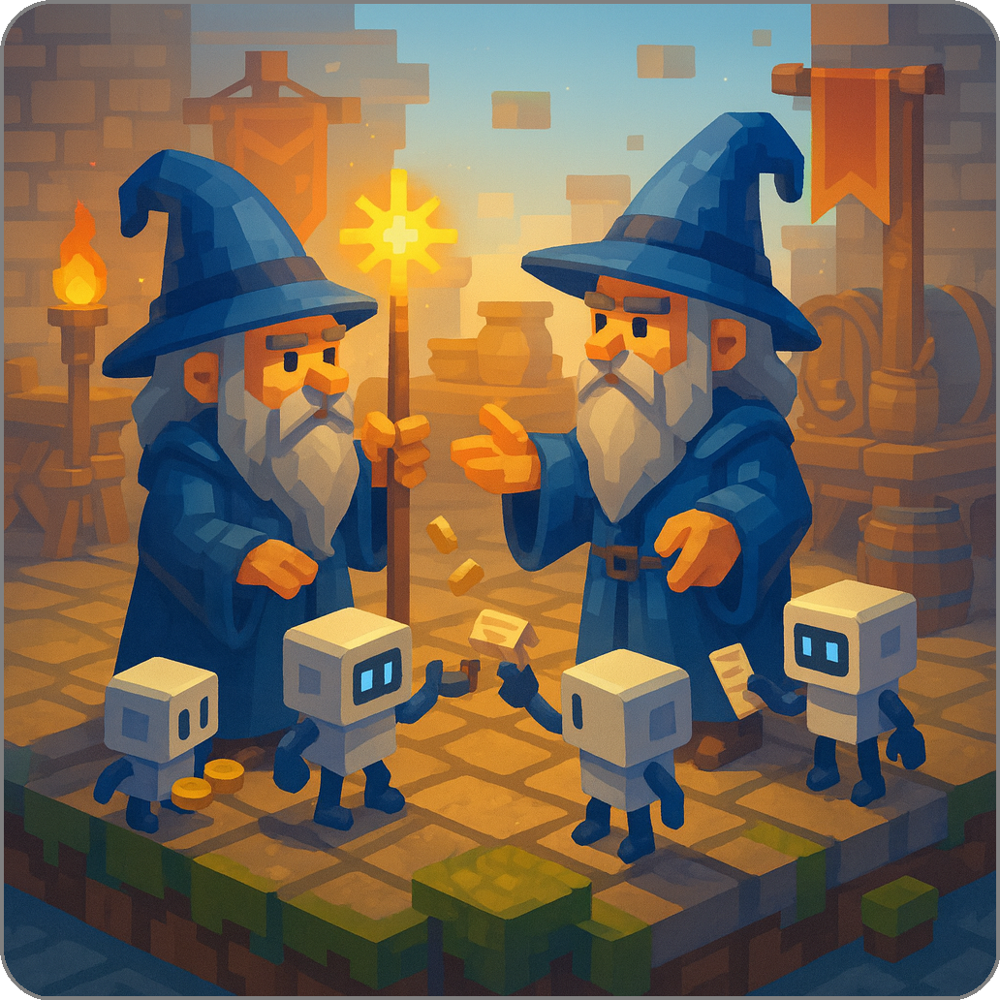
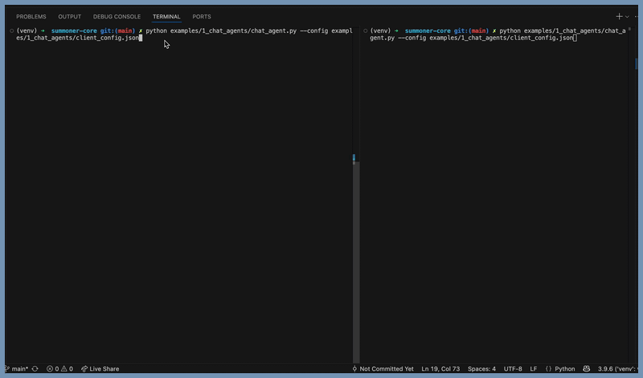
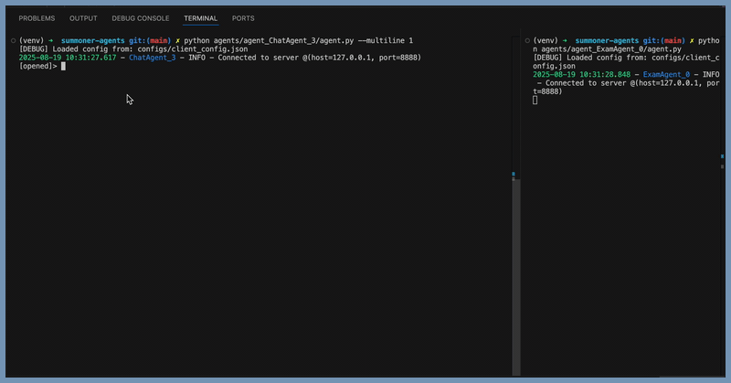

# Summoner Agent Library

<p align="center">

</p>

## Table of Contents

* [SDK setup](#sdk-setup)

* [Desktop App Compatibility](#desktop-app-compatibility)

* [Running an Agent](#running-an-agent)  

* [Agent Collection](#agent-collection)

    * [Legend](#legend)
    * [Core Messaging Agents](#core-messaging-agents)
    * [Chat Agents](#chat-agents)
    * [Feedback Agents](#feedback-agents)
    * [Connector Agents (to MCP, LangChain, CrewAI, etc.)](#connector-agents)
    * [Security and Handshake Agents](#security-and-handshake-agents)
    * [API Agents 🚧 (panned)](#api-agents)
    * [Code Exchange Agents 🚧 (planned)](#code-exchange-agents)


## SDK Setup

To install the SDK, follow the installation pathways available on the [Summoner-Network GitHub organization page](https://github.com/Summoner-Network). If the profile README is not visible, you can instead consult the fallback instructions in the [`.github`](https://github.com/Summoner-Network/.github) repository.


## Desktop App Compatibility

<details>
<summary><b>(Click to expand)</b> This repository contains a collection of agent examples designed to run within the Summoner framework. These agents are organized in a structured and standardized format to ensure compatibility with the Summoner desktop application.</summary>

### Repository Structure

* Agent examples are located in the `agents/` directory.
* Supporting materials such as API adapters or shared tools are located in `api_library/`.

Each subdirectory within `agents/` must follow a specific structure to be recognized and imported correctly by the desktop application (see the [Required Structure for Agent Folders](#required-structure-for-agent-folders) section below).

### Required Structure for Agent Folders

Each folder inside `agents/` **must** comply with the following **strict formatting rules**:

#### ✅ **Mandatory Requirements**

* The folder name **must** follow the naming pattern:

  ```
  agent_<name>
  ```

* The folder **must contain** a file named `agent.py` which includes the agent's entry point:

  ```python
  agent.run()  # should be called within an asyncio context
  ```

* All imports from the Summoner SDK should follow one of the two forms:

  ```python
  from summoner.<module_name> import <function_or_class>
  # or
  import summoner
  ```

* The folder **must include** a `requirements.txt` file:

  * This file will be used by the desktop app to install the agent's dependencies.
  * If running agents locally from this repository, the SDK must first be installed using:

    ```bash
    source build_sdk.sh setup
    ```
  * Then install agent dependencies using:

    ```bash
    pip install -r agents/agent_<name>/requirements.txt
    ```

#### 🟡 **Optional Guidelines**

* The folder **may include** any additional Python files or resources needed by `agent.py`. There are no restrictions on file layout beyond the rules listed above.


Here is a well-structured and clear section you can add to your README to explain how to run an agent. It separates environment setup, server launch, and agent execution, while noting where agent-specific overrides might apply:
</details>

## Running an Agent

<details>
<summary><b>(Click to expand)</b> To run an agent within the Summoner framework, follow these steps. This involves launching a server and then starting the agent process.</summary>

### Activate the Virtual Environment

If you have opened a new terminal, make sure to activate the virtual environment that was created during the SDK installation:

```bash
source venv/bin/activate  # For POSIX systems (Linux/macOS)
```

> 📝 **Note:**
> If you have not installed the SDK yet, run:
>
> ```bash
> source build_sdk.sh setup
> ```


**Install agent requirements before running any agent**

If you want run **one specific agent**, install the agent's dependencies as follows:

```bash
pip install -r agents/agent_<name>/requirements.txt
```

If you want **all agents** to be ready, run the helper script from the repository root (POSIX/bash):

```bash
bash install_requirements.sh
```

This script iterates over `agents/agent_*` and installs each `requirements.txt` it finds. If an agent folder has no `requirements.txt`, nothing is installed for that agent.

> 💡 **Tip:**
> If you encounter `ModuleNotFoundError` when launching an agent, install the requirements using one of the commands above.


### Launch the Summoner Server

The Summoner server is defined in the root file `server.py`. It can be run using either default or custom configurations.

#### Run with Default Config:

```bash
python server.py
```

#### Run with Custom Config:

Configuration files are located in the `configs/` directory. Some agents may require a specific server configuration — refer to the README file inside the agent's folder for details.

```bash
python server.py --config configs/<specific_config>.json
```


### Run the Agent

Once the server is running, you can launch an agent. Most agents are located in folders under `agents/` and follow the naming pattern `agent_<name>`.

#### Run with Default Behavior:

```bash
python agents/agent_<name>/agent.py
```

#### Run with Custom Agent Config:

Some agents require additional configuration (e.g., socket parameters, logging, backpressure behavior). These are usually stored in a file like `<specific_config>.json` in the `configs/` folder.

```bash
python agents/agent_<name>/agent.py --config configs/<specific_config>.json
```

> 💡 **Tip:**
> Always consult the README inside the agent's folder for any overrides, environment variables, or preconditions specific to that agent.
</details>

## Agent Collection

### Legend

<details>
<summary>
Click to show the legend.
</summary>
<br>

| Column          | Description                                                               |
| --------------- | ------------------------------------------------------------------------- |
| **Agent Name**  | Name or identifier of the agent.                                          |
| **Description** | Brief summary of the agent's functionality.                               |
| **Level**       | Difficulty level (e.g. Level 1 = Beginner).                               |
| **Application** | Primary use case (e.g. messaging, orchestration, negotiation).            |
| **Features**    | Key Summoner SDK capability demonstrated (e.g. `core`, `aurora`).         |
| **DB**          | ✅ if the agent uses a persistent or in-memory database (`asqlite`, etc.). |
| **Queue**       | ✅ if the agent relies on asynchronous queues (`asyncio.Queue`, etc.).     |
| **Flows**       | ✅ if the agent follows a modular, trigger-driven flow structure.          |
| **Logs**        | ✅ if the agent demonstrates information logging via its `logger` attribute.  |
| **Hooks**       | ✅ if the agent defines hooks for pre/postprocessing of messages.          |
| **Temp.**       | ✅ if the agent is designed to serve as a reusable template.               |
| **Comp.**       | ✅ if the agent is composable within a larger multi-agent system.          |

</details>

### Core Messaging Agents

<details>
<summary><b>(Click to expand)</b> Agents of <b>level 1 and 2</b> introducing core messaging primitives like <code>@send</code>, <code>@receive</code>, and <code>@hook</code>.</summary>
<br>

<div style="display: flex; justify-content: center;">
<table style="border-collapse: collapse; width: 95%; text-align: center;">
    <thead>
    <tr>
        <th style="width: 10%; text-align: center;">Agent Name</th>
        <th style="width: 33%; text-align: center;">Description</th>
        <th style="width: 12%; text-align: center;">Level</th>
        <th style="width: 12%; text-align: center;">Features</th>
        <th style="width: 12%; text-align: center;">Applications</th>
        <th style="width: 3%; text-align: center;">DB</th>
        <th style="width: 3%; text-align: center;">Queue</th>
        <th style="width: 3%; text-align: center;">Flows</th>
        <th style="width: 3%; text-align: center;">Logs</th>
        <th style="width: 3%; text-align: center;">Hooks</th>
        <th style="width: 3%; text-align: center;">Temp.</th>
        <th style="width: 3%; text-align: center;">Comp.</th>
    </tr>
    </thead>
    <tbody>
    <tr>
        <td> <code><strong><a href="agents/agent_SendAgent_0/">SendAgent_0</a></strong></code></td>
        <td style="font-size: 0.8em;">Demonstrates the use of <code>@send</code></td>
        <td></td>
        <td><code>core</code></td>
        <td></td>
        <td>✗</td><td>✗</td><td>✗</td><td>✗</td><td>✗</td><td>✅</td><td>✅</td>
    </tr>
    <tr>
        <td> <code><strong><a href="agents/agent_SendAgent_1/">SendAgent_1</a></strong></code></td>
        <td style="font-size: 0.8em;">Demonstrates the use of <code>@send</code> and <code>@hook</code> with <code>Direction.SEND</code>.</td>
        <td></td>
        <td><code>core</code> <code>DID</code></td>
        <td></td>
        <td>✗</td><td>✗</td><td>✗</td><td>✅</td><td>✅</td><td>✅</td><td>✅</td>
    </tr>
    <tr>
        <td><code><strong><a href="agents/agent_RecvAgent_0/">RecvAgent_0</a></strong></code></td>
        <td style="font-size: 0.8em;">Demonstrates the use of <code>@receive</code>.</td>
        <td></td>
         <td><code>core</code></td>
        <td></td>
        <td>✅</td><td>✗</td><td>✗</td><td>✅</td><td>✗</td><td>✅</td><td>✅</td>
    </tr>
    <tr>
        <td><code><strong><a href="agents/agent_RecvAgent_1/">RecvAgent_1</a></strong></code></td>
        <td style="font-size: 0.8em;">Demonstrates the use of <code>@receive</code> and <code>@hook</code> with <code>Direction.RECEIVE</code>.</td>
        <td></td>
         <td><code>core</code></td>
        <td></td>
        <td>✅</td><td>✗</td><td>✗</td><td>✅</td><td>✅</td><td>✅</td><td>✅</td>
    </tr>
    <tr>
        <td><code><strong><a href="agents/agent_RecvAgent_2/">RecvAgent_2</a></strong></code></td>
        <td style="font-size: 0.8em;">Demonstrates the use of <code>@receive</code> and <code>@hook</code> to implement validation, banning, and message filtering.</td>
        <td></td>
         <td><code>core</code> <code>validation</code> <code>reputation</code></td>
        <td></td>
        <td>✅</td><td>✗</td><td>✗</td><td>✅</td><td>✅</td><td>✅</td><td>✅</td>
    </tr>
    <tr>
        <td><code><strong><a href="agents/agent_EchoAgent_0/">EchoAgent_0</a></strong></code></td>
        <td style="font-size: 0.8em;">Combines both  <code>@send</code> and <code>@receive</code>.</td>
        <td></td>
         <td><code>core</code></td>
        <td></td>
        <td>✗</td><td>✅</td><td>✗</td><td>✅</td><td>✅</td><td>✅</td><td>✅</td>
    </tr>
    <tr>
        <td><code><strong><a href="agents/agent_EchoAgent_1/">EchoAgent_1</a></strong></code></td>
        <td style="font-size: 0.8em;">Combines both <code>@send</code> and <code>@receive</code> with a receiving <code>hook</code>.</td>
        <td></td>
         <td><code>core</code> <code>validation</code></td>
        <td></td>
        <td>✗</td><td>✅</td><td>✗</td><td>✅</td><td>✅</td><td>✅</td><td>✅</td>
    </tr>
    <tr>
        <td><code><strong><a href="agents/agent_EchoAgent_2/">EchoAgent_2</a></strong></code></td>
        <td style="font-size: 0.8em;">Combines <code>@send</code> and <code>@receive</code> handlers with sending and receiving <code>hooks</code> checking for validation and signing messages.</td>
        <td></td>
         <td><code>core</code> <code>validation</code> <code>DID</code> <code>agent</code></td>
        <td></td>
        <td>✗</td><td>✅</td><td>✗</td><td>✅</td><td>✅</td><td>✅</td><td>✅</td>
    </tr>
    </tbody>
</table>
</div>

</details>

### Chat Agents

<details>
<summary><b>(Click to expand)</b> Agents of <b>level 1-3</b> that implement chat-style user interfaces, remote commands, and automaton routing for interactive control.</summary>
<br>

<div style="display: flex; justify-content: center;">
<table style="border-collapse: collapse; width: 95%; text-align: center;">
    <thead>
    <tr>
        <th style="width: 10%; text-align: center;">Agent Name</th>
        <th style="width: 33%; text-align: center;">Description</th>
        <th style="width: 12%; text-align: center;">Level</th>
        <th style="width: 12%; text-align: center;">Features</th>
        <th style="width: 12%; text-align: center;">Applications</th>
        <th style="width: 3%; text-align: center;">DB</th>
        <th style="width: 3%; text-align: center;">Queue</th>
        <th style="width: 3%; text-align: center;">Flows</th>
        <th style="width: 3%; text-align: center;">Logs</th>
        <th style="width: 3%; text-align: center;">Hooks</th>
        <th style="width: 3%; text-align: center;">Temp.</th>
        <th style="width: 3%; text-align: center;">Comp.</th>
    </tr>
    </thead>
    <tbody>
    <tr>
        <td><code><strong><a href="agents/agent_ChatAgent_0/">ChatAgent_0</a></strong></code></td>
        <td style="font-size: 0.8em;">Implements a minimal chat UI via <code>@send</code>/<code>@receive</code>; supports single- or multi-line input.</td>
        <td></td>
        <td><code>core</code></td>
        <td></td>
        <td>✗</td><td>✗</td><td>✗</td><td>✗</td><td>✗</td><td>✅</td><td>✅</td>
    </tr>
    <tr>
        <td><code><strong><a href="agents/agent_ChatAgent_1/">ChatAgent_1</a></strong></code></td>
        <td style="font-size: 0.8em;">Extends <code>ChatAgent_0</code> with remote/self commands (travel, go_home, quit).</td>
        <td></td>
        <td><code>core</code> <code>traveling</code></td>
        <td></td>
        <td>✗</td><td>✗</td><td>✗</td><td>✗</td><td>✗</td><td>✅</td><td>✅</td>
    </tr>
    <tr>
    <td><code><strong><a href="agents/agent_ChatAgent_2/">ChatAgent_2</a></strong></code></td>
    <td style="font-size: 0.8em;">Activates automaton routing via <code>@upload_states</code>; toggles <code>opened/locked</code> to gate remote commands.</td>
    <td></td>
    <td><code>core</code> <code>upload_states</code> <code>traveling</code></td>
    <td></td>
    <td>✗</td><td>✗</td><td>✅</td><td>✗</td><td>✗</td><td>✅</td><td>✅</td>
    </tr>
    <tr>
    <td><code><strong><a href="agents/agent_ChatAgent_3/">ChatAgent_3</a></strong></code></td>
    <td style="font-size: 0.8em;">Shows explicit automaton transitions with <code>Move</code>/<code>Stay</code> (<code>opened → locked → opened</code>); remote/self travel, lock/open, quit.</td>
    <td></td>
    <td><code>core</code> <code>upload_states</code> <code>download_states</code> <code>traveling</code></td>
    <td></td>
    <td>✗</td><td>✗</td><td>✅</td><td>✗</td><td>✗</td><td>✅</td><td>✅</td>
    </tr>
    </tbody>
</table>
</div>

</details>

<p align="center">

</p>

### Feedback Agents

<details>
<summary><b>(Click to expand)</b> Agents of <b>level 1-3</b> for structured feedback: question/answer flows, delayed responses, and reporting mechanisms.</summary>
<br>

<div style="display: flex; justify-content: center;">
<table style="border-collapse: collapse; width: 95%; text-align: center;">
    <thead>
    <tr>
        <th style="width: 10%; text-align: center;">Agent Name</th>
        <th style="width: 33%; text-align: center;">Description</th>
        <th style="width: 12%; text-align: center;">Level</th>
        <th style="width: 12%; text-align: center;">Features</th>
        <th style="width: 12%; text-align: center;">Applications</th>
        <th style="width: 3%; text-align: center;">DB</th>
        <th style="width: 3%; text-align: center;">Queue</th>
        <th style="width: 3%; text-align: center;">Flows</th>
        <th style="width: 3%; text-align: center;">Logs</th>
        <th style="width: 3%; text-align: center;">Hooks</th>
        <th style="width: 3%; text-align: center;">Temp.</th>
        <th style="width: 3%; text-align: center;">Comp.</th>
    </tr>
    </thead>
    <tbody>
    <tr>
        <td><code><strong><a href="agents/agent_ReportAgent_0/">ReportAgent_0</a></strong></code></td>
        <td style="font-size: 0.8em;">Queues messages for a short window, then sends one newline-joined report.</td>
        <td></td>
        <td><code>core</code></td>
        <td></td>
        <td>✗</td><td>✅</td><td>✗</td><td>✗</td><td>✗</td><td>✅</td><td>✅</td>
    </tr>
    <tr>
        <td><code><strong><a href="agents/agent_ReportAgent_1/">ReportAgent_1</a></strong></code></td>
        <td style="font-size: 0.8em;">Queues messages for a short window, then emits them separately using <code>multi=True</code>.</td>
        <td></td>
        <td><code>core</code> <code>multi</code></td>
        <td></td>
        <td>✗</td><td>✅</td><td>✗</td><td>✗</td><td>✗</td><td>✅</td><td>✅</td>
    </tr>
    <tr>
        <td><code><strong><a href="agents/agent_ExamAgent_0/">ExamAgent_0</a></strong></code></td>
        <td style="font-size: 0.8em;">Demonstrates use of <code>@receive</code> and <code>@send</code> with queues and delays to run an automated Q&amp;A round.</td>
        <td></td>
        <td><code>core</code></td>
        <td></td>
        <td>✗</td><td>✅</td><td>✅</td><td>✗</td><td>✗</td><td>✅</td><td>✅</td>
    </tr>
    <tr>
        <td><code><strong><a href="agents/agent_ExamAgent_1/">ExamAgent_1</a></strong></code></td>
        <td style="font-size: 0.8em;">Extends <code>ExamAgent_0</code> with flow-routed <code>@receive</code>; <code>@send</code> still runs timed scoring but delegates state handling to the flow engine.</td>
        <td></td>
        <td><code>core</code></td>
        <td></td>
        <td>✗</td><td>✅</td><td>✅</td><td>✗</td><td>✅</td><td>✅</td><td>✅</td>
    </tr>
    <!-- <tr>
        <td><code><strong>Storage</strong></code></td>
        <td style="font-size: 0.8em;">...</td>
        <td></td>
         <td><code>core</code></td>
        <td></td>
        <td>✗</td><td>✗</td><td>✗</td><td>✗</td><td>✗</td><td>✗</td><td>✗</td>
    </tr>
    <tr>
        <td><code><strong>Subscribe</strong></code></td>
        <td style="font-size: 0.8em;">...</td>
        <td></td>
         <td><code>core</code></td>
        <td></td>
        <td>✗</td><td>✗</td><td>✗</td><td>✗</td><td>✗</td><td>✗</td><td>✗</td>
    </tr>
    <tr>
        <td><code><strong>EventEmit</strong></code></td>
        <td style="font-size: 0.8em;">...</td>
        <td></td>
         <td><code>core</code></td>
        <td></td>
        <td>✗</td><td>✗</td><td>✗</td><td>✗</td><td>✗</td><td>✗</td><td>✗</td>
    </tr> -->
    </tbody>
</table>
</div>

</details>

<p align="center">

</p>

### Connector Agents

<details>
<summary><b>(Click to expand)</b> Agents of <b>level 1</b> enabling composability via connectors to integrate external ecosystems (e.g., MCP, LangChain, CrewAI).</summary>
<br>

<div style="display: flex; justify-content: center;">
<table style="border-collapse: collapse; width: 95%; text-align: center;">
    <thead>
    <tr>
        <th style="width: 10%; text-align: center;">Agent Name</th>
        <th style="width: 33%; text-align: center;">Description</th>
        <th style="width: 12%; text-align: center;">Level</th>
        <th style="width: 12%; text-align: center;">Features</th>
        <th style="width: 12%; text-align: center;">Applications</th>
        <th style="width: 3%; text-align: center;">DB</th>
        <th style="width: 3%; text-align: center;">Queue</th>
        <th style="width: 3%; text-align: center;">Flows</th>
        <th style="width: 3%; text-align: center;">Logs</th>
        <th style="width: 3%; text-align: center;">Hooks</th>
        <th style="width: 3%; text-align: center;">Temp.</th>
        <th style="width: 3%; text-align: center;">Comp.</th>
    </tr>
    </thead>
    <tbody>
    <tr>
        <td><code><strong><a href="agents/agent_ConnectAgent_0/">ConnectAgent_0</a></strong></code></td>
        <td style="font-size: 0.8em;">Combines <code>@receive</code> and <code>@send(multi=True)</code> to relay Summoner messages via SQLite, using <code>db_sdk</code> (ORM) with batching and persistent connections.</td>
        <td></td>
        <td><code>core</code> <code>multi</code></td>
        <td></td>
        <td>✅</td><td>✗</td><td>✗</td><td>✗</td><td>✗</td><td>✅</td><td>✗</td>
    </tr>
    <tr>
        <td><code><strong><a href="agents/agent_ConnectAgent_1/">ConnectAgent_1</a></strong></code></td>
        <td style="font-size: 0.8em;">Combines <code>@receive</code> and <code>@send(multi=True)</code> to relay Summoner messages via SQLite, using raw <code>aiosqlite</code> with short-lived connections.</td>
        <td></td>
        <td><code>core</code> <code>multi</code></td>
        <td></td>
        <td>✅</td><td>✗</td><td>✗</td><td>✗</td><td>✗</td><td>✅</td><td>✗</td>
    </tr>
    </tbody>
</table>
</div>

</details>


### MMO-game agents

<details>
<summary><b>(Click to expand)</b> Agents of <b>level 3–4</b> that implement a shared 2D sandbox: game masters simulate and broadcast world state while players send keyboard input and render a local view using <code>@receive</code>, <code>@send</code>, and <code>@hook</code>.</summary>
<br>

<div style="display: flex; justify-content: center;">
<table style="border-collapse: collapse; width: 95%; text-align: center;">
  <thead>
  <tr>
    <th style="width: 10%; text-align: center;">Agent Name</th>
    <th style="width: 33%; text-align: center;">Description</th>
    <th style="width: 12%; text-align: center;">Level</th>
    <th style="width: 12%; text-align: center;">Features</th>
    <th style="width: 12%; text-align: center;">Applications</th>
    <th style="width: 3%; text-align: center;">DB</th>
    <th style="width: 3%; text-align: center;">Queue</th>
    <th style="width: 3%; text-align: center;">Flows</th>
    <th style="width: 3%; text-align: center;">Logs</th>
    <th style="width: 3%; text-align: center;">Hooks</th>
    <th style="width: 3%; text-align: center;">Temp.</th>
    <th style="width: 3%; text-align: center;">Comp.</th>
  </tr>
  </thead>
  <tbody>
  <tr>
    <td><code><strong><a href="agents/agent_GameMasterAgent_0/">GameMasterAgent_0</a></strong></code></td>
    <td style="font-size: 0.8em;">
      Authoritative simulator for a 2D world. Consumes player ticks via <code>@receive</code>, broadcasts <code>world_state</code> via <code>@send</code>. Uses <code>@hook</code> to normalize envelopes.
    </td>
    <td></td>
    <td><code>core</code> <code>DID</code></td>
    <td></td>
    <td>🟡</td><td>✗</td><td>✗</td><td>✅</td><td>✅</td><td>✅</td><td>✗</td>
  </tr>
  <tr>
    <td><code><strong><a href="agents/agent_GameMasterAgent_1/">GameMasterAgent_1</a></strong></code></td>
    <td style="font-size: 0.8em;">
      Large-map simulator with clustered golden-angle spawning. Consumes player ticks via <code>@receive</code>, broadcasts <code>world_state</code> via <code>@send</code>. Uses <code>@hook</code> to normalize envelopes.
    </td>
    <td></td>
    <td><code>core</code> <code>DID</code></td>
    <td></td>
    <td>🟡</td><td>✗</td><td>✗</td><td>✅</td><td>✅</td><td>✅</td><td>✗</td>
  </tr>
  <tr>
    <td><code><strong><a href="agents/agent_GamePlayerAgent_0/">GamePlayerAgent_0</a></strong></code></td>
    <td style="font-size: 0.8em;">
      Minimal client UI. Polls keyboard into a <code>keys</code> dict, emits ticks at 20 Hz with <code>@send</code>, and renders <code>world_state</code> received via <code>@receive</code>. Uses <code>@hook</code> to normalize and stamp <code>pid</code>.
    </td>
    <td></td>
    <td><code>core</code> <code>DID</code></td>
    <td></td>
    <td>✗</td><td>✗</td><td>✗</td><td>✗</td><td>✅</td><td>✅</td><td>✗</td>
  </tr>
  <tr>
    <td><code><strong><a href="agents/agent_GamePlayerAgent_1/">GamePlayerAgent_1</a></strong></code></td>
    <td style="font-size: 0.8em;">
      Same messaging pattern as with <code>GamePlayerAgent_0</code>. Resizable client with camera follow, checkerboard grass, optional avatar. Adds persistent ID via <code>--id</code> and configurable client logger.
    </td>
    <td></td>
    <td><code>core</code> <code>DID</code></td>
    <td></td>
    <td>✗</td><td>✗</td><td>✗</td><td>✅</td><td>✅</td><td>✅</td><td>✗</td>
  </tr>
  <tr>
    <td><code><strong><a href="agents/agent_GamePlayerAgent_2/">GamePlayerAgent_2</a></strong></code></td>
    <td style="font-size: 0.8em;">
      Same messaging pattern as with <code>GamePlayerAgent_1</code>. Client with seeded pixel-art grass and an LRU tile cache for performance. Uses persistent ID and <code>--seed</code> for deterministic visuals.
    </td>
    <td></td>
    <td><code>core</code> <code>DID</code></td>
    <td></td>
    <td>✗</td><td>✗</td><td>✗</td><td>✅</td><td>✅</td><td>✅</td><td>✗</td>
  </tr>

  </tbody>
</table>
</div>

</details>

<p align="center">

</p>


### Security and Handshake Agents

<details>
<summary><b>(Click to expand)</b> Agents of <b>level 1, 4, 5 and 6</b> covering backpressure tests, validation hooks, cryptographic DID handshakes, and decision-making in negotiation flows.</summary>
<br>

<div style="display: flex; justify-content: center;">
<table style="border-collapse: collapse; width: 95%; text-align: center;">
    <thead>
    <tr>
        <th style="width: 10%; text-align: center;">Agent Name</th>
        <th style="width: 33%; text-align: center;">Description</th>
        <th style="width: 12%; text-align: center;">Level</th>
        <th style="width: 12%; text-align: center;">Features</th>
        <th style="width: 12%; text-align: center;">Applications</th>
        <th style="width: 3%; text-align: center;">DB</th>
        <th style="width: 3%; text-align: center;">Queue</th>
        <th style="width: 3%; text-align: center;">Flows</th>
        <th style="width: 3%; text-align: center;">Logs</th>
        <th style="width: 3%; text-align: center;">Hooks</th>
        <th style="width: 3%; text-align: center;">Temp.</th>
        <th style="width: 3%; text-align: center;">Comp.</th>
    </tr>
    </thead>
    <tbody>
    <tr>
        <td><code><strong><a href="agents/agent_RateLimitAgent_0/">RateLimitAgent_0</a></strong></code></td>
        <td style="font-size: 0.8em;">Tests server backpressure using <code>@send</code> and <code>@receive</code>.</td>
        <td></td>
         <td><code>core</code> <code>multi</code> </td>
        <td></td>
        <td>✗</td><td>✗</td><td>✗</td><td>✗</td><td>✗</td><td>✅</td><td>✅</td>
    </tr>
    <tr>
        <td><code><strong><a href="agents/agent_RateLimitAgent_1/">RateLimitAgent_1</a></strong></code></td>
        <td style="font-size: 0.8em;">Tests server backpressure using <code>@send(multi=True)</code> and <code>@receive</code> to simulate concurrent sends</td>
        <td></td>
         <td><code>core</code> <code>multi</code> </td>
        <td></td>
        <td>✗</td><td>✗</td><td>✗</td><td>✗</td><td>✗</td><td>✅</td><td>✅</td>
    </tr>
    <tr>
        <td><code><strong><a href="agents/agent_RateLimitAgent_2/">RateLimitAgent_2</a></strong></code></td>
        <td style="font-size: 0.8em;">Tests backpressure using <code>@send(multi=True)</code> and terminates via <code>.quit()</code> in <code>@receive</code>.</td>
        <td></td>
         <td><code>core</code> <code>multi</code> <code>traveling</code> </td>
        <td></td>
        <td>✗</td><td>✗</td><td>✗</td><td>✗</td><td>✗</td><td>✅</td><td>✅</td>
    </tr>
    <tr>
        <td><code><strong><a href="agents/agent_HSAgent_0/">HSAgent_0</a></strong></code></td>
        <td style="font-size: 0.8em;">Explores a nonce-echo handshake to initiate and finalize an exchange.</td>
        <td></td>
         <td><code>core</code> <code>multi</code> <code>upload_states</code> <code>download_states</code> <code>on_triggers</code> <code>validation</code> <code>DID</code></td>
        <td></td>
        <td>✅</td><td>✗</td><td>✅</td><td>✅</td><td>✅</td><td>✅</td><td>✗</td>
    </tr>
    <tr>
        <td><code><strong><a href="agents/agent_HSAgent_1/">HSAgent_1</a></strong></code></td>
        <td style="font-size: 0.8em;">Explores a cryptographic handshake with persistent DID identity to initiate and finalize an exchange.</td>
        <td></td>
         <td><code>core</code> <code>multi</code> <code>upload_states</code> <code>download_states</code> <code>on_triggers</code> <code>validation</code> <code>DID</code></td>
        <td></td>
        <td>✅</td><td>✗</td><td>✅</td><td>✅</td><td>✅</td><td>✅</td><td>✗</td>
    </tr>
    <tr>
        <td><code><strong><a href="agents/agent_HSSellAgent_0/">HSSellAgent_0</a></strong></code></td>
        <td style="font-size: 0.8em;">Explores a selling negotiation overlay on top of the handshake to initiate and finalize a deal.</td>
        <td></td>
         <td><code>core</code> <code>multi</code> <code>upload_states</code> <code>download_states</code> <code>on_triggers</code> <code>validation</code> <code>DID</code></td>
        <td> </td>
        <td>✅</td><td>✗</td><td>✅</td><td>✅</td><td>✅</td><td>✅</td><td>✗</td>
    </tr>
    <tr>
        <td><code><strong><a href="agents/agent_HSBuyAgent_0/">HSBuyAgent_0</a></strong></code></td>
        <td style="font-size: 0.8em;">Explores a buying negotiation overlay on top of the handshake to initiate and finalize a deal.</td>
        <td></td>
         <td><code>core</code> <code>multi</code> <code>upload_states</code> <code>download_states</code> <code>on_triggers</code> <code>validation</code> <code>DID</code></td>
        <td> </td>
        <td>✅</td><td>✗</td><td>✅</td><td>✅</td><td>✅</td><td>✅</td><td>✗</td>
    </tr>
    </tbody>
</table>
</div>

</details>

<p align="center">

</p>

<a id="api-agents"></a>

### API Agents 🚧

<details>
<summary><b>(Click to expand)</b> Agents of <b>level 1-3</b> bridging external services (registries, apps, LLM tools) to extend SDK capabilities.</summary>
<br>

<div style="display: flex; justify-content: center;">
<table style="border-collapse: collapse; width: 95%; text-align: center;">
    <thead>
    <tr>
        <th style="width: 10%; text-align: center;">Agent Name</th>
        <th style="width: 33%; text-align: center;">Description</th>
        <th style="width: 12%; text-align: center;">Level</th>
        <th style="width: 12%; text-align: center;">Features</th>
        <th style="width: 12%; text-align: center;">Applications</th>
        <th style="width: 3%; text-align: center;">DB</th>
        <th style="width: 3%; text-align: center;">Queue</th>
        <th style="width: 3%; text-align: center;">Flows</th>
        <th style="width: 3%; text-align: center;">Logs</th>
        <th style="width: 3%; text-align: center;">Hooks</th>
        <th style="width: 3%; text-align: center;">Temp.</th>
        <th style="width: 3%; text-align: center;">Comp.</th>
    </tr>
    </thead>
    <tbody>
    <tr>
        <td><code><strong>Wikipedia</strong></code></td>
        <td style="font-size: 0.8em;">...</td>
        <td></td>
         <td><code>core</code></td>
        <td></td>
        <td>✗</td><td>✗</td><td>✗</td><td>✗</td><td>✗</td><td>✗</td><td>✗</td>
    </tr>
    <tr>
        <td><code><strong>ArXiv</strong></code></td>
        <td style="font-size: 0.8em;">...</td>
        <td></td>
         <td><code>core</code></td>
        <td></td>
        <td>✗</td><td>✗</td><td>✗</td><td>✗</td><td>✗</td><td>✗</td><td>✗</td>
    </tr>
    <tr>
        <td><code><strong>PubMed</strong></code></td>
        <td style="font-size: 0.8em;">...</td>
        <td></td>
         <td><code>core</code></td>
        <td></td>
        <td>✗</td><td>✗</td><td>✗</td><td>✗</td><td>✗</td><td>✗</td><td>✗</td>
    </tr>
    <tr>
        <td><code><strong>GitHub</strong></code></td>
        <td style="font-size: 0.8em;">...</td>
        <td></td>
         <td><code>core</code></td>
        <td></td>
        <td>✗</td><td>✗</td><td>✗</td><td>✗</td><td>✗</td><td>✗</td><td>✗</td>
    </tr>
    <tr>
        <td><code><strong>Reddit</strong></code></td>
        <td style="font-size: 0.8em;">...</td>
        <td></td>
         <td><code>core</code></td>
        <td></td>
        <td>✗</td><td>✗</td><td>✗</td><td>✗</td><td>✗</td><td>✗</td><td>✗</td>
    </tr>
    <tr>
        <td><code><strong>Notion</strong></code></td>
        <td style="font-size: 0.8em;">...</td>
        <td></td>
         <td><code>core</code></td>
        <td></td>
        <td>✗</td><td>✗</td><td>✗</td><td>✗</td><td>✗</td><td>✗</td><td>✗</td>
    </tr>
    <tr>
        <td><code><strong>Slack</strong></code></td>
        <td style="font-size: 0.8em;">...</td>
        <td></td>
         <td><code>core</code></td>
        <td></td>
        <td>✗</td><td>✗</td><td>✗</td><td>✗</td><td>✗</td><td>✗</td><td>✗</td>
    </tr>
    <tr>
        <td><code><strong>GPTSummary</strong></code></td>
        <td style="font-size: 0.8em;">...</td>
        <td></td>
         <td><code>core</code></td>
        <td></td>
        <td>✗</td><td>✗</td><td>✗</td><td>✗</td><td>✗</td><td>✗</td><td>✗</td>
    </tr>
    <tr>
        <td><code><strong>GPTPArsing</strong></code></td>
        <td style="font-size: 0.8em;">...</td>
        <td></td>
         <td><code>core</code></td>
        <td></td>
        <td>✗</td><td>✗</td><td>✗</td><td>✗</td><td>✗</td><td>✗</td><td>✗</td>
    </tr>
    <tr>
        <td><code><strong>GPTCluster</strong></code></td>
        <td style="font-size: 0.8em;">...</td>
        <td></td>
         <td><code>core</code></td>
        <td></td>
        <td>✗</td><td>✗</td><td>✗</td><td>✗</td><td>✗</td><td>✗</td><td>✗</td>
    </tr>
    <tr>
        <td><code><strong>GPTSearch</strong></code></td>
        <td style="font-size: 0.8em;">...</td>
        <td></td>
         <td><code>core</code></td>
        <td></td>
        <td>✗</td><td>✗</td><td>✗</td><td>✗</td><td>✗</td><td>✗</td><td>✗</td>
    </tr>
    </tbody>
</table>
</div>

</details>

<a id="code-exchange-agents"></a>

### Code Exchange Agents 🚧

<details>
<summary><b>(Click to expand)</b> Agents of <b>level 3</b> showcasing smart-tool exchange and shareable logic for collaborative extension.</summary>
<br>

<div style="display: flex; justify-content: center;">
<table style="border-collapse: collapse; width: 95%; text-align: center;">
    <thead>
    <tr>
        <th style="width: 10%; text-align: center;">Agent Name</th>
        <th style="width: 33%; text-align: center;">Description</th>
        <th style="width: 12%; text-align: center;">Level</th>
        <th style="width: 12%; text-align: center;">Features</th>
        <th style="width: 12%; text-align: center;">Applications</th>
        <th style="width: 3%; text-align: center;">DB</th>
        <th style="width: 3%; text-align: center;">Queue</th>
        <th style="width: 3%; text-align: center;">Flows</th>
        <th style="width: 3%; text-align: center;">Logs</th>
        <th style="width: 3%; text-align: center;">Hooks</th>
        <th style="width: 3%; text-align: center;">Temp.</th>
        <th style="width: 3%; text-align: center;">Comp.</th>
    </tr>
    </thead>
    <tbody>
    <tr>
        <td><code><strong>SmartTool</strong></code></td>
        <td style="font-size: 0.8em;">...</td>
        <td></td>
        <td><code>smart-tools</code></td>
        <td></td>
        <td>✗</td><td>✗</td><td>✗</td><td>✗</td><td>✗</td><td>✗</td><td>✗</td>
    </tr>
    </tbody>
</table>
</div>

</details>


