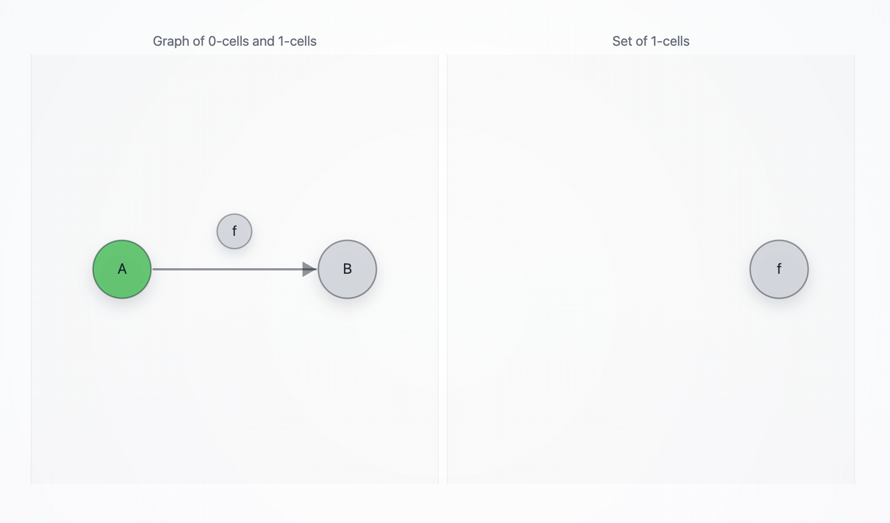
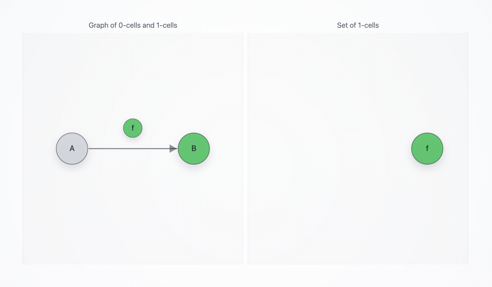

# `CatArrowAgent`

A minimal Summoner client that traverses a **1-categorical arrow** and exposes its current `states` through a **globular** graph visualization. The agent listens on category-structured routes (two objects and one arrow), calls an LLM to decide whether to traverse an arrow (see the code in [`llm_call.py`](./llm_call.py)), and renders the current position in a browser window where **objects are nodes**, **arrows are directed edges**, and **arrow labels are circled bubbles attached to edges** (see the code in [`summoner_web_viz.py`](./summoner_web_viz.py)). Occupied tokens in `states` are colored **green**; non-occupied tokens are **gray**.


> [!IMPORTANT]
> **OpenAI credentials required.** The agent calls `load_dotenv()` and expects an environment variable named `OPENAI_API_KEY`. Put a `.env` file at the **project root** (or set the variable in your shell/CI) so it is available at runtime:
>
> * **.env:**
>   `OPENAI_API_KEY=sk-...your_key...`
>
> * **macOS/Linux terminal:**
>   `export OPENAI_API_KEY="sk-...your_key..."`
>
> * **Windows (PowerShell) terminal:**
>   `$env:OPENAI_API_KEY="sk-...your_key..."`
>
> If the key is missing, the agent will raise: `ValueError("Missing api_key (pass api_key=... or set OPENAI_API_KEY).")`.

## Behavior

<details>
<summary><b>(Click to expand)</b> The agent goes through these steps:</summary>
<br>

1. On startup, the agent initializes `states = [Node("A")]` and a lock (`state_lock`) used to protect updates coming from Summoner’s tape lifecycle.

2. The agent configures its flow and arrow syntax:

   * `client_flow = client.flow().activate()`
   * `client_flow.add_arrow_style(stem="-", brackets=("[", "]"), separator=",", tip=">")`

   This makes routes like:

   ```
   A --[ f ]--> B
   ```

   parseable in a way consistent with the Summoner flow parser.

3. The agent starts a browser-based graph view (`WebGraphVisualizer`) on:

   ```
   http://127.0.0.1:8765/
   ```

   The visualizer reconstructs the graph from `client.dna()` and uses `client_flow.parse_route` to interpret each route:

   * **nodes:** tokens that appear in `source` and `target`
   * **edges:** one directed edge per arrow route `source -> target`
   * **edge label bubbles:** tokens in the arrow `label`, drawn as circled bubbles attached to the edge (globular picture)

4. Summoner state tape integration:

   * `@client.upload_states()` returns the current `states` (defaults back to `[Node("A")]` if empty).
   * `@client.download_states()` receives tape updates, stores them, and pushes them to the visualizer.
   * Any token present in `states` becomes **occupied** (green) in the visualization. This applies to both object tokens (node circles) and arrow-label tokens (bubbles attached to edges).

5. Incoming messages are validated by the receive hook:

   * The agent expects a dict of the form:

     ```python
     {"remote_addr": "...", "content": {...}}
     ```
   * Invalid payloads are dropped.

6. The arrow receive handler (`route=" A --[ f ]--> B "`) calls the LLM:

   * Context is fixed to the local arrow `A --[f]--> B`.
   * Allowed actions are `("move", "stay")`.
   * The LLM must return strict JSON of the form:

     ```json
     {"action":"move|stay","reason":"..."}
     ```

   The agent maps the decision to Summoner events:

   * `"move"` → `Move(Trigger.ok)`
   * `"stay"` → `Stay(Trigger.ok)`

7. Object and cell handlers (`route="A"`, `route="B"`, `route="f"`) return `Test(Trigger.ok)`. These are minimal “processing” steps to exercise the tape lifecycle.

8. Send handlers emit a short event trace back to the server depending on the action that fired (Move / Stay / Test).

</details>

## SDK Features Used

| Feature                                                    | Description                                                          |
| ---------------------------------------------------------- | -------------------------------------------------------------------- |
| `SummonerClient(name=...)`                                 | Creates a named client agent (`AGENT_ID = "CatArrowAgent"`)          |
| `client.flow().activate()`                                 | Enables flow parsing/dispatch                                        |
| `flow.add_arrow_style(...)`                                | Defines route syntax like `A --[ f ]--> B`                           |
| `@client.upload_states()`                                  | Supplies current `states` to Summoner’s tape                         |
| `@client.download_states()`                                | Receives tape updates and synchronizes local `states`                |
| `@client.hook(Direction.RECEIVE)`                          | Validates incoming message shape before dispatch                     |
| `@client.hook(Direction.SEND)`                             | Normalizes outgoing payload and adds `from=AGENT_ID`                 |
| `@client.receive(route=...)`                               | Defines handlers for arrow/object/cell routes                        |
| `@client.send(route=..., on_actions=..., on_triggers=...)` | Emits event trace back to the server                                 |
| `client.dna()`                                             | Introspects registered routes to reconstruct the visualization graph |

## How to Run

First, start the Summoner server:

```bash
python server.py
```

Then start the agent:

```bash
python agents/agent_CatArrowAgent/agent.py
```

A browser window should open automatically at:

```
http://127.0.0.1:8765/
```

Optional CLI flag:

* `--config <path>`: Summoner **client** config path (defaults to `configs/client_config.json`).

Example:

```bash
python agents/agent_CatArrowAgent/agent.py --config configs/client_config.json
```

## Simulation Scenarios

These scenarios run a minimal loop with a server, this agent, and an input-presenting agent.

```bash
# Terminal 1
python server.py

# Terminal 2
python agents/agent_CatArrowAgent/agent.py

# Terminal 3
python agents/agent_InputAgent/agent.py
```

> [!NOTE]
>  The visualization is intentionally **not simplicial**:
>
> * The label `f` is **not** a graph node used for connectivity.
> * The graph has a single edge `A → B`.
> * The label `f` is rendered as a **circled bubble attached to the edge**.
> * If `Node("f")` appears in `states`, that bubble turns green.
> 
> The browser view polls `/state` every ~200ms and updates colors accordingly.


> [!NOTE]
>
> * The visualization graph is built once at startup from `client.dna()`. If you register additional routes dynamically, you must rebuild the graph by calling `viz.set_graph_from_dna(...)` again.
>
> * `agent.py` currently calls:
>
>     ```python
>     viz.set_graph_from_dna(json.loads(client.dna()), parse_route=client_flow.parse_route)
>     ```
>
>     which assumes `client.dna()` returns a JSON string.
>
> * `upload_states()` is annotated as returning `list[str]`, but it returns `list[Node]`. If you care about type checking, change it to `list[Node]`.


**Scenario A — Irrelevant message (defaults to stay):**

In Terminal 3, send:

```
> Hello!
```

Terminal 3 should receive:

```
[Received] {'message': 'Decided to stay on A and not traverse f', 'from': 'CatArrowAgent'}
[Received] {'message': 'A processed and forgotten', 'from': 'CatArrowAgent'}
```

Terminal 2 (`CatArrowAgent`) prints the LLM decision:

```json
{
  "action": "stay",
  "reason": "The incoming payload does not instruct to move through the arrow.",
}
```

The browser should display the following image:

<p align="center">
  
</p>


**Scenario B — Move through the arrow:**

In Terminal 3, send:

```
> move through the arrow
```

Terminal 3 should receive:

```
[Received] {'message': 'A processed and forgotten', 'from': 'CatArrowAgent'}
[Received] {'message': 'Decided to move from A to B via f', 'from': 'CatArrowAgent'}
```

Terminal 2 prints:

```json
{
  "action": "move",
  "reason": "Instruction to move through the arrow is applicable.",
}
```

The browser should display the following image:

<p align="center">
  
</p>


**Scenario C — Move somewhere else (no matching arrow, tape clears, next round restarts on A):**

In Terminal 3, send:

```
> move somewhere else
```

Terminal 3 should receive:

```
[Received] {'message': 'B processed and forgotten', 'from': 'CatArrowAgent'}
[Received] {'message': 'f processed and forgotten', 'from': 'CatArrowAgent'}
```

(No LLM decision is printed here.)

This clears the active tape states and on the next round the agent will return to the default starting point `Node("A")`.

**Scenario D — Explicit stay:**

In Terminal 3, send:

```
> Stay
```

Terminal 3 should receive:

```
[Received] {'message': 'Decided to stay on A and not traverse f', 'from': 'CatArrowAgent'}
[Received] {'message': 'A processed and forgotten', 'from': 'CatArrowAgent'}
```

Terminal 2 prints:

```json
{
  "action": "stay",
  "reason": "The instruction 'Stay' indicates not to move.",
}
```
