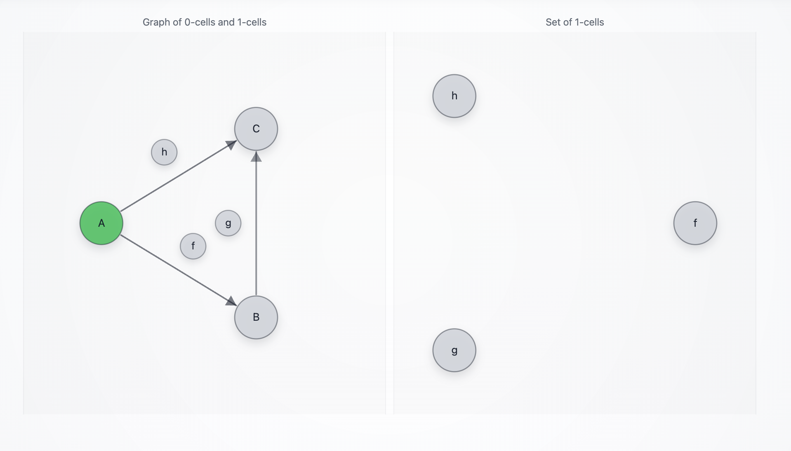
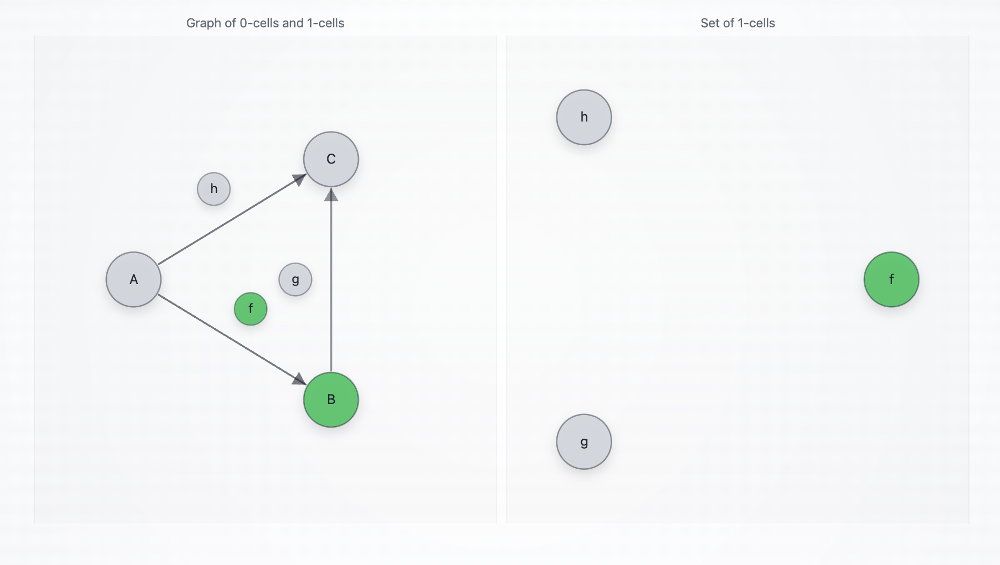
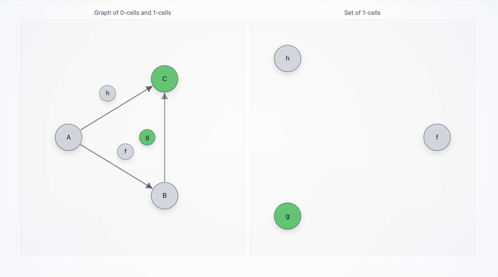

# `CatTriangleAgent`

A minimal Summoner client that traverses a **1-categorical triangle** and exposes its current `states` through a **globular** graph visualization. The agent listens on category-structured routes (three objects and three arrows), calls an LLM to **extract** structured registration fields (see [`llm_call.py`](./llm_call.py)), and lets the **automaton** decide whether to traverse each arrow (see [`agent.py`](./agent.py)). It renders the current position in a browser window where **objects are nodes**, **arrows are directed edges**, and **arrow labels are circled bubbles attached to edges** (see [`summoner_web_viz.py`](./summoner_web_viz.py)). Occupied tokens in `states` are colored **green**; non-occupied tokens are **gray**.

The triangle category is:

```
A --[ f ]--> B
B --[ g ]--> C
A --[ h ]--> C
```

`A` is an uncommitted drafting state, `B` is a committed collection state, and `C` is a terminal "registration complete" state.

> [!IMPORTANT]
> **OpenAI credentials required.** The agent calls `load_dotenv()` and expects an environment variable named `OPENAI_API_KEY`. Put a `.env` file at the **project root** (or set the variable in your shell/CI) so it is available at runtime:
>
> * **.env:**
>   `OPENAI_API_KEY=sk-...your_key...`
>
> * **macOS/Linux terminal:**
>   `export OPENAI_API_KEY="sk-...your_key..."`
>
> * **Windows (PowerShell) terminal:**
>   `$env:OPENAI_API_KEY="sk-...your_key..."`
>
> If the key is missing, the agent will raise: `ValueError("Missing api_key (pass api_key=... or set OPENAI_API_KEY).")`.

## Behavior

<details>
<summary><b>(Click to expand)</b> The agent goes through these steps:</summary>
<br>

1. On startup, the agent initializes `states = [Node("A")]` and two minimal memory dicts protected by one lock:

   * `draft`: uncommitted scratchpad (used in `A`)
   * `registration`: committed dict (used in `B`)

2. The agent configures its flow and arrow syntax:

   * `client_flow = client.flow().activate()`
   * `client_flow.add_arrow_style(stem="-", brackets=("[", "]"), separator=",", tip=">")`

   This makes routes like:

   ```
   A --[ f ]--> B
   B --[ g ]--> C
   A --[ h ]--> C
   ```

   parseable in a way consistent with the Summoner flow parser.

3. The agent starts a browser-based graph view (`WebGraphVisualizer`) on:

   ```
   http://127.0.0.1:8765/
   ```

   The visualizer reconstructs the graph from `client.dna()` and uses the flow parser to interpret each route:

   * **nodes:** tokens that appear in `source` and `target` (A, B, C)
   * **edges:** one directed edge per arrow route `source -> target` (A→B, B→C, A→C)
   * **edge label bubbles:** tokens in the arrow label (f, g, h), drawn as circled bubbles attached to edges

4. Summoner state tape integration:

   * `@client.upload_states()` supplies current `states`.
   * `@client.download_states()` receives tape updates, applies a priority rule, and pushes the filtered states to the visualizer.

5. State priority resolution (done in `download_states`):

   * `C` wins over `B` and `A`
   * `B` wins over `A`

   This is how independent arrow decisions resolve into one resulting tape state.

6. Incoming messages are validated by the receive hook:

   * The agent expects a dict of the form:

     ```python
     {"remote_addr": "...", "content": ...}
     ```

   * `content` can be a string or any JSON-serializable object. The LLM sees it as JSON.

7. LLM usage is **extraction only**:

   * Each arrow receive handler calls `llm_client.extract(...)`.

   * The LLM returns a JSON object containing a subset of allowed keys only:

     ```json
     {"first_name":"...","last_name":"...","company":"...","email":"..."}
     ```

   * There is no `"action"`. Traversal decisions are deterministic, based on extracted fields and local memory.

8. Registration field policy:

   Required fields:

   ```
   first_name, last_name, company, email
   ```

   The agent also validates emails with a basic regex and drops empty strings.

9. Arrow semantics (automaton rules):

   * **`f: A -> B` (start commit)**
     The agent merges extracted fields into `draft`. It moves to `B` only if:

     * `draft` has `first_name` and `last_name`, and
     * `draft` has `email` or `company`, and
     * `draft` is still incomplete (missing at least one required field)

     When `f` moves, the agent copies `draft` into `registration` and clears `draft`.

   * **`h: A -> C` (direct completion)**
     The agent merges extracted fields into `draft`. It moves to `C` only if `draft` becomes complete.

   * **`g: B -> C` (finish commit)**
     The agent merges extracted fields into `registration`. It moves to `C` only if `registration` becomes complete. Identity is frozen during commit:

     * `first_name` and `last_name` are protected and will not be overwritten once present.

10. Terminal transition handling:

    When the tape reaches `C`, the agent clears both `draft` and `registration`. This resets the agent for the next registration.

</details>

## SDK Features Used

| Feature                                                    | Description                                                               |
| ---------------------------------------------------------- | ------------------------------------------------------------------------- |
| `SummonerClient(name=...)`                                 | Creates a named client agent (`AGENT_ID = "CatTriangleAgent"`)            |
| `client.flow().activate()`                                 | Enables flow parsing and dispatch                                         |
| `flow.add_arrow_style(...)`                                | Defines route syntax like `A --[ f ]--> B`                                |
| `@client.upload_states()`                                  | Supplies current `states` to Summoner's tape                              |
| `@client.download_states()`                                | Receives tape updates, applies priority rule, synchronizes local `states` |
| `@client.hook(Direction.RECEIVE)`                          | Validates incoming message shape before dispatch                          |
| `@client.hook(Direction.SEND)`                             | Normalizes outgoing payload and adds `from=AGENT_ID`                      |
| `@client.receive(route=...)`                               | Defines handlers for arrow/object/cell routes                             |
| `@client.send(route=..., on_actions=..., on_triggers=...)` | Emits an event trace back to the server                                   |
| `client.dna()`                                             | Introspects registered routes to reconstruct the visualization graph      |

## How to Run

First, start the Summoner server:

```bash
python server.py
```

Then start the agent:

```bash
python agents/agent_CatTriangleAgent/agent.py
```

A browser window should open automatically at:

```
http://127.0.0.1:8765/
```

Optional CLI flag:

* `--config <path>`: Summoner **client** config path (defaults to `configs/client_config.json`).

Example:

```bash
python agents/agent_CatTriangleAgent/agent.py --config configs/client_config.json
```

## Simulation Scenarios

These scenarios run a minimal loop with a server, this agent, and an input agent.

```bash
# Terminal 1
python server.py

# Terminal 2
python agents/agent_CatTriangleAgent/agent.py

# Terminal 3
python agents/agent_InputAgent/agent.py
```

> [!NOTE]
> The visualization is intentionally **not simplicial**:
>
> * Arrow labels (`f`, `g`, `h`) are **not** connectivity nodes.
> * The visualization shows edges `A → B`, `B → C`, `A → C`.
> * Labels appear as circled bubbles attached to the corresponding edges.
> * If `Node("f")`, `Node("g")`, or `Node("h")` appears in `states`, that bubble turns green.

### Scenario A — Names only (no commit)

In Terminal 3, send:

```
> My name is Bob Dylan
```

Terminal 3 should receive **exactly**:

```
[Received] {'message': 'Stayed on A via f (no commit)', 'from': 'CatTriangleAgent'}
[Received] {'message': 'Stayed on A via h (not complete)', 'from': 'CatTriangleAgent'}
[Received] {'message': 'A processed and forgotten', 'from': 'CatTriangleAgent'}
```

Interpretation:

* `h` extracts the name into `draft`, but the draft is not complete, so `h` stays.
* `f` sees the same message, but there is no email/company anchor yet, so it does not commit.
* The tape remains at `A`.

In the browser:

<p align="center">
  
</p>


### Scenario B — Multi-message registration (commit via `f`, finish via `g`)

In Terminal 3, send:

```
> My name is Bob Dylan
> My work email is bob@dylan.com
> I work at Google
```

Terminal 3 should receive:

```
[Received] {'message': 'Stayed on A via f (no commit)', 'from': 'CatTriangleAgent'}
[Received] {'message': 'Stayed on A via h (not complete)', 'from': 'CatTriangleAgent'}
[Received] {'message': 'A processed and forgotten', 'from': 'CatTriangleAgent'}
[Received] {'message': 'Moved A -> B via f (commit started)', 'from': 'CatTriangleAgent'}
[Received] {'message': 'Stayed on A via h (not complete)', 'from': 'CatTriangleAgent'}
[Received] {'message': 'A processed and forgotten', 'from': 'CatTriangleAgent'}
[Received] {'message': 'Moved B -> C via g (commit finished)', 'from': 'CatTriangleAgent'}
[Received] {'message': 'B processed and forgotten', 'from': 'CatTriangleAgent'}
[Received] {'message': 'f processed and forgotten', 'from': 'CatTriangleAgent'}
```

Interpretation:

* After the email message, `draft` contains identity + an anchor, but is still incomplete, so `f` commits and moves to `B`.
* In `B`, `g` merges the company and finishes the registration, moving to `C`.
* `C` wins by priority and clears both `draft` and `registration`.


In the browser:

<p align="center">
  
  <span style="vertical-align: middle;">&rarr;</span>
  
  <span style="vertical-align: middle;">&rarr;</span>
  
</p>


### Scenario C — One-shot complete registration (direct via `h`)

In Terminal 3, send:

```
> Hi, I'm Remy Tuyeras. I work at DoubleUp. My email is rtuyeras@summoner.org
```

Terminal 3 should receive:

```
[Received] {'message': 'Stayed on A via f (no commit)', 'from': 'CatTriangleAgent'}
[Received] {'message': 'Moved A -> C via h (direct success)', 'from': 'CatTriangleAgent'}
[Received] {'message': 'A processed and forgotten', 'from': 'CatTriangleAgent'}
```

Interpretation:

* `h` completes the full registration in `A`, so it moves directly to `C`.
* Even if `f` could have started a commit, `C` wins by priority and the tape takes the direct completion path.

In the browser:

<p align="center">
  
  <span style="vertical-align: middle;">&rarr;</span>
  
</p>