# `CatUpdateAgent_0`

A minimal Summoner client that traverses a **2-categorical supply-chain workflow** and exposes its current `states` through a **globular** graph visualization. The agent listens on category-structured routes (four objects, five 1-cells, and four 2-cells), calls an LLM to **extract** structured incident and logistics fields (see [`llm_call.py`](./llm_call.py)), and lets a deterministic **automaton** decide how to traverse both **transitions** (1-cells) and **transitions between transitions** (2-cells) (see [`agent.py`](./agent.py)). It renders the current position in a browser window where **objects are nodes**, **arrows are directed edges**, and **arrow labels are circled bubbles attached to edges** (see [`summoner_web_viz.py`](./summoner_web_viz.py)). Occupied tokens in `states` are colored **green**; non-occupied tokens are **gray**.

The workflow graph is:

**Objects (states):**

* `A`: incident intake (line-down risk / critical spare-part request)
* `B`: committed supply plan (source chosen, promise computed)
* `C`: shipment ready (pick/pack/compliance complete, ready to tender)
* `D`: delivered + evaluation (terminal output depends on full history)

**1-cells (transitions):**

```
A --[ f ]--> B     (regional distribution center (DC) fulfillment)
A --[ g ]--> B     (supplier fulfillment)
B --[ h ]--> C     (pick/pack/compliance pipeline)
C --[ p ]--> D     (premium shipment execution)
C --[ q ]--> D     (economy shipment execution)
```

**2-cells (higher-order transitions between 1-cells):**

These are modeled as arrows between transition-states. They represent **policy amendments** that attach a commitment to the chosen plan and bias the later shipping execution.

If the agent chose `f` (DC):

```
f --[ eta_f ]--> p   (expedite authorization; intent -> premium)
f --[ mu_f  ]--> q   (consolidation mandate; intent -> economy)
```

If the agent chose `g` (supplier):

```
g --[ eta_g ]--> p   (supplier expedite clause; intent -> premium)
g --[ mu_g  ]--> q   (standard clause; intent -> economy)
```

> [!IMPORTANT]
> **OpenAI credentials required.** The agent calls `load_dotenv()` and expects an environment variable named `OPENAI_API_KEY`. Put a `.env` file at the **project root** (or set the variable in your shell/CI) so it is available at runtime:
>
> * **.env:**
>   `OPENAI_API_KEY=sk-...your_key...`
>
> * **macOS/Linux terminal:**
>   `export OPENAI_API_KEY="sk-...your_key..."`
>
> * **Windows (PowerShell) terminal:**
>   `$env:OPENAI_API_KEY="sk-...your_key..."`
>
> If the key is missing, the agent will raise: `ValueError("Missing api_key (pass api_key=... or set OPENAI_API_KEY).")`.

## Behavior

<details>
<summary><b>(Click to expand)</b> The agent goes through these steps:</summary>
<br>

1. On startup, the agent initializes:

   * `states = [Node("A")]`
   * a small internal memory protected by `mem_lock`:

     * `case`: incident fields (part, urgency, stock signals)
     * `policy`: service-level amendment fields (budget, downtime cost, risk)
     * `ops`: readiness fields that allow `h : B -> C` to progress
     * `feasibility`: shipping feasibility fields at `C` (premium/economy availability)
     * `path`: path-dependent trace (the agent's "short-term memory"):

       * `source_choice ∈ {f,g}` (chosen sourcing plan)
       * `amendment_choice ∈ {eta_f,mu_f,eta_g,mu_g}` (chosen policy amendment)
       * `intent_lane ∈ {p,q}` (committed earlier by the 2-cell)
       * `shipment_lane ∈ {p,q}` (actual executed shipping)
       * `exception` (if execution had to override intent)

   The `path` fields are intentionally duplicated into `states` as extra tokens, so chosen decisions remain green in the visualization while the object-level tape progresses from `A` to `D`.

2. The agent configures its flow and arrow syntax:

   * `client_flow = client.flow().activate()`
   * `client_flow.add_arrow_style(stem="-", brackets=("[", "]"), separator=",", tip=">")`

   This supports both:

   * standard 1-cells: `A --[ f ]--> B`
   * 2-cells as arrows between transition-states: `f --[ eta_f ]--> p`

3. The agent starts a browser-based graph view (`WebGraphVisualizer`) on:

   ```
   http://127.0.0.1:8765/
   ```

   The visualizer reconstructs the graph once at startup from `client.dna()` and uses the flow parser to interpret each route.

4. Summoner tape integration:

   * `@client.upload_states()` supplies current `states`.
   * `@client.download_states()` receives tape updates, applies priority, and pushes them to the visualizer.

   Crucially:

   * the tape moves on **0-cells** (`A, B, C, D`) in the usual way
   * the agent also injects `path` tokens (`f/g`, `eta*/mu*`, `p/q`) into `states` so the visualization preserves a minimal memory of decisions

5. Priority resolution:

   * `D` wins over `C`, `B`, `A`
   * `C` wins over `B`, `A`
   * `B` wins over `A`

   This prevents "backsliding" in the object tape. Once the tape has a valid `B`, it should not collapse back to `A` unless a reset occurs.

6. Incoming messages are validated by the receive hook:

   * The agent expects:

     ```python
     {"remote_addr": "...", "content": ...}
     ```

   * Empty strings are ignored, so pressing Enter does not advance anything.

   * Unstructured text is allowed, but it must contain extractable fields. Otherwise the automaton stays.

7. LLM usage is **extraction only**:

   * the LLM returns a JSON object with only allowed keys for the current stage
   * the LLM is instructed to return JSON numbers (no `$`, no commas, no units).
   * traversal decisions are deterministic, based on extracted + validated fields

8. `A → B` sourcing decision (`f` vs `g`):

   The agent only commits a source choice if it has enough incident information to justify a plan.

   Minimal incident fields used in this PoC:

   * `part_id` (identifier)
   * `qty` (required quantity)
   * `required_by_hours` (deadline horizon)
   * `dc_on_hand` (stock signal)
   * `supplier_lead_time_hours` (fallback plan feasibility)
   * `line_down` (risk amplifier)

   Rule (PoC):

   * choose `f` if `dc_on_hand >= qty`
   * otherwise choose `g` if `supplier_lead_time_hours` is present
   * otherwise stay on `A`

   If an input is generic ("Hello") or does not contain at least the core fields needed to compute the rule, both `f` and `g` will stay.

9. 2-cell amendment decision (conditioned on `f` or `g`):

   Once a source choice exists (the tape is at `B`), the agent can accept a policy amendment input.

   Policy fields (PoC):

   * `expedite_budget_usd`
   * `downtime_cost_per_hour_usd`
   * `disruption_risk`
   * `carrier_capacity_score`

   Rule (PoC):

   * prefer `eta_*` vs `mu_*` using best-effort:
      * use the inequality `downtime_cost_per_hour_usd * required_by_hours >= expedite_budget_usd` when both cost and budget are present (after cleaning)
      * otherwise, fall back to partial signals (e.g., `disruption_risk`, `carrier_capacity_score`) when available
   * if no usable policy signal is available after validation, stay

   If the input at `B` has no policy fields, the agent stays (it does not "guess" a policy amendment). This is important for stability in demos and batch tests.

10. `B → C` progression (`h`):

    Operations progression is modeled as a separate input channel. This prevents the common failure where a policy-only message accidentally triggers "ops progression".

    Ops readiness fields (PoC):

    * `ready_to_tender` (boolean)

    Rule:

    * `h` moves only if `ready_to_tender=true` is present (dict) or strongly stated (text) and a source choice exists

    This makes `h` meaningful: it corresponds to a real operational gate (pick/pack done, compliance done, paperwork ready).

11. `C → D` execution (`p` vs `q`), conditioned on intent:

    Feasibility fields (PoC):

    * `premium_mode_available`
    * `economy_mode_available`
    * optionally `next_milk_run_departure_hours` (used for narrative context, not required)

    Rule:

    * follow `intent_lane` when feasible
    * if infeasible, override and store `exception` (this is a common real-world pattern)
    * if feasibility is missing, stay on `C`

12. Terminal evaluation at `D`:

    `D` is an evaluation stage driven by a final input. The intended pattern is:

    * reach `D`
    * send one additional message containing optional ground truth / KPI targets
    * the agent emits a final report that includes:

      * full path (`f/g`, `eta/mu`, `p/q`)
      * extracted inputs used for decisions
      * feasibility override, if any
      * evaluation checks, if ground truth was provided

    After emitting the report once, the agent resets its memory and re-anchors on `A` for the next run.

</details>

## SDK Features Used

| Feature                                                    | Description                                                               |
| ---------------------------------------------------------- | ------------------------------------------------------------------------- |
| `SummonerClient(name=...)`                                 | Creates a named client agent                                              |
| `client.flow().activate()`                                 | Enables flow parsing and dispatch                                         |
| `flow.add_arrow_style(...)`                                | Defines route syntax like `A --[ f ]--> B` and `f --[ eta_f ]--> p`       |
| `@client.upload_states()`                                  | Supplies current `states` to Summoner's tape                              |
| `@client.download_states()`                                | Receives tape updates, applies priority rule, synchronizes local `states` |
| `@client.hook(Direction.RECEIVE)`                          | Validates incoming message shape before dispatch                          |
| `@client.hook(Direction.SEND)`                             | Normalizes outgoing payload and adds `from=AGENT_ID`                      |
| `@client.receive(route=...)`                               | Defines handlers for 1-cells, 2-cells, objects, and cell tokens           |
| `@client.send(route=..., on_actions=..., on_triggers=...)` | Emits an event trace back to the server                                   |
| `client.dna()`                                             | Introspects registered routes to reconstruct the visualization graph      |

## How to Run

First, start the Summoner server:

```bash
python server.py
```

Then start the agent:

```bash
python agents/agent_CatUpdateAgent_0/agent.py
```

A browser window should open automatically at:

```
http://127.0.0.1:8765/
```

Optional CLI flag:

* `--config <path>`: Summoner **client** config path (defaults to `configs/client_config.json`).

Example:

```bash
python agents/agent_CatUpdateAgent_0/agent.py --config configs/client_config.json
```

## Simulation Scenarios

These scenarios run a minimal loop with a server, this agent, and an input-presenting agent.

```bash
# Terminal 1
python server.py

# Terminal 2
python agents/agent_CatUpdateAgent_0/agent.py

# Terminal 3
python agents/agent_InputAgent/agent.py
```

### Scenario context

<p align="center">
  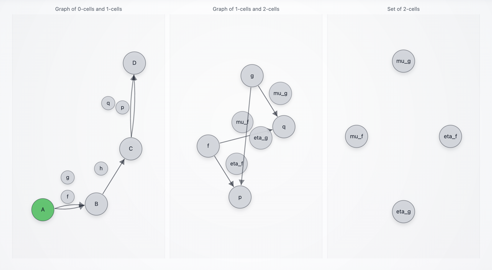
</p>

A factory line is at risk of downtime because a **critical spare part** is missing. The workflow is intentionally modeled as a **2-category** so the agent can represent decisions at two levels:

1. **Source plan selection** (a 1-cell at `A`: `f` vs `g`)

2. **Policy amendment** (a 2-cell on the chosen plan: `eta_*` vs `mu_*`) that commits an *intent* toward a later shipping lane (`p` vs `q`)

In parallel, operations progress as an independent pipeline (`h : B -> C`) that requires explicit readiness information. Finally, at `C`, the agent executes the shipping lane (`p` or `q`), possibly overriding earlier intent if feasibility contradicts it.

There are four main workflows to cover, because they correspond to distinct operational outcomes:

* `(f, eta_f, p)`: DC sourcing, expedite intent, premium execution
* `(f, mu_f, q)`: DC sourcing, economy intent, economy execution
* `(g, eta_g, p)`: supplier sourcing, expedite intent, premium execution
* `(g, mu_g, q)`: supplier sourcing, economy intent, economy execution

In the visualization:

* object states (`A,B,C,D`) show the current stage of the case
* decision tokens (`f/g`, `eta*/mu*`, `p/q`) remain green across later stages to preserve a short-term decision trace

<p align="center">
   
   <span style="vertical-align: middle;">&rarr;</span>
   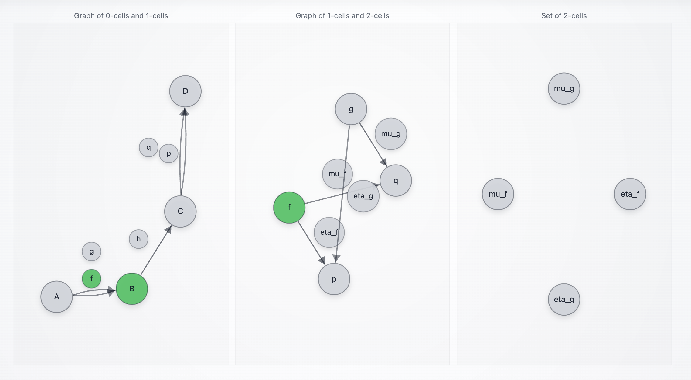
   <span style="vertical-align: middle;">&rarr;</span>
   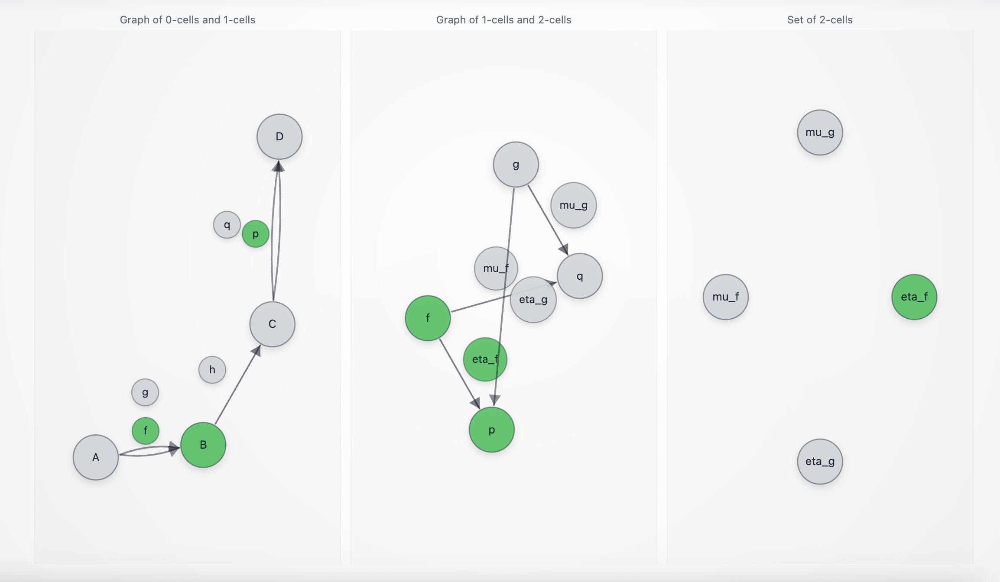
   <span style="vertical-align: middle;">&rarr;</span>
   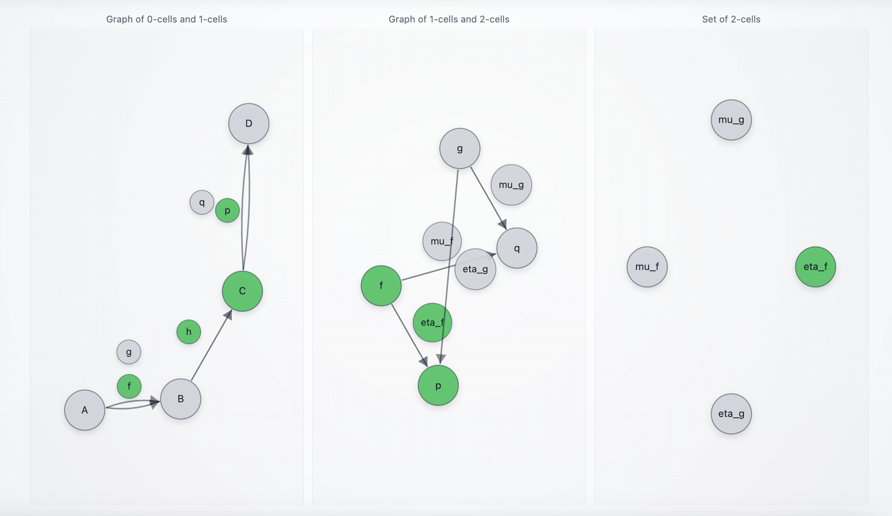
   <span style="vertical-align: middle;">&rarr;</span>
   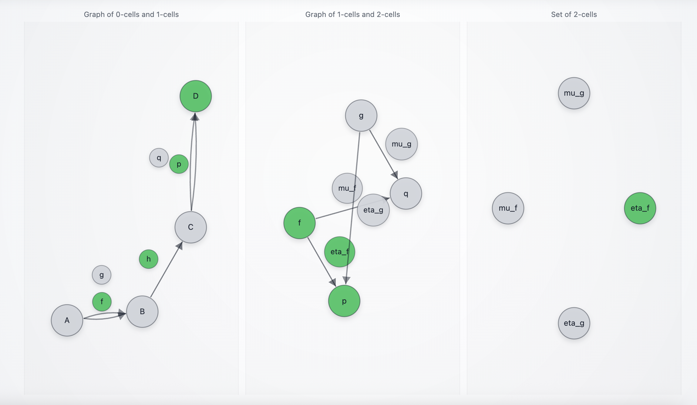
</p>

This is deliberate. Persisting the decision tokens across later stages provides an audit trail without requiring a database or a long-term memory subsystem.

> [!NOTE]
> **Pressing Enter does nothing.** Empty strings are ignored. This prevents accidental advancement during live demos.

> [!NOTE]
> **Chatter does not advance the workflow.** Messages like "Hello how are you?" do not contain incident/policy/ops/feasibility fields, so all relevant arrows stay.

> [!NOTE]
> **`h : B -> C` is not a "proceed" button.** It requires ops readiness information (`ready_to_tender=true`). This is intentional: ops progression is high-stakes and must not be driven by vague text.


## Workflow 1: `(f, eta_f, p)` DC sourcing, expedite intent, premium execution

This is the "DC has stock, downtime is expensive, premium lane is available" path. It is a clean end-to-end demo because each transition is justified by explicit fields, and the agent's final report can be scored against optional ground truth.

### Step 0 (A): irrelevant input does not move

<p align="center">
  
</p>

This step is here to show a hard guardrail: if the message does not carry incident fields, the workflow does not advance.

**Unstructured input:**

```text
> Hello how are you?
```

**Structured input (equivalent, still irrelevant):**

```json
{"message":"Hello how are you?"}
```

**Expected messages:**

```text
[Received] {'message': 'Stayed on A via f (incident insufficient for DC selection, or supplier path better)', 'from': 'CatUpdateAgent_0'}
[Received] {'message': 'Stayed on A via g (incident insufficient for supplier selection, or DC path better)', 'from': 'CatUpdateAgent_0'}
[Received] {'message': 'A processed and forgotten', 'from': 'CatUpdateAgent_0'}
```

**Interpretation:**

* Both `f` and `g` handlers get a chance to react to the same input.
* Neither can extract the minimum incident fields needed to decide a sourcing plan.
* The tape stays at `A`.
* In the visualization, `A` stays green. No decision memory bubbles turn green.


### Step 1 (A): incident selects `f` (DC has stock)

<p align="center">
  
</p>

This is the first "real" business decision: choose between DC (`f`) and supplier (`g`).

**Structured input:**

```json
{"part_id":"AX-773","qty":1,"required_by_hours":10,"line_down":true,"dc_on_hand":1,"supplier_lead_time_hours":36}
```

**Unstructured input (equivalent):**

```text
> Line-down. Need part AX-773 qty 1 within 10 hours. DC has 1 on hand. Supplier lead time is 36h.
```

**Expected messages:**

```text
[Received] {'message': 'Moved A -> B via f (regional DC selected)', 'from': 'CatUpdateAgent_0'}
[Received] {'message': 'Stayed on A via g (incident insufficient for supplier selection, or DC path better)', 'from': 'CatUpdateAgent_0'}
[Received] {'message': 'A processed and forgotten', 'from': 'CatUpdateAgent_0'}
```

**Interpretation:**

* The deterministic rule sees `dc_on_hand >= qty`, so it commits the DC plan.
* `f : A -> B` fires (Move), `g : A -> B` stays.
* The tape moves to `B` (priority keeps `B` as the active object).
* The visualization shows:

  * `B` green (current object state)
  * the bubble `f` green (remembered decision token, kept in `states` as short-term memory)

### Step 2 (B): amendment selects `eta_f` (intent `p`) while ops is not ready yet

<p align="center">
  
</p>

This is the 2-cell decision that attaches policy intent to the chosen plan. Here, we send only policy fields, so the workflow records the amendment but does not progress operationally.

**Structured input (policy fields only):**

```json
{"expedite_budget_usd":1200,"downtime_cost_per_hour_usd":5000,"carrier_capacity_score":0.8,"disruption_risk":"medium"}
```

**Unstructured input (equivalent):**

```text
> Downtime is around $5k/hour and the deadline is 10 hours. Expedite budget is about $1200. Risk medium. Carrier capacity looks decent.
```

**Expected messages:**

```text
[Received] {'message': 'Selected eta_f: expedite authorization (intent -> p)', 'from': 'CatUpdateAgent_0'}
[Received] {'message': 'Stayed on B via h (waiting for ops readiness fields)', 'from': 'CatUpdateAgent_0'}
[Received] {'message': 'B processed and forgotten', 'from': 'CatUpdateAgent_0'}
```

**Interpretation:**

* The amendment logic compares downtime exposure to expedite budget:

  * `downtime_cost_per_hour_usd * required_by_hours >= expedite_budget_usd`
  * `5000 * 10 >= 1200`, so expedite is justified.
* The agent records:

  * `source_choice = f`
  * `amendment_choice = eta_f`
  * `intent_lane = p`
* `h : B -> C` stays because ops readiness was not provided.
* The visualization shows:

  * `B` green (still the active object)
  * `f` green (remembered sourcing choice)
  * `eta_f` green (remembered amendment choice)
  * `p` green (remembered intent lane)

### Step 3 (B): ops readiness triggers `h : B -> C`

<p align="center">
  
</p>

Now we provide the operational readiness signal. This lets the agent progress to `C` without changing the already-recorded amendment intent.

**Structured input (ops readiness only):**

```json
{"ready_to_tender": true}
```

**Unstructured input (equivalent):**

```text
> We are ready to tender. Pick/pack is done and compliance paperwork is complete.
```

**Expected messages:**

```text
[Received] {'message': 'Moved B -> C via h (ops ready: pick/pack + compliance complete)', 'from': 'CatUpdateAgent_0'}
[Received] {'message': 'B processed and forgotten', 'from': 'CatUpdateAgent_0'}
```

**Interpretation:**

* Ops readiness is the minimal condition for `h` in this PoC.
* The tape advances to `C`.
* The visualization shows:

  * `C` green (current object state)
  * `f`, `eta_f`, `p` still green (decision memory bubbles remain visible across later states)

### Variant: Step 2 and Step 3 merged into a single message (policy + ops together)

<p align="center">
   
   <span style="vertical-align: middle;">&rarr;</span>
   
</p>

In practice, policy and ops readiness can arrive together (same event, same payload). This agent supports that: the same input can both (1) select `eta_f` and (2) move `B -> C` via `h`.

#### Merged structured input:

```json
{
  "expedite_budget_usd": 1200,
  "downtime_cost_per_hour_usd": 5000,
  "carrier_capacity_score": 0.8,
  "disruption_risk": "medium",
  "ready_to_tender": true
}
```

#### Merged unstructured input:

```text
> Downtime is $5k/hour, expedite budget is $1200, risk is medium. Also ops is ready to tender, pick/pack and compliance are complete.
```

**Expected messages (typical):**

```text
[Received] {'message': 'Selected eta_f: expedite authorization (intent -> p)', 'from': 'CatUpdateAgent_0'}
[Received] {'message': 'Moved B -> C via h (ops ready: pick/pack + compliance complete)', 'from': 'CatUpdateAgent_0'}
[Received] {'message': 'B processed and forgotten', 'from': 'CatUpdateAgent_0'}
```

**Interpretation:**

* The same payload carries enough fields for both decisions.
* The agent records the 2-cell decision and progresses the 1-cell ops stage in the same "round".
* This shows that the workflow is not fragile with respect to message grouping.

### Step 4 (C): feasibility triggers `p : C -> D`

<p align="center">
  
</p>

Now we provide feasibility. The agent must execute shipping in a way that follows intent (`p`) when feasible.

**Structured input:**

```json
{"premium_mode_available": true, "economy_mode_available": true, "next_milk_run_departure_hours": 6}
```

**Unstructured input (equivalent):**

```text
> Premium courier is available. Economy is also available. Next milk run departs in about 6 hours.
```

**Expected messages:**

```text
[Received] {'message': 'Moved C -> D via p (premium shipment executed)', 'from': 'CatUpdateAgent_0'}
[Received] {'message': 'C processed and forgotten', 'from': 'CatUpdateAgent_0'}
[Received] {'message': 'Stayed on C via q (not chosen, or feasibility missing)', 'from': 'CatUpdateAgent_0'}
```

**Interpretation:**

* The recorded intent is `p`.
* Premium is available, so `p` executes and the tape reaches `D`.
* The full decision trail remains visible as green bubbles, even though the active object becomes `D`.

### Step 5 (D): evaluation input emits the final report

<p align="center">
  
</p>

At `D`, you send one more message. This is the "scoring harness" step. It is where you can:

* provide optional ground truth for automated checks, or
* omit ground truth and still get a closure report.

#### Option A: with ground truth (scored evaluation)

**Structured input with mock ground truth:**

```json
{"ground_truth":{"source_choice":"f","amendment_choice":"eta_f","intent_lane":"p","shipment_lane":"p"}}
```

**Unstructured input (equivalent):**

```text
> Ground truth: source f, amendment eta_f, intent p, shipment p.
```

**Expected messages:**

* A single closure report emitted by the agent (as one `[Received]` message), containing:

  * the final path (`source_choice`, `amendment_choice`, `intent_lane`, `shipment_lane`)
  * the extracted `case`, `policy`, `ops`, `feasibility` fields used
  * evaluation checks showing matches against `ground_truth`

A representative shape (content will match your run's stored fields):

```text
[Received] {'message': "{'scenario': 'critical_spare_part_fulfillment', 'path': {'stage': 'D', 'source_choice': 'f', 'amendment_choice': 'eta_f', 'intent_lane': 'p', 'shipment_lane': 'p', 'exception': None}, 'case': {...}, 'policy': {...}, 'ops': {...}, 'feasibility': {...}, 'evaluation': {'ground_truth_checks': {...}, 'all_matches': True}}", 'from': 'CatUpdateAgent_0'}
```

Example payload emitted by the agent:

```json
{
  "message": {
    "scenario": "critical_spare_part_fulfillment",
    "path": {
      "stage": "D",
      "source_choice": "f",
      "amendment_choice": "eta_f",
      "intent_lane": "p",
      "shipment_lane": "p",
      "exception": null
    },
    "case": {
      "dc_on_hand": 1,
      "line_down": true,
      "part_id": "AX-773",
      "qty": 1,
      "required_by_hours": 10.0,
      "supplier_lead_time_hours": 36.0
    },
    "policy": {
      "disruption_risk": "medium",
      "downtime_cost_per_hour_usd": 5000.0,
      "expedite_budget_usd": 1200.0
    },
    "ops": {
      "compliance_cleared": true,
      "pick_pack_complete": true,
      "ready_to_tender": true
    },
    "feasibility": {
      "economy_mode_available": true,
      "next_milk_run_departure_hours": 6.0,
      "premium_mode_available": true
    },
    "evaluation": {
      "path": {
        "source_choice": "f",
        "amendment_choice": "eta_f",
        "intent_lane": "p",
        "shipment_lane": "p"
      },
      "exception": null,
      "has_exception": false
    }
  },
  "from": "CatUpdateAgent_0"
}
```

**Interpretation:**

* The report makes the workflow auditable: it includes both decisions and the inputs that justified them.
* This is the evaluation loop you can reuse to compare prompt revisions over time:

  * tighten extraction constraints
  * re-run the same scripted messages
  * compare end-to-end outcome and match rates

#### Option B: without ground truth (still valid)

**Structured input without ground truth:**

```json
{"note":"closing case without ground truth"}
```

**Unstructured input (equivalent):**

```text
> Close case. No ground truth for this run.
```

**Expected:**

* The closure report is still emitted, but the evaluation section either:

  * omits `ground_truth_checks`, or
  * marks them as absent / empty, depending on your current code path.

**Interpretation:**

* This is useful when you want the workflow trace but do not have labels.
* The report is still valuable for later offline scoring.


## Workflow 2: `(f, mu_f, q)` DC sourcing, economy intent, economy execution

This is the "DC has stock, but expedite is not justified, so consolidate and ship economy" path. It is the clean counterpart to Workflow 1: same sourcing (`f`), different amendment (`mu_f`) and different final execution (`q`).

### Step 0 (A): irrelevant input does not move

<p align="center">
  
</p>

Same guardrail as Workflow 1. This shows that the agent does not "hallucinate motion" from casual text.

**Unstructured input:**

```text
> Hello how are you?
```

**Structured input (equivalent, still irrelevant):**

```json
{"message":"Hello how are you?"}
```

**Expected messages:**

```text
[Received] {'message': 'Stayed on A via f (incident insufficient for DC selection, or supplier path better)', 'from': 'CatUpdateAgent_0'}
[Received] {'message': 'Stayed on A via g (incident insufficient for supplier selection, or DC path better)', 'from': 'CatUpdateAgent_0'}
[Received] {'message': 'A processed and forgotten', 'from': 'CatUpdateAgent_0'}
```

**Interpretation:**

* No incident fields, so no plan can be committed.
* The tape stays at `A`.

### Step 1 (A): incident selects `f` (DC has stock)

<p align="center">
  
</p>

You can reuse the exact same incident as Workflow 1 to keep the comparison clean.

**Structured input:**

```json
{"part_id":"AX-773","qty":1,"required_by_hours":10,"line_down":true,"dc_on_hand":1,"supplier_lead_time_hours":36}
```

**Unstructured input (equivalent):**

```text
> Line-down. Need part AX-773 qty 1 within 10 hours. DC has 1 on hand. Supplier lead time is 36h.
```

**Expected messages:**

```text
[Received] {'message': 'Moved A -> B via f (regional DC selected)', 'from': 'CatUpdateAgent_0'}
[Received] {'message': 'Stayed on A via g (incident insufficient for supplier selection, or DC path better)', 'from': 'CatUpdateAgent_0'}
[Received] {'message': 'A processed and forgotten', 'from': 'CatUpdateAgent_0'}
```

**Interpretation:**

* `dc_on_hand >= qty` triggers `f`.
* The tape moves to `B`, and the decision token `f` remains green as remembered state.

### Step 2 (B): amendment selects `mu_f` (intent `q`) while ops is not ready yet

<p align="center">
  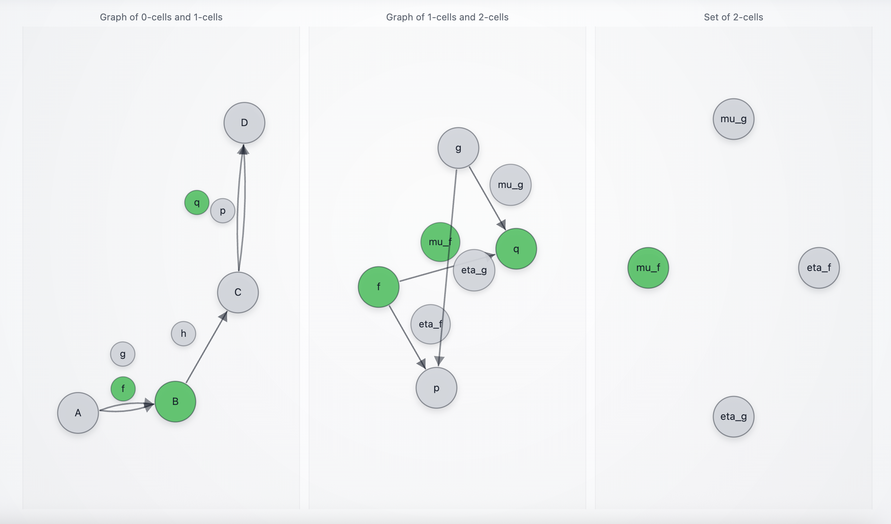
</p>

Here we send policy fields that make expedite unjustified. The key point is that we still have a line-down case, but the policy math makes the "economy" amendment the chosen 2-cell.

**Structured input (policy fields only):**

```json
{"expedite_budget_usd":1200,"downtime_cost_per_hour_usd":50,"carrier_capacity_score":0.9,"disruption_risk":"low"}
```

**Unstructured input (equivalent):**

```text
> Downtime cost is low (around $50/hour). Budget allows expedite up to $1200, but it is not worth it. Risk low. Carrier capacity is strong.
```

**Expected messages:**

```text
[Received] {'message': 'Selected mu_f: consolidation mandate (intent -> q)', 'from': 'CatUpdateAgent_0'}
[Received] {'message': 'Stayed on B via h (waiting for ops readiness fields)', 'from': 'CatUpdateAgent_0'}
[Received] {'message': 'B processed and forgotten', 'from': 'CatUpdateAgent_0'}
```

**Interpretation:**

* The amendment rule compares downtime exposure to expedite budget:

  * `downtime_cost_per_hour_usd * required_by_hours = 50 * 10 = 500`
  * `500 < 1200`, so expedite is not justified in this PoC.
* The agent records:

  * `source_choice = f`
  * `amendment_choice = mu_f`
  * `intent_lane = q`
* `h` stays because ops readiness is not present yet.
* The visualization shows `B` green, plus memory bubbles `f`, `mu_f`, `q` green.

### Step 3 (B): ops readiness triggers `h : B -> C`

<p align="center">
  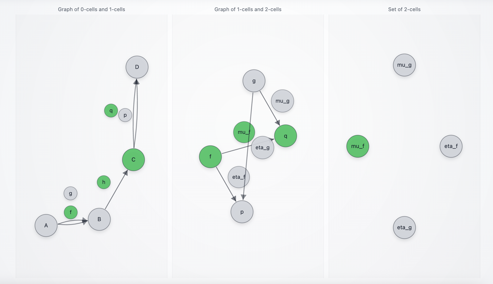
</p>

Now we provide the operational readiness signal that allows the workflow to progress.

**Structured input:**

```json
{"ready_to_tender": true}
```

**Unstructured input (equivalent):**

```text
> We are ready to tender. Pick/pack is done and compliance paperwork is complete.
```

**Expected messages:**

```text
[Received] {'message': 'Moved B -> C via h (ops ready: pick/pack + compliance complete)', 'from': 'CatUpdateAgent_0'}
[Received] {'message': 'B processed and forgotten', 'from': 'CatUpdateAgent_0'}
```

**Interpretation:**

* Ops readiness is sufficient for `h` to fire.
* The tape advances to `C`.
* The decision memory bubbles (`f`, `mu_f`, `q`) remain green across the transition.

### Variant: Step 2 and Step 3 merged into a single message (policy + ops together)

<p align="center">
   
   <span style="vertical-align: middle;">&rarr;</span>
   
</p>

As in Workflow 1, policy and ops readiness can arrive in a single payload. This often happens in real processes (the same operational update includes a managerial stance on cost vs speed).

#### Merged structured input:

```json
{
  "expedite_budget_usd": 1200,
  "downtime_cost_per_hour_usd": 50,
  "carrier_capacity_score": 0.9,
  "disruption_risk": "low",
  "ready_to_tender": true
}
```

#### Merged unstructured input:

```text
> Downtime cost is about $50/hour, expedite budget is $1200 but not worth using. Risk is low, carrier capacity is strong. Ops is ready to tender.
```

**Expected messages (typical):**

```text
[Received] {'message': 'Selected mu_f: consolidation mandate (intent -> q)', 'from': 'CatUpdateAgent_0'}
[Received] {'message': 'Moved B -> C via h (ops ready: pick/pack + compliance complete)', 'from': 'CatUpdateAgent_0'}
[Received] {'message': 'B processed and forgotten', 'from': 'CatUpdateAgent_0'}
```

**Interpretation:**

* Same payload triggers both the 2-cell selection and the `B -> C` operational progression.

### Step 4 (C): feasibility triggers `q : C -> D`

<p align="center">
  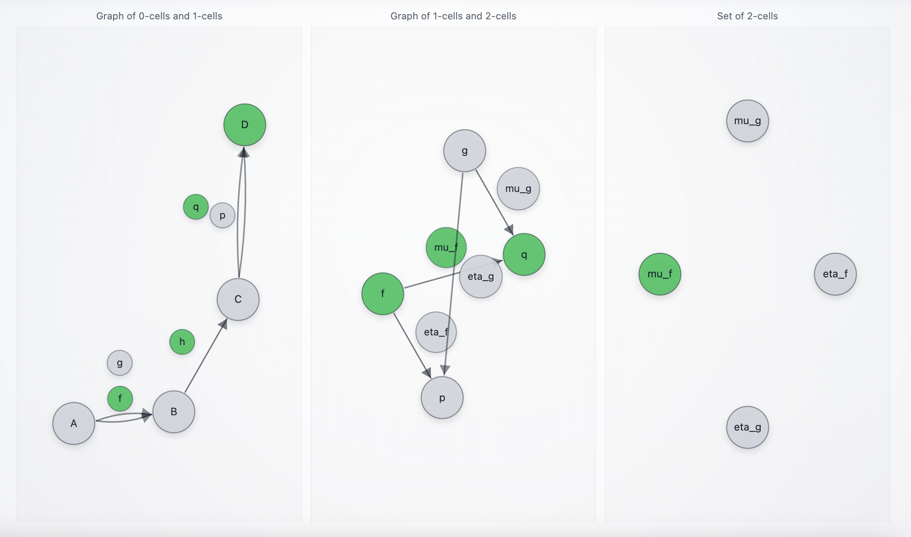
</p>

Now we provide feasibility. Since the recorded intent is `q`, and economy is available, the agent executes economy shipment.

**Structured input:**

```json
{"premium_mode_available": true, "economy_mode_available": true}
```

**Unstructured input (equivalent):**

```text
> Economy shipping is available. Premium is also available if we needed it.
```

**Expected messages:**

```text
[Received] {'message': 'Stayed on C via p (not chosen, or feasibility missing)', 'from': 'CatUpdateAgent_0'}
[Received] {'message': 'Moved C -> D via q (economy shipment executed)', 'from': 'CatUpdateAgent_0'}
[Received] {'message': 'C processed and forgotten', 'from': 'CatUpdateAgent_0'}
```

**Interpretation:**

* Intent is `q`, economy is available, so `q` executes.
* Tape reaches `D`.
* Visualization shows `D` green, and the remembered decision trail stays green (`f`, `mu_f`, `q`).

### Step 5 (D): evaluation input emits the final report

<p align="center">
  
</p>

At `D`, send one additional message to obtain the closure report and optional scoring.

#### Option A: with ground truth (recommended)

**Structured input:**

```json
{"ground_truth":{"source_choice":"f","amendment_choice":"mu_f","intent_lane":"q","shipment_lane":"q"}}
```

**Unstructured input (equivalent):**

```text
> Ground truth: source f, amendment mu_f, intent q, shipment q.
```

**Expected:**

* One final closure report (as a single `[Received]` message) containing:

  * the full path taken
  * the extracted fields that drove each decision
  * evaluation checks showing all matches

#### Option B: without ground truth (still valid)

**Structured input:**

```json
{"note":"closing case without ground truth"}
```

**Expected:**

* A closure report is still emitted, but evaluation checks are absent or empty.


<!-- **What you narrate here:**

* Workflow 2 is the "cost discipline" variant of Workflow 1.
* It is the same sourcing plan (`f`), but the policy amendment flips the intent lane (`q`) and the execution follows it.
* This is exactly the kind of controlled delta you can use to demonstrate how policy prompts, extraction constraints, or thresholds change the end-to-end outcome in a measurable way. -->


## Workflow 3: `(g, eta_g, p)` Supplier sourcing, expedite intent, premium execution

This is the "DC cannot cover quantity, supplier is the plan, but downtime risk justifies expedite" path. This shows that the workflow can choose supplier sourcing without losing the ability to attach an expedite intent and still execute premium shipping when feasible.

### Step 0 (A): irrelevant input does not move

<p align="center">
  
</p>

Same guardrail as the other workflows.

**Unstructured input:**

```text
> Hello how are you?
```

**Structured input (equivalent, still irrelevant):**

```json
{"message":"Hello how are you?"}
```

**Expected messages:**

```text
[Received] {'message': 'Stayed on A via f (incident insufficient for DC selection, or supplier path better)', 'from': 'CatUpdateAgent_0'}
[Received] {'message': 'Stayed on A via g (incident insufficient for supplier selection, or DC path better)', 'from': 'CatUpdateAgent_0'}
[Received] {'message': 'A processed and forgotten', 'from': 'CatUpdateAgent_0'}
```

**Interpretation:**

* No incident fields, no sourcing plan.
* Tape stays at `A`.

### Step 1 (A): incident selects `g` (DC stock is insufficient)

<p align="center">
  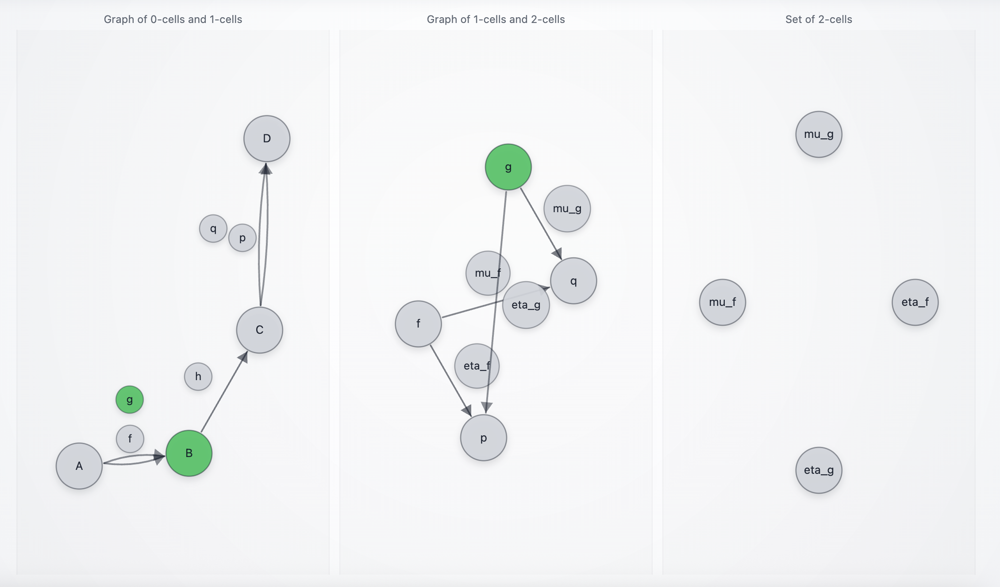
</p>

Here the quantity requirement forces supplier sourcing because DC on-hand cannot cover.

**Structured input:**

```json
{"part_id":"AX-773","qty":2,"required_by_hours":10,"line_down":true,"dc_on_hand":1,"supplier_lead_time_hours":36}
```

**Unstructured input (equivalent):**

```text
> Line-down. Need part AX-773 qty 2 within 10 hours. DC only has 1 on hand. Supplier lead time is 36h.
```

**Expected messages:**

```text
[Received] {'message': 'Stayed on A via f (incident insufficient for DC selection, or supplier path better)', 'from': 'CatUpdateAgent_0'}
[Received] {'message': 'Moved A -> B via g (supplier selected)', 'from': 'CatUpdateAgent_0'}
[Received] {'message': 'A processed and forgotten', 'from': 'CatUpdateAgent_0'}
```

**Interpretation:**

* `dc_on_hand < qty`, so `f` cannot justify the DC plan.
* Supplier lead time exists, so `g` is viable and is selected.
* Tape moves to `B`.
* Visualization shows `B` green and the decision bubble `g` green as remembered state.

### Step 2 (B): amendment selects `eta_g` (intent `p`) while ops is not ready yet

<p align="center">
  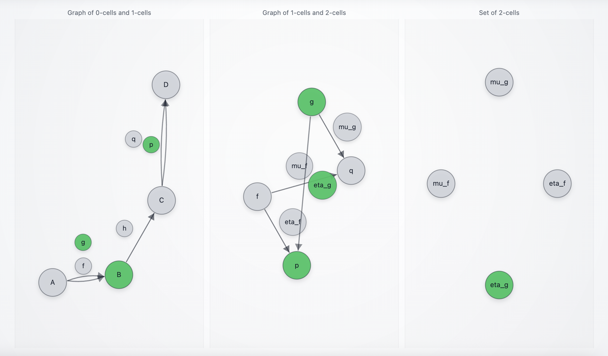
</p>

Now we attach an expedite clause to the supplier plan. This is the 2-cell selection conditioned on having chosen `g`.

**Structured input (policy fields only):**

```json
{"expedite_budget_usd":700,"downtime_cost_per_hour_usd":5000,"carrier_capacity_score":0.3,"disruption_risk":"high"}
```

**Unstructured input (equivalent):**

```text
> Downtime is about $5k/hour. We can spend up to $700 to expedite. Risk is high and carrier capacity is tight.
```

**Expected messages:**

```text
[Received] {'message': 'Selected eta_g: supplier expedite clause (intent -> p)', 'from': 'CatUpdateAgent_0'}
[Received] {'message': 'Stayed on B via h (waiting for ops readiness fields)', 'from': 'CatUpdateAgent_0'}
[Received] {'message': 'B processed and forgotten', 'from': 'CatUpdateAgent_0'}
```

**Interpretation:**

* The amendment rule compares downtime exposure to expedite budget:

  * `downtime_cost_per_hour_usd * required_by_hours = 5000 * 10 = 50000`
  * `50000 >= 700`, so expedite is justified.
* The agent records:

  * `source_choice = g`
  * `amendment_choice = eta_g`
  * `intent_lane = p`
* `h` stays because ops readiness is not present yet.
* Visualization shows `B` green, plus memory bubbles `g`, `eta_g`, `p` green.

### Step 3 (B): ops readiness triggers `h : B -> C`

<p align="center">
  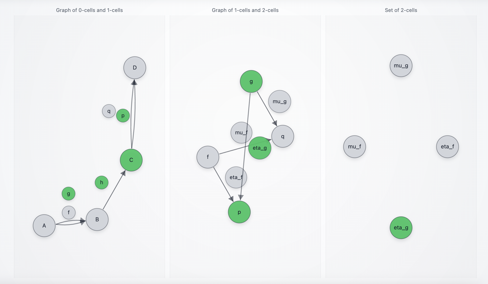
</p>

Now we provide the operational readiness signal.

**Structured input:**

```json
{"ready_to_tender": true}
```

**Unstructured input (equivalent):**

```text
> Ready to tender. Pick/pack is complete and compliance checks are done.
```

**Expected messages:**

```text
[Received] {'message': 'Moved B -> C via h (ops ready: pick/pack + compliance complete)', 'from': 'CatUpdateAgent_0'}
[Received] {'message': 'B processed and forgotten', 'from': 'CatUpdateAgent_0'}
```

**Interpretation:**

* Tape advances to `C`.
* Memory bubbles remain green (`g`, `eta_g`, `p`).

### Variant: Step 2 and Step 3 merged into a single message (policy + ops together)

<p align="center">
   
   <span style="vertical-align: middle;">&rarr;</span>
   
</p>

This is common operationally: a manager's policy call and the readiness state are communicated in the same update.

#### Merged structured input:

```json
{
  "expedite_budget_usd": 700,
  "downtime_cost_per_hour_usd": 5000,
  "carrier_capacity_score": 0.3,
  "disruption_risk": "high",
  "ready_to_tender": true
}
```

#### Merged unstructured input:

```text
> Downtime is $5k/hour, expedite budget is $700, risk high, carrier capacity is tight. Also ops is ready to tender.
```

**Expected messages (typical):**

```text
[Received] {'message': 'Selected eta_g: supplier expedite clause (intent -> p)', 'from': 'CatUpdateAgent_0'}
[Received] {'message': 'Moved B -> C via h (ops ready: pick/pack + compliance complete)', 'from': 'CatUpdateAgent_0'}
[Received] {'message': 'B processed and forgotten', 'from': 'CatUpdateAgent_0'}
```

**Interpretation:**

* One payload triggers both the 2-cell selection and the ops progression.

### Step 4 (C): feasibility triggers `p : C -> D`

<p align="center">
  
</p>

Now we provide feasibility. Since intent is `p`, premium shipping executes if premium is available.

**Structured input:**

```json
{"premium_mode_available": true, "economy_mode_available": true}
```

**Unstructured input (equivalent):**

```text
> Premium shipping is available. Economy is also available.
```

**Expected messages:**

```text
[Received] {'message': 'Moved C -> D via p (premium shipment executed)', 'from': 'CatUpdateAgent_0'}
[Received] {'message': 'C processed and forgotten', 'from': 'CatUpdateAgent_0'}
[Received] {'message': 'Stayed on C via q (not chosen, or feasibility missing)', 'from': 'CatUpdateAgent_0'}
```

**Interpretation:**

* Intent is `p` and premium is available, so `p` executes.
* Tape reaches `D`.
* Visualization shows `D` green and the full decision trail stays green (`g`, `eta_g`, `p`).

### Step 5 (D): evaluation input emits the final report

<p align="center">
  
</p>

Send one additional message at `D` to get the closure report and optional scoring.

#### Option A: with ground truth (recommended)

**Structured input:**

```json
{"ground_truth":{"source_choice":"g","amendment_choice":"eta_g","intent_lane":"p","shipment_lane":"p"}}
```

**Unstructured input (equivalent):**

```text
> Ground truth: source g, amendment eta_g, intent p, shipment p.
```

**Expected:**

* One closure report emitted (single `[Received]` message) including:

  * the path taken
  * extracted fields (`case`, `policy`, `ops`, `feasibility`)
  * evaluation checks showing all matches

#### Option B: without ground truth

**Structured input:**

```json
{"note":"closing case without ground truth"}
```

**Expected:**

* Closure report still emitted, evaluation checks absent or empty.

<!-- **What you narrate here:**

* Workflow 3 is the "supplier path under pressure" case.
* The agent still uses a higher-order amendment (`eta_g`) to commit expedite intent, even though sourcing is supplier rather than DC.
* This is a direct illustration of why 2-cells matter: the policy choice is attached to the chosen transition, and it drives later execution. -->


## Workflow 4: `(g, mu_g, q)` Supplier sourcing, economy intent, economy execution

This is the "supplier plan with standard clause" path. It mirrors Workflow 3 (supplier sourcing) but flips the amendment: instead of expedite intent, we attach the standard clause (`mu_g`) and commit an economy intent (`q`). In the context of our simulation scenario, this is the clean "supplier + cost discipline" baseline.

### Step 0 (A): irrelevant input does not move

<p align="center">
  
</p>

Same guardrail as the other workflows.

**Unstructured input:**

```text
> Hello how are you?
```

**Structured input (equivalent, still irrelevant):**

```json
{"message":"Hello how are you?"}
```

**Expected messages:**

```text
[Received] {'message': 'Stayed on A via f (incident insufficient for DC selection, or supplier path better)', 'from': 'CatUpdateAgent_0'}
[Received] {'message': 'Stayed on A via g (incident insufficient for supplier selection, or DC path better)', 'from': 'CatUpdateAgent_0'}
[Received] {'message': 'A processed and forgotten', 'from': 'CatUpdateAgent_0'}
```

**Interpretation:**

* No incident fields, no sourcing plan.
* Tape stays at `A`.

### Step 1 (A): incident selects `g` (DC stock is insufficient)

<p align="center">
  
</p>

Reuse the same incident as Workflow 3 so the only delta is policy.

**Structured input:**

```json
{"part_id":"AX-773","qty":2,"required_by_hours":10,"line_down":true,"dc_on_hand":1,"supplier_lead_time_hours":36}
```

**Unstructured input (equivalent):**

```text
> Line-down. Need part AX-773 qty 2 within 10 hours. DC only has 1 on hand. Supplier lead time is 36h.
```

**Expected messages:**

```text
[Received] {'message': 'Stayed on A via f (incident insufficient for DC selection, or supplier path better)', 'from': 'CatUpdateAgent_0'}
[Received] {'message': 'Moved A -> B via g (supplier selected)', 'from': 'CatUpdateAgent_0'}
[Received] {'message': 'A processed and forgotten', 'from': 'CatUpdateAgent_0'}
```

**Interpretation:**

* `dc_on_hand < qty` blocks `f`.
* Supplier lead time exists, so `g` is selected.
* Tape moves to `B`.
* Visualization shows `B` green, and `g` green as a remembered decision token.

### Step 2 (B): amendment selects `mu_g` (intent `q`) while ops is not ready yet

<p align="center">
  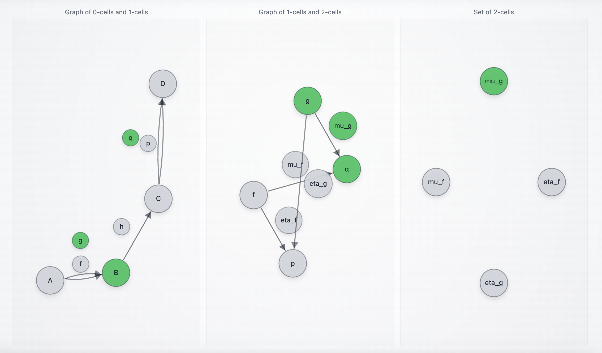
</p>

Here the policy payload is "economy leaning": downtime cost is low and risk is low, so expedite is not justified.

**Structured input (policy fields only):**

```json
{"expedite_budget_usd":700,"downtime_cost_per_hour_usd":50,"carrier_capacity_score":0.8,"disruption_risk":"low"}
```

**Unstructured input (equivalent):**

```text
> Downtime cost is low (around $50/hour). Budget allows expedite up to $700 but it is not worth it. Risk is low. Carrier capacity looks fine.
```

**Expected messages:**

```text
[Received] {'message': 'Selected mu_g: standard clause (intent -> q)', 'from': 'CatUpdateAgent_0'}
[Received] {'message': 'Stayed on B via h (waiting for ops readiness fields)', 'from': 'CatUpdateAgent_0'}
[Received] {'message': 'B processed and forgotten', 'from': 'CatUpdateAgent_0'}
```

**Interpretation:**

* The amendment rule compares downtime exposure to expedite budget:

  * `downtime_cost_per_hour_usd * required_by_hours = 50 * 10 = 500`
  * `500 < 700`, so expedite is not justified in this PoC.
* The agent records:

  * `source_choice = g`
  * `amendment_choice = mu_g`
  * `intent_lane = q`
* `h` stays because ops readiness is not present yet.
* Visualization shows `B` green plus memory bubbles `g`, `mu_g`, `q` green.

### Step 3 (B): ops readiness triggers `h : B -> C`

<p align="center">
  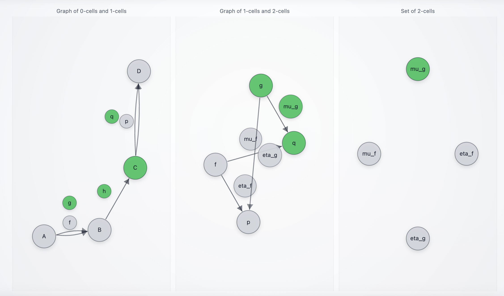
</p>

Now we provide the operational readiness signal.

**Structured input:**

```json
{"ready_to_tender": true}
```

**Unstructured input (equivalent):**

```text
> Ready to tender. Pick/pack is complete and compliance checks are done.
```

**Expected messages:**

```text
[Received] {'message': 'Moved B -> C via h (ops ready: pick/pack + compliance complete)', 'from': 'CatUpdateAgent_0'}
[Received] {'message': 'B processed and forgotten', 'from': 'CatUpdateAgent_0'}
```

**Interpretation:**

* Tape advances to `C`.
* Memory bubbles remain green (`g`, `mu_g`, `q`).

### Variant: Step 2 and Step 3 merged into a single message (policy + ops together)

<p align="center">
   
   <span style="vertical-align: middle;">&rarr;</span>
   
</p>

This is often the most realistic: the same update includes "do not expedite" plus "ready to tender".

#### Merged structured input:

```json
{
  "expedite_budget_usd": 700,
  "downtime_cost_per_hour_usd": 50,
  "carrier_capacity_score": 0.8,
  "disruption_risk": "low",
  "ready_to_tender": true
}
```

#### Merged unstructured input:

```text
> Downtime is low at $50/hour, expedite budget is $700 but not worth using. Risk low, carrier capacity fine. Ops is ready to tender.
```

**Expected messages (typical):**

```text
[Received] {'message': 'Selected mu_g: standard clause (intent -> q)', 'from': 'CatUpdateAgent_0'}
[Received] {'message': 'Moved B -> C via h (ops ready: pick/pack + compliance complete)', 'from': 'CatUpdateAgent_0'}
[Received] {'message': 'B processed and forgotten', 'from': 'CatUpdateAgent_0'}
```

**Interpretation:**

* One payload triggers both `mu_g` and `h`.

### Step 4 (C): feasibility triggers `q : C -> D`

<p align="center">
  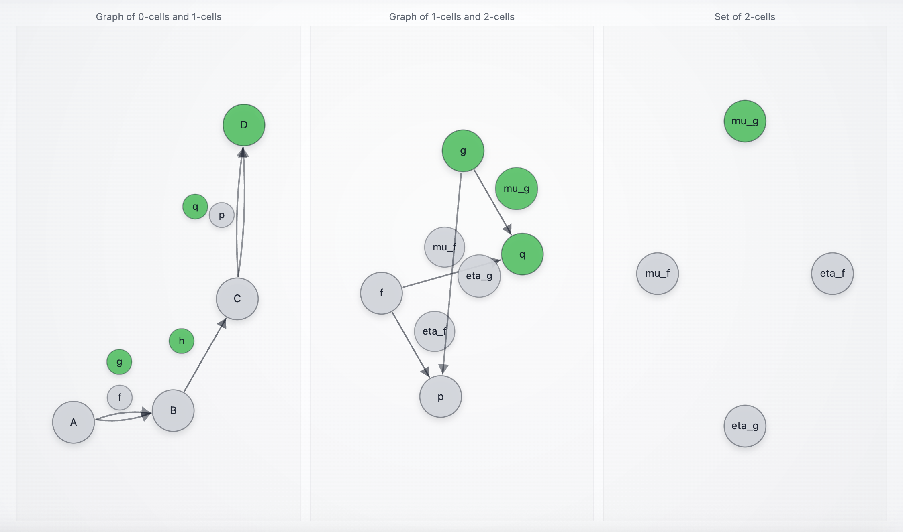
</p>

Now we provide feasibility. Since intent is `q`, economy shipping executes if economy is available.

**Structured input:**

```json
{"premium_mode_available": true, "economy_mode_available": true}
```

**Unstructured input (equivalent):**

```text
> Economy shipping is available. Premium is also available if needed.
```

**Expected messages:**

```text
[Received] {'message': 'Stayed on C via p (not chosen, or feasibility missing)', 'from': 'CatUpdateAgent_0'}
[Received] {'message': 'Moved C -> D via q (economy shipment executed)', 'from': 'CatUpdateAgent_0'}
[Received] {'message': 'C processed and forgotten', 'from': 'CatUpdateAgent_0'}
```

**Interpretation:**

* Intent is `q`, economy is available, so `q` executes.
* Tape reaches `D`.
* Visualization shows `D` green and the full decision trail stays green (`g`, `mu_g`, `q`).

### Step 5 (D): evaluation input emits the final report

<p align="center">
  
</p>

Send one additional message at `D` to emit the closure report and (optionally) score it.

#### Option A: with ground truth (recommended)

**Structured input:**

```json
{"ground_truth":{"source_choice":"g","amendment_choice":"mu_g","intent_lane":"q","shipment_lane":"q"}}
```

**Unstructured input (equivalent):**

```text
> Ground truth: source g, amendment mu_g, intent q, shipment q.
```

**Expected:**

* One closure report (single `[Received]` message) including:

  * the full path `(g, mu_g, q)`
  * the extracted fields that drove each decision
  * evaluation checks showing all matches

#### Option B: without ground truth (still valid)

**Structured input:**

```json
{"note":"closing case without ground truth"}
```

**Expected:**

* Closure report still emitted, evaluation checks absent or empty.

<!-- **What you narrate here:**

* Workflow 4 is the "supplier + standard clause" baseline.
* It is especially useful when investors ask "what happens when you do not expedite?" because it shows a stable path from sourcing to execution that still records policy intent explicitly, and it remains auditable in the final report. -->


## Workflow variants and edge cases

This section contains variants and edge cases for the situations explored above. Each section covers questions people usually ask when they try to stress the workflow:

* What happens if signals arrive out of order?
* Can one update legitimately advance multiple stages?
* Does the agent stay put on irrelevant or low-information messages?
* What happens when the intended shipping lane is infeasible?


### Variant 1: mixed payload at `B` (policy + ops readiness in the same message)

This is the most realistic operational pattern: a single status update contains both a service-level decision and an ops readiness signal.

At `B`, send:

```json
{
  "expedite_budget_usd": 1200,
  "downtime_cost_per_hour_usd": 5000,
  "disruption_risk": "medium",
  "carrier_capacity_score": 0.8,
  "ready_to_tender": true
}
```

Expected:

* the 2-cell amendment fires (`eta_*` or `mu_*`, depending on the numbers)
* `h : B -> C` fires in the same round (because readiness is present)
* the tape resolves to `C` by priority (you should see `C` win over `B`)

Typical message pattern:

```text
[Received] {'message': 'Selected eta_f: expedite authorization (intent -> p)', 'from': 'CatUpdateAgent_0'}
[Received] {'message': 'Moved B -> C via h (ops ready: pick/pack + compliance complete)', 'from': 'CatUpdateAgent_0'}
[Received] {'message': 'B processed and forgotten', 'from': 'CatUpdateAgent_0'}
```

Interpretation:

* The agent supports **co-trigger**: "record the amendment" and "advance ops stage" can be captured from the same payload.
* The tape remains consistent because `download_states()` enforces object priority (`C > B > A`).

### Variant 2: feasibility arrives too early (before `C`)

If you send feasibility fields while the tape is still at `B`, expected behavior is:

* nothing moves to `D` (because `p/q : C -> D` are only meaningful at `C`)
* feasibility may be extracted and stored, but it is not acted on until `C`

Example (sent too early at `B`):

```json
{"premium_mode_available": true, "economy_mode_available": true, "next_milk_run_departure_hours": 6}
```

Interpretation:

* This is a deliberate safety property: shipping execution is gated by ops readiness and the `C` stage.
* In a demo, this is a useful moment to emphasize that the agent is **path-dependent**, not "LLM-reactive".

### Variant 3: missing ops readiness blocks progression (no accidental `h`)

If you never send:

```json
{"ready_to_tender": true}
```

then you should never reach `C` or `D`, even if:

* sourcing (`f/g`) is selected
* policy amendment (`eta_*` or `mu_*`) is selected
* feasibility indicates both lanes are available

Interpretation:

* Ops readiness is treated as a hard gate in this PoC.
* This prevents "pretty policy + feasibility" from bypassing operational reality.

### Variant 4: empty messages do not advance

At any stage, pressing Enter should do nothing.

Expected:

* no arrow moves
* you may still see harmless "Stayed on …" traces, but **no state progression**

If you see advancement on empty messages, treat it as a bug. The usual cause is letting `""` be treated as meaningful content in an extraction call.

## Feasibility overrides at `C`

These are not new workflows. They are deviations at the final decision because the world contradicts the committed intent.

### Override 1: intent is premium (`p`), but premium is unavailable, force economy (`q`)

At `C`, send:

```json
{"premium_mode_available": false, "economy_mode_available": true, "next_milk_run_departure_hours": 2}
```

Expected:

* the agent executes `q`
* the closure report contains an `exception` explaining the override

Interpretation:

* This corresponds to real conditions like carrier capacity collapse, embargo, weather shutdown, or premium lane saturation.
* This is a high-signal moment: the system shows **policy intent** versus **execution feasibility**, and records the mismatch explicitly.

### Override 2: intent is economy (`q`), but economy is unavailable, force premium (`p`)

At `C`, send:

```json
{"premium_mode_available": true, "economy_mode_available": false}
```

Expected:

* the agent executes `p`
* the closure report contains an `exception`

Interpretation:

* This corresponds to missed milk-run cutoff, consolidation window closed, economy lane paused, or a compliance rule forcing a faster lane.

### Override 3: neither lane is available (hard block)

At `C`, send:

```json
{"premium_mode_available": false, "economy_mode_available": false}
```

Expected:

* the agent stays on `C` (cannot ship)
* no closure report is emitted because `D` is never reached

Interpretation:

* In a fuller demo, this would branch to escalation (alternate carriers, manual approval, re-plan).
* In this PoC, it cleanly blocks without inventing an outcome.

## Restart after the final report

After you reach `D` and send the final evaluation input (or a closure trigger without ground truth), the agent emits the final report **once**, then resets internal memory.

Expected:

* next message starts a clean new case
* re-anchors on:

  * `states = [Node("A")]`

Why this matters for this demo:

* You can run the same workflow repeatedly while changing prompts or constraints.
* That makes it possible to compare "before/after" extraction prompt revisions using the same evaluation harness.
