# `CatUpdate_1`

A minimal Summoner client (built on [`CatUpdateAgent_0`](../../agent_CatUpdateAgent_0)) that traverses a **2-categorical supply-chain workflow** and exposes its current position through a **globular** graph visualization.

This agent is meant as a PoC for **production presentation concerns**:

* **Public tape / viz labels** should be stable and readable (what operators and other agents see).
* **Internal logic labels** can stay compact and canonical (what the automaton uses for reasoning, reporting, and evaluation).
* **Agent behavior can be optimized** by swapping strategies at the **2-cell level** (transitions between transitions).

The workflow structure, behavior, and scenarios are the same as [`CatUpdateAgent_0`](../../agent_CatUpdateAgent_0). The revealed difference in `CatUpdate_1` is that it splits **label space** into:

* a **public label space** (used for DNA, viz, and tape exchange), and
* an **internal canonical label space** (used for deterministic logic, logs, closure reports, and evaluation).

The agent listens on category-structured routes (four objects, five 1-cells, and four 2-cells), calls an LLM to **extract** structured incident and logistics fields (see [`llm_call.py`](./llm_call.py)), and uses a deterministic **automaton** to decide traversal of both **transitions** (1-cells) and **transitions between transitions** (2-cells) (see [`agent.py`](./agent.py)). It renders the current position in a browser window where **objects are nodes**, **arrows are directed edges**, and **arrow labels are circled bubbles attached to edges** (see [`summoner_web_viz.py`](./summoner_web_viz.py)).

### Public labels vs internal labels

This agent maintains **internal canonical tokens** for logic and reporting, while exposing a **public label space** for:

* Summoner DNA graph reconstruction
* the browser visualization
* tape state exchange with other agents

### Mapping table

| Meaning | Internal token | Public token (DNA/viz/tape) |
|---|---:|---:|
| Intake stage | `A` | `Intake` |
| Plan stage | `B` | `Plan` |
| Ready stage | `C` | `Ready` |
| Delivered stage | `D` | `Delivered` |
| DC sourcing (A→B) | `f` | `DC` |
| Supplier sourcing (A→B) | `g` | `supp` |
| Ops progression (B→C) | `h` | `proc` |
| Premium ship (C→D) | `p` | `prem` |
| Economy ship (C→D) | `q` | `eco` |
| 2-cell: DC expedite intent (f→p) | `eta_f` | `a` |
| 2-cell: DC economy intent (f→q) | `mu_f` | `b` |
| 2-cell: Supplier expedite intent (g→p) | `eta_g` | `c` |
| 2-cell: Supplier economy intent (g→q) | `mu_g` | `d` |

Important consequences:

* **Outgoing trace messages** (the `[Received] ...` strings) still use the **internal** names in their phrasing (compact logs like `A -> B via f`, `Selected eta_f`, etc).
* The **graph and bubbles** in the browser use the **public** names (`Intake`, `Plan`, `DC`, `a`, `prem`, etc).
* The **closure report** is internal-facing: it reports `source_choice=f/g`, `amendment_choice=eta_*/mu_*`, `intent_lane=p/q`, `shipment_lane=p/q`.

### Workflow graph

For the full semantics and scenarios, see [`CatUpdateAgent_0`](../../agent_CatUpdateAgent_0). Below is the same workflow, rewritten to show **both label spaces**.

**Objects:**

* `Intake (A)`: incident intake (line-down risk / critical spare-part request)
* `Plan (B)`: committed supply plan (source chosen, promise computed)
* `Ready (C)`: shipment ready (pick/pack/compliance complete, ready to tender)
* `Delivered (D)`: delivered + evaluation (terminal output depends on full history)

**1-cells:**

```text
Intake (A) --[ DC   (f) ]--> Plan (B)
Intake (A) --[ supp (g) ]--> Plan (B)
Plan   (B) --[ proc (h) ]--> Ready (C)
Ready  (C) --[ prem (p) ]--> Delivered (D)
Ready  (C) --[ eco  (q) ]--> Delivered (D)
````

**2-cells (transitions between transitions):**

If the agent chose `DC (f)`:

```text
DC (f) --[ a (eta_f) ]--> prem (p)
DC (f) --[ b (mu_f)  ]--> eco  (q)
```

If the agent chose `supp (g)`:

```text
supp (g) --[ c (eta_g) ]--> prem (p)
supp (g) --[ d (mu_g)  ]--> eco  (q)
```

> [!IMPORTANT]
> **OpenAI credentials required.** The agent calls `load_dotenv()` and expects an environment variable named `OPENAI_API_KEY`. Put a `.env` file at the **project root** (or set the variable in your shell/CI) so it is available at runtime:
>
> * **.env:**
>   `OPENAI_API_KEY=sk-...your_key...`
>
> * **macOS/Linux terminal:**
>   `export OPENAI_API_KEY="sk-...your_key..."`
>
> * **Windows (PowerShell) terminal:**
>   `$env:OPENAI_API_KEY="sk-...your_key..."`
>
> If the key is missing, the agent will raise: `ValueError("Missing api_key (pass api_key=... or set OPENAI_API_KEY).")`.


## Behavior

<details>
<summary><b>(Click to expand)</b> The agent goes through these steps:</summary>
<br>

### 1) Startup and memory model

On startup, the agent initializes:

* **Public tape state**:

  * `states = [Node("Intake")]`

* **Internal memory** (protected by `mem_lock`):

  * `case`: incident fields (part, urgency, stock signals)
  * `policy`: amendment fields (budget, downtime cost, risk, capacity)
  * `ops`: readiness fields that allow `proc (h) : Plan (B) -> Ready (C)` to progress
  * `feas`: shipping feasibility fields at `Ready (C)`
  * `history`: path-dependent trace (internal canonical labels)

    * `stage ∈ {A,B,C,D}`
    * `source_choice ∈ {f,g}`
    * `amendment_choice ∈ {eta_f,mu_f,eta_g,mu_g}`
    * `intent_lane ∈ {p,q}` (set by the 2-cell)
    * `shipment_lane ∈ {p,q}` (chosen at Ready→Delivered)
    * `exception` (if execution had to override intent)
    * `intent_strategy` (records which strategy set intent)
    * `evaluation` (stored at Delivered)

### 2) Tape states vs review display states (key production idea)

This agent separates:

* **Tape states** (what Summoner exchanges between agents):

  * minimal and stable: `[current_object]` plus (once known) the sourcing token
  * concretely, upload returns:

    * `Intake (A)` only at stage A
    * `Plan (B) + (DC (f) or supp (g))` at stages B/C/D

* **Display states** (what the operator sees in the browser):

  * tape states plus a **history snapshot** of decisions:

    * `DC/supp (f/g)`, `a/b/c/d (eta_*/mu_*)`, `prem/eco (p/q)`
    * plus `proc (h)` shown once the workflow passed Plan (at Ready/Delivered)

This is intentional:

* other agents do not need every bubble to coordinate
* operators do want a compact audit trail visible at a glance

### 3) Extraction is stage-aware and gated

The LLM is used for **extraction only**, and only when a message has stage-relevant cues.

* Incident extraction:

  * fast deterministic parsing for common phrases (part id, qty, within hours, DC on hand, lead time, line-down)
  * LLM only if the text looks incident-like

* Policy, ops, feasibility extraction:

  * hard gating: if the text does not contain relevant keywords, extraction returns `{}` without calling the LLM

Empty strings are ignored (pressing Enter does nothing).

### 4) Decisions

#### A→B sourcing (`f` vs `g`) / (`DC` vs `supp`)

Minimal incident fields:

* `part_id`, `qty`, `required_by_hours`
* `dc_on_hand`, `supplier_lead_time_hours`
* `line_down`

Rule (PoC):

* choose `f` (`DC`) if `dc_on_hand >= qty`
* else choose `g` (`supp`) if `supplier_lead_time_hours` exists
* else stay at `A` (`Intake`)

#### 2-cell amendment (conditioned on source)

Once source exists (stage `B` / `Plan`), the agent can select a policy amendment.

Hard guardrail:

* **If no policy fields were extracted, no amendment is chosen.**

Intent decision is strategy-aware (see below). Only the matching 2-cell fires:

* if intent resolves to `p` (`prem`), choose `eta_*` (public `a` or `c`)
* if intent resolves to `q` (`eco`), choose `mu_*` (public `b` or `d`)

#### B→C ops progression (`h`) / (`proc`)

Ops readiness fields:

* `ready_to_tender` or both `pick_pack_complete` and `compliance_cleared`

Rule:

* advance to `C` (`Ready`) only if `_ops_ready()` is true
* otherwise stay at `B` (`Plan`)

#### C→D execution (`p` vs `q`) / (`prem` vs `eco`)

Feasibility fields:

* `premium_mode_available`, `economy_mode_available`

Rule:

* follow `intent_lane` (`p`/`q`) when feasible
* else override if the opposite lane is feasible and record `exception`
* if feasibility is missing, stay at `C` (`Ready`)

### 5) Strategy knob for intent at the 2-cell level

The 2-cell decision can run with one of two strategies:

* `strict`:

  * primary economic check: `downtime_cost_per_hour_usd * required_by_hours >= expedite_budget_usd`
  * additional reliability veto using `carrier_capacity_score` and `disruption_risk`
* `ev` (expected value):

  * estimates probability of on-time execution from capacity and risk
  * compares an expected downtime exposure to budget

The chosen strategy is stored in `history.intent_strategy`, and the evaluation step can compute a **counterfactual**: "would switching strategies have matched ground truth intent/amendment?"

### 6) Terminal evaluation at Delivered (D)

At `Delivered (D)`, you send one more message. If it contains:

```json
{"ground_truth": {...}}
```

the agent computes:

* ground truth checks (supports both new keys and old legacy keys)
* counterfactual attribution for the intent strategy (`strict` vs `ev`)

The closure report is emitted once, then the agent resets to `Intake (A)`.

</details>


## SDK Features Used

| Feature                                                    | Description                                                                  |
| ---------------------------------------------------------- | ---------------------------------------------------------------------------- |
| `SummonerClient(name=...)`                                 | Creates a named client agent                                                 |
| `client.flow().activate()`                                 | Enables flow parsing and dispatch                                            |
| `flow.add_arrow_style(...)`                                | Defines route syntax like `Intake --[ DC ]--> Plan` and `DC --[ a ]--> prem` |
| `@client.upload_states()`                                  | Supplies tape states (minimal coordination state)                            |
| `@client.download_states()`                                | Receives tape updates, applies priority rule, anchors on internal stage      |
| `@client.hook(Direction.RECEIVE)`                          | Validates incoming message shape and ignores empty content                   |
| `@client.hook(Direction.SEND)`                             | Normalizes outgoing payload and adds `from=AGENT_ID`                         |
| `@client.receive(route=...)`                               | Defines handlers for objects, 1-cells, 2-cells, and token nodes              |
| `@client.send(route=..., on_actions=..., on_triggers=...)` | Emits a trace back to the server                                             |
| `client.dna()`                                             | Introspects registered routes to reconstruct the visualization graph         |


## How to Run

First, start the Summoner server:

```bash
python server.py
```

Then start the agent:

```bash
python agents/agent_CatUpdateAgent_0/agent.py
```

A browser window should open automatically at:

```text
http://127.0.0.1:8765/
```

Optional CLI flags:

* `--config <path>`: Summoner client config path (defaults to `configs/client_config.json`)
* `--intent-strategy [strict|ev]`:

  * default is `strict`
  * if passed without a value (`--intent-strategy`), it uses `ev`

Examples:

```bash
python agents/agent_CatUpdateAgent_0/agent.py --config configs/client_config.json
python agents/agent_CatUpdateAgent_0/agent.py --intent-strategy ev
python agents/agent_CatUpdateAgent_0/agent.py --intent-strategy
```


### Scenario context

<p align="center">
  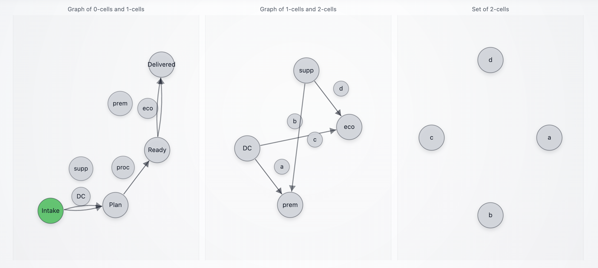
</p>

A factory line is at risk of downtime because a **critical spare part** is missing. The workflow is intentionally modeled as a **2-category** so the agent can represent decisions at two levels:

1. **Source plan selection** at `Intake`: `DC` vs `supp` (internal: `f` vs `g`)

2. **Policy amendment** on the chosen plan: `a/b/c/d` (internal: `eta_*` vs `mu_*`) that commits an *intent* toward a later shipping lane: `prem` vs `eco` (internal: `p` vs `q`)

In parallel, operations progress as an independent pipeline (`proc : Plan -> Ready`, internal: `h`) that requires explicit readiness information. Finally, at `Ready`, the agent executes the shipping lane (`prem` or `eco`), possibly overriding earlier intent if feasibility contradicts it.

There are four main workflows to cover, because they correspond to distinct operational outcomes:

* `(DC, a, prem)` (internal: `(f, eta_f, p)`)
* `(DC, b, eco)` (internal: `(f, mu_f, q)`)
* `(supp, c, prem)` (internal: `(g, eta_g, p)`)
* `(supp, d, eco)` (internal: `(g, mu_g, q)`)

In the visualization:

* object states (`Intake`, `Plan`, `Ready`, `Delivered`) show the current stage of the case (internal: `A,B,C,D`)
* decision tokens (`DC/supp`, `a/b/c/d`, `prem/eco`) remain green across later stages to preserve a short-term decision trace (internal: `f/g`, `eta*/mu*`, `p/q`)

<p align="center">
   
   <span style="vertical-align: middle;">&rarr;</span>
   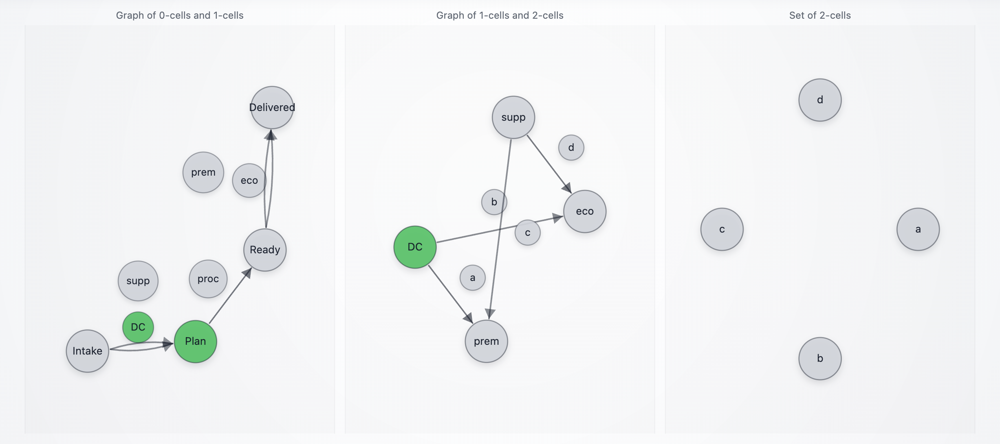
   <span style="vertical-align: middle;">&rarr;</span>
   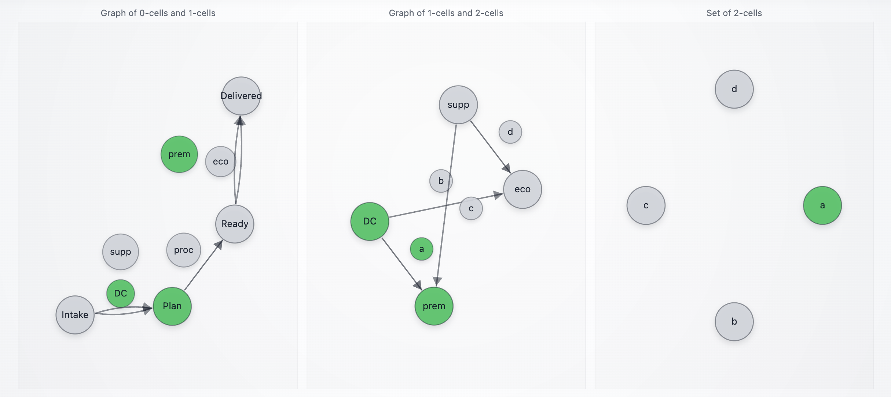
   <span style="vertical-align: middle;">&rarr;</span>
   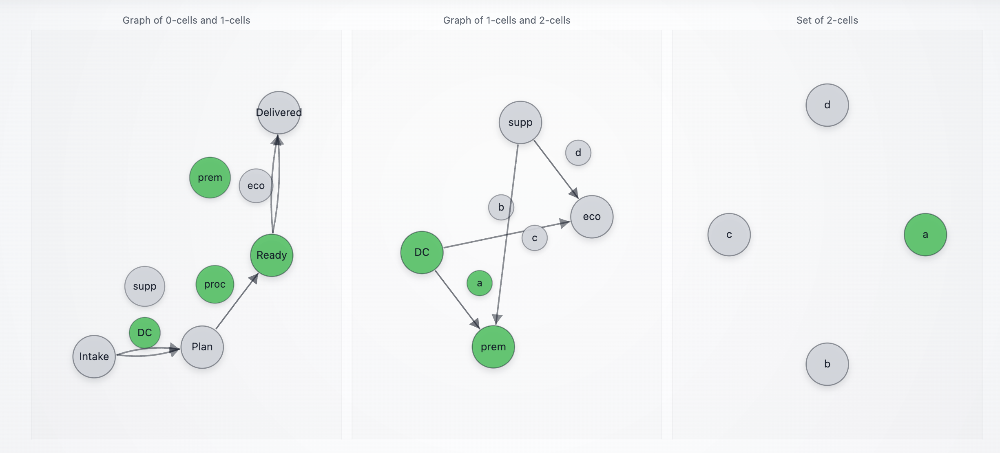
   <span style="vertical-align: middle;">&rarr;</span>
   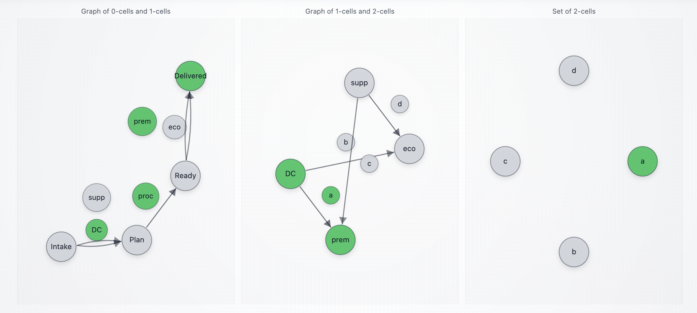
</p>

This is deliberate. Persisting the decision tokens across later stages provides an audit trail without requiring a database or a long-term memory subsystem.

> [!NOTE]
> **Pressing Enter does nothing.** Empty strings are ignored. This prevents accidental advancement during live demos.

> [!NOTE]
> **Chatter does not advance the workflow.** Messages like "Hello how are you?" do not contain incident/policy/ops/feasibility fields, so all relevant arrows stay.

> [!NOTE]
> **`proc : Plan -> Ready` is not a "proceed" button.** It requires ops readiness information (`ready_to_tender=true`). This is intentional: ops progression is high-stakes and must not be driven by vague text.


> [!IMPORTANT]
> These workflows depend on the **2-cell intent rule** selected at launch:
>
> * **Strict (default):** `python agent.py` or `python agent.py --intent-strategy strict`
> * **EV:** `python agent.py --intent-strategy ev` (or `python agent.py --intent-strategy`)
>
> The chosen strategy is recorded in the closure report as `path.intent_strategy`, and the evaluation output includes a `counterfactual` section that recomputes what the **other** strategy would have predicted.

## Workflow 1: `(DC, a, prem)` (internal: `(f, eta_f, p)`)

This is the "DC has stock, downtime is expensive, premium lane is available" path. It is a clean end-to-end demo because each transition is justified by explicit fields, and the final report can be scored against optional ground truth.

### Step 0 (`Intake`): irrelevant input does not move

<p align="center">
  
</p>

This step shows a hard guardrail: if the message does not carry incident fields, the workflow does not advance.

**Unstructured input:**
```text
> Hello how are you?
```

**Structured input (equivalent, still irrelevant):**

```json
{"message":"Hello how are you?"}
```

**Expected messages:**

```text
[Received] {'message': 'Stayed on A via f (incident insufficient for DC selection, or supplier path better)', 'from': 'CatUpdate_1'}
[Received] {'message': 'Stayed on A via g (incident insufficient for supplier selection, or DC path better)', 'from': 'CatUpdate_1'}
[Received] {'message': 'A processed and forgotten', 'from': 'CatUpdate_1'}
```

**Interpretation (front-facing):**

* The case stays at `Intake`. No decision bubbles (`DC/supp`, `a/b/c/d`, `prem/eco`) turn green.

### Step 1 (`Intake`): incident selects `DC` (internal: `f`)

<p align="center">
  
</p>

This is the first business decision: choose between `DC` and `supp`.

**Structured input:**

```json
{"part_id":"AX-773","qty":1,"required_by_hours":10,"line_down":true,"dc_on_hand":1,"supplier_lead_time_hours":36}
```

**Unstructured input (equivalent):**

```text
> Line-down. Need part AX-773 qty 1 within 10 hours. DC has 1 on hand. Supplier lead time is 36h.
```

**Expected messages:**

```text
[Received] {'message': 'Moved A -> B via f (regional DC selected)', 'from': 'CatUpdate_1'}
[Received] {'message': 'Stayed on A via g (incident insufficient for supplier selection, or DC path better)', 'from': 'CatUpdate_1'}
[Received] {'message': 'A processed and forgotten', 'from': 'CatUpdate_1'}
```

**Interpretation (front-facing):**

* The case advances to `Plan`.
* The visualization shows `Plan` as the active object, with the `DC` decision bubble remembered in green.

### Step 2 (`Plan`): amendment selects `a` (internal: `eta_f`) and commits intent `prem` (internal: `p`)

<p align="center">
  
</p>

This is the 2-cell decision that attaches a policy amendment to the chosen sourcing plan. Here we send only policy fields, so the workflow records the amendment but does not progress operationally.

> This policy payload yields `prem` intent under **both** `--intent-strategy strict` and `--intent-strategy ev`.

**Structured input (policy fields only):**

```json
{"expedite_budget_usd":1200,"downtime_cost_per_hour_usd":5000,"carrier_capacity_score":0.8,"disruption_risk":"medium"}
```

**Unstructured input (equivalent):**

```text
> Downtime is around $5k/hour and the deadline is 10 hours. Expedite budget is about $1200. Risk medium. Carrier capacity looks decent.
```

**Expected messages:**

```text
[Received] {'message': 'Selected eta_f: expedite authorization (intent -> p)', 'from': 'CatUpdate_1'}
[Received] {'message': 'Stayed on B via h (waiting for ops readiness fields)', 'from': 'CatUpdate_1'}
[Received] {'message': 'B processed and forgotten', 'from': 'CatUpdate_1'}
```

**Interpretation (front-facing):**

* The 2-cell bubble `a` turns green (internal: `eta_f`), and the intent bubble `prem` turns green (internal: `p`).
* The case remains at `Plan` until ops readiness arrives.

### Step 3 (`Plan`): ops readiness triggers `proc : Plan -> Ready` (internal: `h`)

<p align="center">
  
</p>

Now we provide operational readiness. This advances the case without changing the already-recorded amendment intent.

**Structured input (ops readiness only):**

```json
{"ready_to_tender": true}
```

**Unstructured input (equivalent):**

```text
> We are ready to tender. Pick/pack is done and compliance paperwork is complete.
```

**Expected messages:**

```text
[Received] {'message': 'Moved B -> C via h (ops ready: pick/pack + compliance complete)', 'from': 'CatUpdate_1'}
[Received] {'message': 'B processed and forgotten', 'from': 'CatUpdate_1'}
```

**Interpretation (front-facing):**

* The case advances to `Ready`.
* Decision bubbles remain visible in green: `DC`, `a`, `prem`.

### Variant: Step 2 and Step 3 merged (policy + ops together)

A single payload can select the 2-cell amendment and advance ops in the same round.

**Merged structured input:**

```json
{
  "expedite_budget_usd": 1200,
  "downtime_cost_per_hour_usd": 5000,
  "carrier_capacity_score": 0.8,
  "disruption_risk": "medium",
  "ready_to_tender": true
}
```

**Expected messages (typical):**

```text
[Received] {'message': 'Selected eta_f: expedite authorization (intent -> p)', 'from': 'CatUpdate_1'}
[Received] {'message': 'Moved B -> C via h (ops ready: pick/pack + compliance complete)', 'from': 'CatUpdate_1'}
[Received] {'message': 'B processed and forgotten', 'from': 'CatUpdate_1'}
```

### Step 4 (`Ready`): feasibility triggers `prem : Ready -> Delivered` (internal: `p`)

<p align="center">
  
</p>

Now we provide feasibility. The agent executes shipping in a way that follows intent (`prem`) when feasible.

**Structured input:**

```json
{"premium_mode_available": true, "economy_mode_available": true, "next_milk_run_departure_hours": 6}
```

**Unstructured input (equivalent):**

```text
> Premium courier is available. Economy is also available. Next milk run departs in about 6 hours.
```

**Expected messages:**

```text
[Received] {'message': 'Moved C -> D via p (premium shipment executed)', 'from': 'CatUpdate_1'}
[Received] {'message': 'C processed and forgotten', 'from': 'CatUpdate_1'}
[Received] {'message': 'Stayed on C via q (not chosen, or feasibility missing)', 'from': 'CatUpdate_1'}
```

**Interpretation (front-facing):**

* The case reaches `Delivered`.
* The green "decision trace" remains visible: `DC`, `a`, `prem`, and the executed lane.

### Step 5 (`Delivered`): evaluation input emits the final report (and strategy counterfactual)

At `Delivered`, send one more message. This is where you can provide optional ground truth for automated checks.

#### Option A: with ground truth (scored evaluation)

**Structured input:**

```json
{"ground_truth":{"source_choice":"f","amendment_choice":"eta_f","intent_lane":"p","shipment_lane":"p"}}
```

**Expected:**

* One closure report emitted as a single `[Received]` message. The payload includes:

  * `path` (internal tokens)
  * extracted `case/policy/ops/feasibility`
  * `evaluation.ground_truth_checks`
  * `evaluation.counterfactual` comparing the current strategy vs the alternate one

#### Option B: without ground truth (still valid)

```json
{"note":"closing case without ground truth"}
```

## Workflow 2: `(DC, b, eco)` (internal: `(f, mu_f, q)`)

This is the "DC has stock, but expedite is not justified, so ship economy" path.

### Step 0 (`Intake`): irrelevant input does not move

Use the same Step 0 as Workflow 1.

### Step 1 (`Intake`): incident selects `DC` (internal: `f`)

Reuse the same incident as Workflow 1:

```json
{"part_id":"AX-773","qty":1,"required_by_hours":10,"line_down":true,"dc_on_hand":1,"supplier_lead_time_hours":36}
```

Expected messages are the same as Workflow 1 Step 1.

### Step 2 (`Plan`): amendment selects `b` (internal: `mu_f`) and commits intent `eco` (internal: `q`)

<p align="center">
  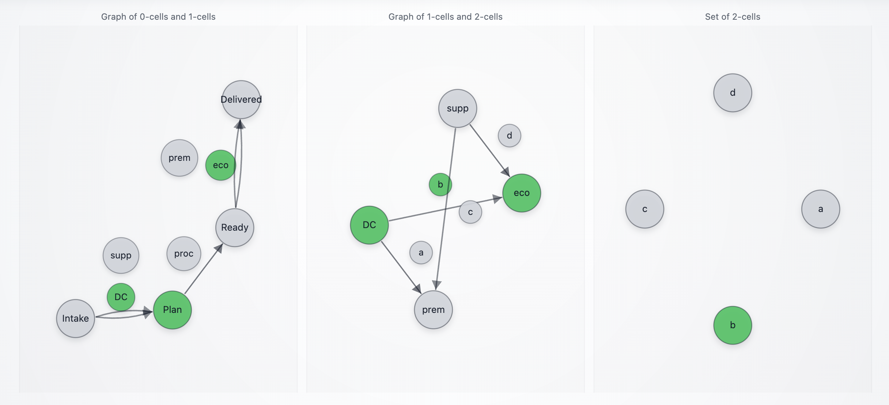
</p>

> This policy payload yields `eco` intent under **both** `--intent-strategy strict` and `--intent-strategy ev`.

**Structured input (policy fields only):**

```json
{"expedite_budget_usd":1200,"downtime_cost_per_hour_usd":50,"carrier_capacity_score":0.9,"disruption_risk":"low"}
```

**Expected messages:**

```text
[Received] {'message': 'Selected mu_f: consolidation mandate (intent -> q)', 'from': 'CatUpdate_1'}
[Received] {'message': 'Stayed on B via h (waiting for ops readiness fields)', 'from': 'CatUpdate_1'}
[Received] {'message': 'B processed and forgotten', 'from': 'CatUpdate_1'}
```

### Step 3 (`Plan`): ops readiness triggers `proc : Plan -> Ready` (internal: `h`)

Same as Workflow 1 Step 3:

```json
{"ready_to_tender": true}
```

### Step 4 (`Ready`): feasibility triggers `eco : Ready -> Delivered` (internal: `q`)

<p align="center">
  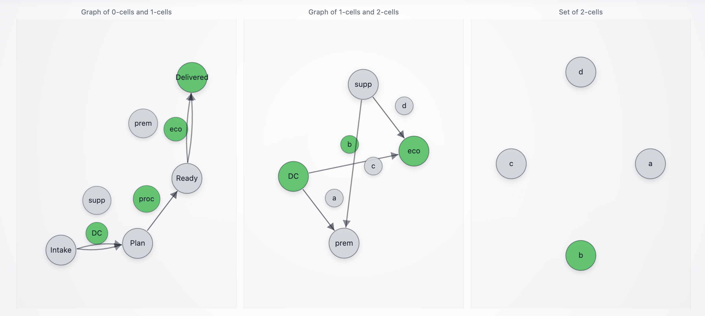
</p>

**Structured input:**

```json
{"premium_mode_available": true, "economy_mode_available": true}
```

**Expected messages:**

```text
[Received] {'message': 'Stayed on C via p (not chosen, or feasibility missing)', 'from': 'CatUpdate_1'}
[Received] {'message': 'Moved C -> D via q (economy shipment executed)', 'from': 'CatUpdate_1'}
[Received] {'message': 'C processed and forgotten', 'from': 'CatUpdate_1'}
```

### Step 5 (`Delivered`): evaluation + closure report

**Structured input:**

```json
{"ground_truth":{"source_choice":"f","amendment_choice":"mu_f","intent_lane":"q","shipment_lane":"q"}}
```

## Workflow 3: `(supp, c, prem)` (internal: `(g, eta_g, p)`)

This is the "DC cannot cover quantity, supplier is the plan, expedite intent, premium execution" path.

### Step 0 (`Intake`): irrelevant input does not move

Use the same Step 0 as Workflow 1.

### Step 1 (`Intake`): incident selects `supp` (internal: `g`)

<p align="center">
  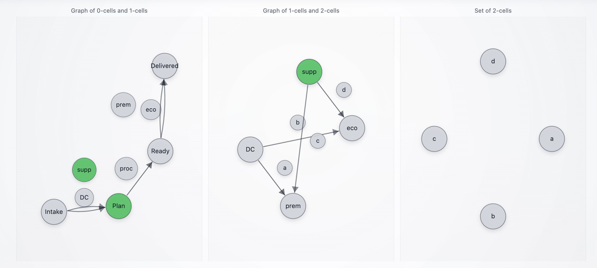
</p>

**Structured input:**

```json
{"part_id":"AX-773","qty":2,"required_by_hours":10,"line_down":true,"dc_on_hand":1,"supplier_lead_time_hours":36}
```

**Expected messages:**

```text
[Received] {'message': 'Stayed on A via f (incident insufficient for DC selection, or supplier path better)', 'from': 'CatUpdate_1'}
[Received] {'message': 'Moved A -> B via g (supplier selected)', 'from': 'CatUpdate_1'}
[Received] {'message': 'A processed and forgotten', 'from': 'CatUpdate_1'}
```

### Step 2 (`Plan`): amendment selects `c` (internal: `eta_g`) and commits intent `prem` (internal: `p`)

<p align="center">
  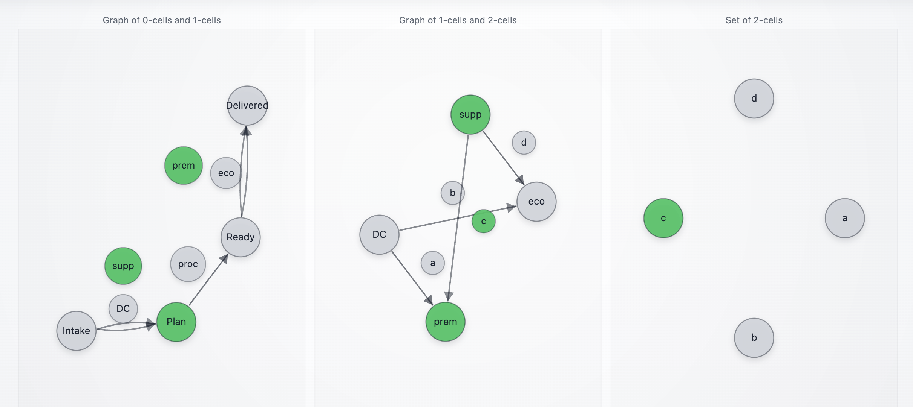
</p>

Here is the part that is **strategy-sensitive** in the new agent:

* Under **strict**, a low `carrier_capacity_score` combined with `disruption_risk="high"` can veto expedite intent.
* Under **ev**, the agent uses an expected-value calculation that can still favor expedite.

To keep this workflow as "supplier + expedite" under **both** strategies, use a policy payload that avoids the strict veto:

**Policy payload (works for both `strict` and `ev`):**

```json
{"expedite_budget_usd":700,"downtime_cost_per_hour_usd":5000,"carrier_capacity_score":0.6,"disruption_risk":"high"}
```

**Expected messages:**

```text
[Received] {'message': 'Selected eta_g: supplier expedite clause (intent -> p)', 'from': 'CatUpdate_1'}
[Received] {'message': 'Stayed on B via h (waiting for ops readiness fields)', 'from': 'CatUpdate_1'}
[Received] {'message': 'B processed and forgotten', 'from': 'CatUpdate_1'}
```

> [!NOTE]
> If you instead set `carrier_capacity_score` below `0.4` *and* `disruption_risk="high"`, then:
>
> * `--intent-strategy strict` will typically select `mu_g` (intent `q`) rather than `eta_g`.
> * `--intent-strategy ev` can still select `eta_g` depending on the numbers.

### Step 3 (`Plan`): ops readiness triggers `proc : Plan -> Ready` (internal: `h`)

```json
{"ready_to_tender": true}
```

Expected messages are the same as Workflow 1 Step 3.

### Step 4 (`Ready`): feasibility triggers `prem : Ready -> Delivered` (internal: `p`)

<p align="center">
  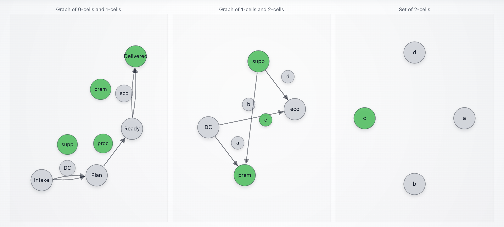
</p>

**Structured input:**

```json
{"premium_mode_available": true, "economy_mode_available": true}
```

**Expected messages:**

```text
[Received] {'message': 'Moved C -> D via p (premium shipment executed)', 'from': 'CatUpdate_1'}
[Received] {'message': 'C processed and forgotten', 'from': 'CatUpdate_1'}
[Received] {'message': 'Stayed on C via q (not chosen, or feasibility missing)', 'from': 'CatUpdate_1'}
```

### Step 5 (`Delivered`): evaluation + closure report

```json
{"ground_truth":{"source_choice":"g","amendment_choice":"eta_g","intent_lane":"p","shipment_lane":"p"}}
```

## Workflow 4: `(supp, d, eco)` (internal: `(g, mu_g, q)`)

This is the "supplier + standard clause + economy shipping" baseline.

### Step 0 (`Intake`): irrelevant input does not move

Use the same Step 0 as Workflow 1.

### Step 1 (`Intake`): incident selects `supp` (internal: `g`)

Reuse Workflow 3 Step 1:

```json
{"part_id":"AX-773","qty":2,"required_by_hours":10,"line_down":true,"dc_on_hand":1,"supplier_lead_time_hours":36}
```

### Step 2 (`Plan`): amendment selects `d` (internal: `mu_g`) and commits intent `eco` (internal: `q`)

<p align="center">
  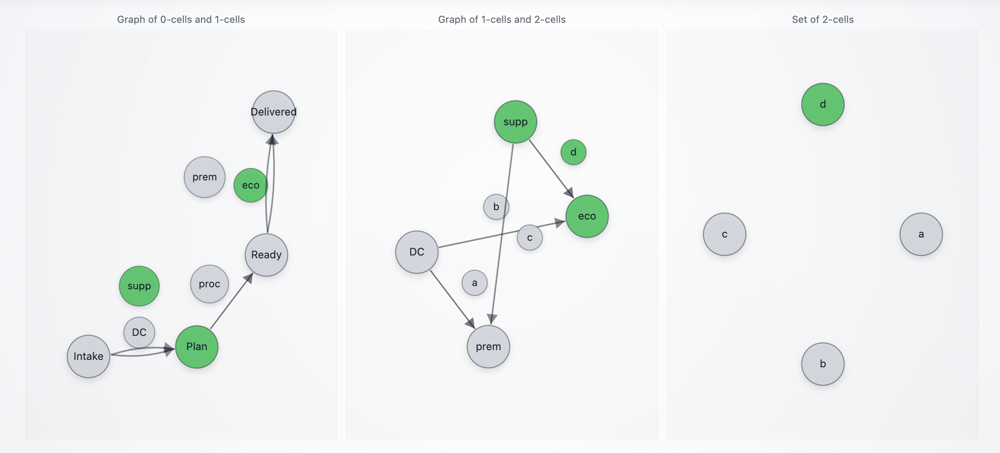
</p>

> This policy payload yields `eco` intent under **both** strategies.

**Structured input (policy fields only):**

```json
{"expedite_budget_usd":700,"downtime_cost_per_hour_usd":50,"carrier_capacity_score":0.8,"disruption_risk":"low"}
```

**Expected messages:**

```text
[Received] {'message': 'Selected mu_g: standard clause (intent -> q)', 'from': 'CatUpdate_1'}
[Received] {'message': 'Stayed on B via h (waiting for ops readiness fields)', 'from': 'CatUpdate_1'}
[Received] {'message': 'B processed and forgotten', 'from': 'CatUpdate_1'}
```

### Step 3 (`Plan`): ops readiness triggers `proc : Plan -> Ready` (internal: `h`)

```json
{"ready_to_tender": true}
```

### Step 4 (`Ready`): feasibility triggers `eco : Ready -> Delivered` (internal: `q`)

<p align="center">
  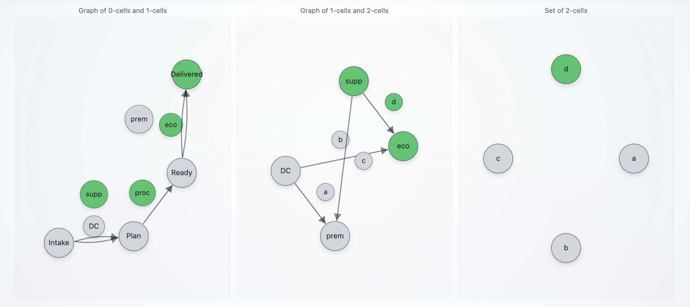
</p>

**Structured input:**

```json
{"premium_mode_available": true, "economy_mode_available": true}
```

**Expected messages:**

```text
[Received] {'message': 'Stayed on C via p (not chosen, or feasibility missing)', 'from': 'CatUpdate_1'}
[Received] {'message': 'Moved C -> D via q (economy shipment executed)', 'from': 'CatUpdate_1'}
[Received] {'message': 'C processed and forgotten', 'from': 'CatUpdate_1'}
```

### Step 5 (`Delivered`): evaluation + closure report

```json
{"ground_truth":{"source_choice":"g","amendment_choice":"mu_g","intent_lane":"q","shipment_lane":"q"}}
```


## Workflow variants and edge cases

This section contains variants and edge cases for the situations explored above. Each section targets questions people ask when they try to stress the workflow:

* What happens if signals arrive out of order?
* Can one update legitimately advance multiple stages?
* Does the agent stay put on irrelevant or low-information messages?
* What happens when the intended shipping lane is infeasible?
* How does `--intent-strategy` change which 2-cell is selected?

### Variant 1: mixed payload at `Plan` (policy + ops readiness in the same message)

This is the most realistic operational pattern: a single status update contains both a service-level decision (2-cell) and an ops readiness signal (`proc : Plan -> Ready`).

At `Plan`, send:

```json
{
  "expedite_budget_usd": 1200,
  "downtime_cost_per_hour_usd": 5000,
  "disruption_risk": "medium",
  "carrier_capacity_score": 0.8,
  "ready_to_tender": true
}
````

Expected:

* one of the 2-cells fires:

  * `a` (internal: `eta_*`) if the intent rule yields `prem`
  * `b/d` (internal: `mu_*`) if the intent rule yields `eco`
* `proc : Plan -> Ready` (internal: `h`) fires in the same round because readiness is present
* the tape resolves to `Ready` by priority (`Delivered > Ready > Plan > Intake`)

Typical message pattern:

```text
[Received] {'message': 'Selected eta_f: expedite authorization (intent -> p)', 'from': 'CatUpdate_1'}
[Received] {'message': 'Moved B -> C via h (ops ready: pick/pack + compliance complete)', 'from': 'CatUpdate_1'}
[Received] {'message': 'B processed and forgotten', 'from': 'CatUpdate_1'}
```

Interpretation (front-facing):

* The agent supports **co-trigger**: "record the amendment bubble (`a/b/c/d`)" and "advance to `Ready`" can be captured from the same payload.
* The tape stays consistent because the state anchoring enforces object priority (`Ready` wins over `Plan`).

> [!NOTE]
> If you want this mixed payload to deterministically select `a` under **both** strategies, use numbers similar to Workflow 1 (high downtime, moderate risk, capacity not below `0.4`).

### Variant 2: feasibility arrives too early (before `Ready`)

If you send feasibility fields while the tape is still at `Plan`, expected behavior is:

* nothing moves to `Delivered` (because `prem/eco : Ready -> Delivered` only apply at `Ready`)
* feasibility is **not acted on** until `Ready` is reached

Example (sent too early at `Plan`):

```json
{"premium_mode_available": true, "economy_mode_available": true, "next_milk_run_departure_hours": 6}
```

Interpretation:

* This is a deliberate safety property: shipping execution is gated by ops readiness and the `Ready` stage.
* The agent is path-dependent: feasibility does not override missing ops progression.

### Variant 3: missing ops readiness blocks progression (no accidental `proc`)

If you never send ops readiness (for example, you never provide `ready_to_tender=true` or the `pick/pack + compliance` pair), then you should never reach `Ready` or `Delivered`, even if:

* sourcing is selected (`DC` or `supp`)
* a policy amendment is selected (`a/b/c/d`)
* feasibility indicates both lanes are available

Interpretation:

* Ops readiness is treated as a hard gate in this PoC.
* This prevents "policy + feasibility" from bypassing operational reality.

### Variant 4: empty messages do not advance

At any stage, pressing Enter should do nothing.

Expected:

* no arrow moves
* you may still see harmless "Stayed on …" traces, but no state progression

If you see advancement on empty messages, treat it as a bug. The usual cause is letting `""` be treated as meaningful content.

## Intent-strategy edge cases at `Plan` (`--intent-strategy strict` vs `ev`)

This agent's 2-cell selection depends on the strategy chosen at launch:

* `--intent-strategy strict` uses a rule with a reliability veto:

  * expedite intent requires economic justification (`downtime * required_by_hours >= budget`)
  * and rejects expedite if `carrier_capacity_score < 0.4` **and** `disruption_risk == "high"`
* `--intent-strategy ev` uses an expected-value proxy based on:

  * `p_ontime ≈ carrier_capacity_score * risk_penalty`
  * and expedites if `p_ontime * (downtime * required_by_hours) >= budget`

Practical consequence: the same `Plan` policy payload can select different 2-cells under the two strategies.

### Strategy split example: `strict` selects economy, `ev` selects expedite

Precondition: you already reached `Plan` with `supp` (internal: `g`) and the incident carries `required_by_hours = 10` and `line_down = true`.

At `Plan`, send:

```json
{
  "expedite_budget_usd": 700,
  "downtime_cost_per_hour_usd": 5000,
  "carrier_capacity_score": 0.3,
  "disruption_risk": "high"
}
```

Expected:

* with `--intent-strategy strict`:

  * reliability veto applies (`0.3 < 0.4` and risk high), so intent becomes `eco`
  * the selected 2-cell is `d` (internal: `mu_g`)
* with `--intent-strategy ev`:

  * expected-value test can still justify expedite, so intent becomes `prem`
  * the selected 2-cell is `c` (internal: `eta_g`)

Interpretation:

* This is the intended "optimization surface" for production tuning: the strategy changes which higher-order transition is taken given the same policy evidence.
* In the closure report at `Delivered`, the agent includes `path.intent_strategy` (the one you ran with), and the evaluation includes a `counterfactual` block recomputing the alternate strategy's prediction.

## Feasibility overrides at `Ready`

These are not new workflows. They are deviations at the final decision because the world contradicts the committed intent.

### Override 1: intent is `prem`, but `prem` is unavailable, force `eco`

At `Ready`, send:

```json
{"premium_mode_available": false, "economy_mode_available": true, "next_milk_run_departure_hours": 2}
```

Expected:

* the agent executes `eco : Ready -> Delivered`
* the closure report contains an `exception` explaining the override

Interpretation:

* This corresponds to conditions like premium lane saturation, embargo, weather shutdown, or carrier collapse.
* The system records policy intent versus execution feasibility explicitly.

### Override 2: intent is `eco`, but `eco` is unavailable, force `prem`

At `Ready`, send:

```json
{"premium_mode_available": true, "economy_mode_available": false}
```

Expected:

* the agent executes `prem : Ready -> Delivered`
* the closure report contains an `exception`

Interpretation:

* This corresponds to missed milk-run cutoff, consolidation window closed, or an economy lane pause.

### Override 3: neither lane is available (hard block)

At `Ready`, send:

```json
{"premium_mode_available": false, "economy_mode_available": false}
```

Expected:

* the agent stays at `Ready` (cannot ship)
* no closure report is emitted because `Delivered` is never reached

Interpretation:

* In a fuller demo, this would branch to escalation or replanning.
* In this PoC, it cleanly blocks without inventing an outcome.

## Restart after the final report

After you reach `Delivered` and send the evaluation input (or any closing message), the agent emits the closure report **once**, then resets internal memory.

Expected:

* the next message starts a clean new case
* the tape re-anchors on `Intake`

Why this matters for this demo:

* You can run the same workflow repeatedly while changing prompts, thresholds, or `--intent-strategy`.
* The evaluation output (including `counterfactual`) makes it possible to compare "before/after" changes using the same scripted inputs.


