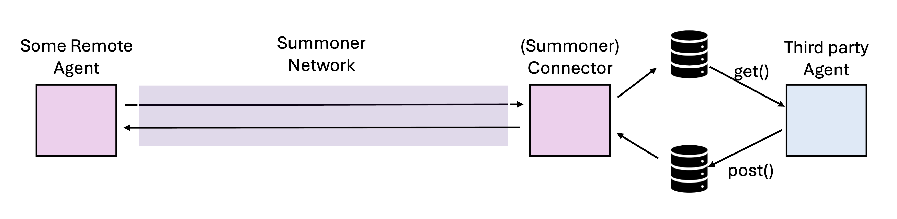
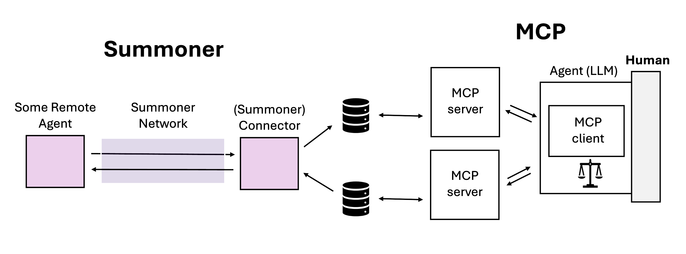

# `ConnectAgent_0`

A connector agent that relays between the Summoner server and two SQLite files using a lightweight async ORM [`db_sdk.py`](./db_sdk.py). It demonstrates:

* **True relay**: the receive handler stores the entire inbound payload as JSON in a *receive* database; the send handler reads pending items from a *send* database and emits them back to the server.
* **Batching + multi-send**: incoming messages are buffered and flushed on a timer; outgoing messages use `multi=True` to emit lists as separate sends.
* **CLI-selectable DB paths**: `--send_db` and `--recv_db` let you point the agent at different files.

Behind the scenes, all messages live in at most **two databases** (they can be the same file if you pass only one flag). Storage is powered by the [`Message` model](./db_models.py), which creates the `messages` table and an index suitable for FIFO reads. For interactive testing, the project includes [`mcp_sim.py`](./mcp_sim.py), a tiny CLI that acts like an external process:

* `/get` prints and **consumes** new items from the **send DB** (changing `state` from `new` → `processed`),
* `/post "..."` inserts a new, **outgoing** item into the **receive DB**.

<p align="center">
  
</p>

**How this relates to [MCP (Model Context Protocol)](https://modelcontextprotocol.io/docs/getting-started/intro).**
You can think of the connector as a minimal "MCP-style server," and the two SQLite files as its simplest **tools**:

* `messages.get()` → "return and consume pending items" (our **send DB**, read side)
* `messages.post()` → "enqueue a new item to send" (our **receive DB**, write side)

The CLI simulator plays the **client**: `/get` calls the "read" tool; `/post` calls the "write" tool. The handoff between **connector ⇄ simulator** mirrors an MCP client speaking to one or more MCP servers — only here the "transport" is a pair of files instead of JSON-RPC over stdio/HTTP.

<p align="center">
  
</p>

## Behavior

<details>
<summary><b>(Click to expand)</b> The agent goes through these steps:</summary>
<br>

1. On startup, the agent prepares configuration and storage:

   * Parses optional flags `--send_db` and `--recv_db`. If only one is provided, it is used for both roles.

   * Resolves relative paths next to this file and appends `.db` if missing.

   * Creates two persistent `db_sdk.Database` objects (one per file).

   * Ensures the schema via the ORM: a `messages` table with `(id, data, state, created_at, updated_at)` and an index on `(state, id)` for FIFO reads by state.

   * Sets cadences: `BATCH_INTERVAL_SECONDS = 5.0` (receive flush) and `SEND_POLL_INTERVAL_SECONDS = 1.0` (send polling).

   > 📝 **Note:**
   > **[MCP lens]** At this point, you can picture two minimal **tools** backed by DB tables:
   >
   > * *post* → write JSON into the **receive DB** (creates "pending" work for the connector to hold),
   > * *get* → read/consume JSON from the **send DB** (the connector’s outbound queue).

2. When a message arrives (`@client.receive(route="")`), the handler serializes the **entire** inbound object with `json.dumps(msg).strip()` and appends it to an in-memory buffer.

   * Non-serializable payloads are ignored.
   * **MCP lens:** This is similar to a server capturing the **request context** as a resource and staging it for a later tool response.

3. On a timer (every `BATCH_INTERVAL_SECONDS`), a background task flushes the buffer to the **receive DB**, inserting rows with `state='new'`.

   * After commit, each inserted line is printed: `[From server] ...` for warnings, `[Received] ...` otherwise.
   * **MCP lens:** Treating `state='new'` as "pending items" is akin to a server queue  —  a simple substitute for streaming or push notifications.

4. When sending (`@client.send(route="", multi=True)`), the handler polls the **send DB** every `SEND_POLL_INTERVAL_SECONDS` for rows where `state='new'`, ordered by `id` (FIFO).

   * Each row is marked `processed`.
   * Each `data` string is parsed with `json.loads` when possible; otherwise the raw string is kept.
   * The handler returns a **list**; with `multi=True`, the client emits each element as a separate send.
   * **MCP lens:** This mirrors a client (or another server) calling `messages.get()` repeatedly and the connector emitting each item as an individual message.

5. On shutdown, both database connections are closed for a clean exit.

</details>

## SDK Features Used

| Feature                                      | Description                                                      |
| -------------------------------------------- | ---------------------------------------------------------------- |
| `SummonerClient(name=...)`                   | Creates and manages the agent                                    |
| `@client.receive(route="")`                  | Receives messages from the server                                |
| `@client.send(route="", multi=True)`         | Emits multiple messages as separate sends                        |
| `client.loop.run_until_complete(setup())`    | Runs startup tasks (table + index creation, helper construction) |
| `client.run(host, port, config_path)`        | Connects to the server and starts the event loop                 |
| `Database(db_path)`                          | One async SQLite connection per file (managed by `db_sdk`)       |
| `Model.create_table(db)`                     | Ensures the `messages` table exists                              |
| `Model.create_index(db, name, columns, ...)` | Creates `(state, id)` index                                      |
| `Model.insert(db, **fields)`                 | Persists buffered receive rows                                   |
| `Model.find(db, where=..., order_by=...)`    | Fetches pending send rows in FIFO order                          |
| `Model.update(db, where=..., fields=...)`    | Marks fetched rows as `processed`                                |

## How to Run

Start a server (default config shown):

```bash
python server.py
```

> [!TIP]
> Use `--config configs/server_config_nojsonlogs.json` for cleaner terminal output if you prefer.

Run the connector agent (defaults to `test.db` for both roles):

```bash
python agents/agent_ConnectAgent_0/agent.py
```

Choose different files for the **send** and **receive** roles:

```bash
python agents/agent_ConnectAgent_0/agent.py --send_db out --recv_db in
```

* **receive DB**: where the agent **stores** inbound payloads as JSON (`state='new'`), after batching
* **send DB**: where the agent **reads** pending rows (`state='new'`) to emit back to the server

## Simulation Scenarios

### Scenario 1  —  Echo via a single DB (I/O pointed to the same file)

This setup mimics an echo: every chat message reappears because the connector reads its outgoing messages from the same DB where it stores incoming ones.

```bash
# Terminal 1: server
python server.py

# Terminal 2: a simple chat agent
python agents/agent_ChatAgent_0/agent.py

# Terminal 3: connector (no flags → both roles use test.db)
python agents/agent_ConnectAgent_0/agent.py
```

**Terminal 2 (send a few lines):**

Type a few lines in the chat agent; these are sent to the server and will be batched by the connector.

```
[DEBUG] Loaded config from: configs/client_config.json
2025-08-27 09:36:22.748 - ChatAgent_0 - INFO - Connected to server @(host=127.0.0.1, port=8888)
> Hello
> How are you?
> Bye
>
```

**Terminal 3 (about 5s later, the connector flushes and prints):**

Watch the connector terminal: after the batch interval, it flushes its in-memory buffer to the receive DB and prints the stored JSON lines.

```
[DEBUG] Loaded config from: configs/client_config.json
2025-08-27 09:45:07.377 - ConnectAgent_0 - INFO - Connected to server @(host=127.0.0.1, port=8888)
[Received] {"remote_addr": "127.0.0.1:62290", "content": "Hello"}
[Received] {"remote_addr": "127.0.0.1:62290", "content": "How are you?"}
[Received] {"remote_addr": "127.0.0.1:62290", "content": "Bye"}
```

**Terminal 2 (the connector emits them back using `multi=True`):**

Return to the chat agent: it receives each stored line as an individual message because the connector’s send handler returns a list with `multi=True`.

```
[Received] {'remote_addr': '127.0.0.1:62290', 'content': 'Hello'}
[Received] {'remote_addr': '127.0.0.1:62290', 'content': 'How are you?'}
[Received] {'remote_addr': '127.0.0.1:62290', 'content': 'Bye'}
>
```

> [!NOTE]
> The batch flush interval is 5 seconds by default (`BATCH_INTERVAL_SECONDS=5.0`). Adjust as needed.

### Scenario 2  —  MCP-style loop with the CLI simulator

This simulates an **external agent** that reads from one DB and writes to the other.
The DB roles are **intentionally reversed** between the simulator and the connector so they "hand off" messages correctly:

* The simulator’s `/get` should read what the connector **stored** → point simulator **send_db** to the connector’s **receive DB** file.
* The simulator’s `/post` should feed the connector’s **outgoing** queue → point simulator **recv_db** to the connector’s **send DB** file.

```bash
# Terminal 1: server
python server.py

# Terminal 2: simulator (reads from 'in', writes to 'out')
python agents/agent_ConnectAgent_0/mcp_sim.py --recv_db out --send_db in

# Terminal 3: chat agent
python agents/agent_ChatAgent_0/agent.py

# Terminal 4: connector (writes received data to 'in', reads outgoing from 'out')
python agents/agent_ConnectAgent_0/agent.py --send_db out --recv_db in
```

**Terminal 2 (simulator starts):**

Start the simulator; confirm it points to the expected files and check for pending messages with `/get`.

```
send_db: .../in.db
recv_db: .../out.db
Type /help for commands.
mcp> /get
(no new messages)
```

**Terminal 3 (send a few lines):**

Send messages from the chat agent; the connector will batch and write them into `in.db` (its receive DB).

```
[DEBUG] Loaded config from: configs/client_config.json
2025-08-27 09:56:41.312 - ChatAgent_0 - INFO - Connected to server @(host=127.0.0.1, port=8888)
> Hello!
> How are you?
> Bye
```

**Terminal 4 (connector prints flushed inbound payloads):**

Observe the connector printing the JSON it has just flushed to `in.db`.

```
[DEBUG] Loaded config from: configs/client_config.json
2025-08-27 09:56:46.500 - ConnectAgent_0 - INFO - Connected to server @(host=127.0.0.1, port=8888)
[Received] {"remote_addr": "127.0.0.1:62436", "content": "Hello!"}
[Received] {"remote_addr": "127.0.0.1:62436", "content": "How are you?"}
[Received] {"remote_addr": "127.0.0.1:62436", "content": "Bye"}
```

**Terminal 2 (simulator `/get` consumes from `in.db`):**

Use `/get` to display and consume the newly stored messages from `in.db`.

```
mcp> /get
{"remote_addr": "127.0.0.1:62436", "content": "Hello!"}
{"remote_addr": "127.0.0.1:62436", "content": "How are you?"}
{"remote_addr": "127.0.0.1:62436", "content": "Bye"}
```

**Terminal 2 (simulator `/post` writes into `out.db`):**

Post a reply to `out.db` so the connector’s send handler will read and emit it back to the server.

```
mcp> /post Ok, bye!
ok
mcp>
```

**Terminal 3 (chat agent receives what the connector read from `out.db`):**

Verify the chat agent receives the reply relayed by the connector.

```
[Received] Ok, bye!
```

> [!TIP]
> **[MCP lens]**
>
> * Treat `/get` as calling a server tool like `messages.get()`  —  it **returns & consumes** pending items.
> * Treat `/post "..."` as calling `messages.post(payload)`  —  it **enqueues** a new outbound item.
> * Reversing DB roles between **simulator** and **connector** gives you a clean *client ↔ server* loop with two independent endpoints, just like an MCP client juggling multiple servers.
> * The DB acts as a transport substitute; `state='new' → 'processed'` models acknowledgment.

To exit the simulator, type `/exit` (agents are terminated with `Ctrl+C`).
