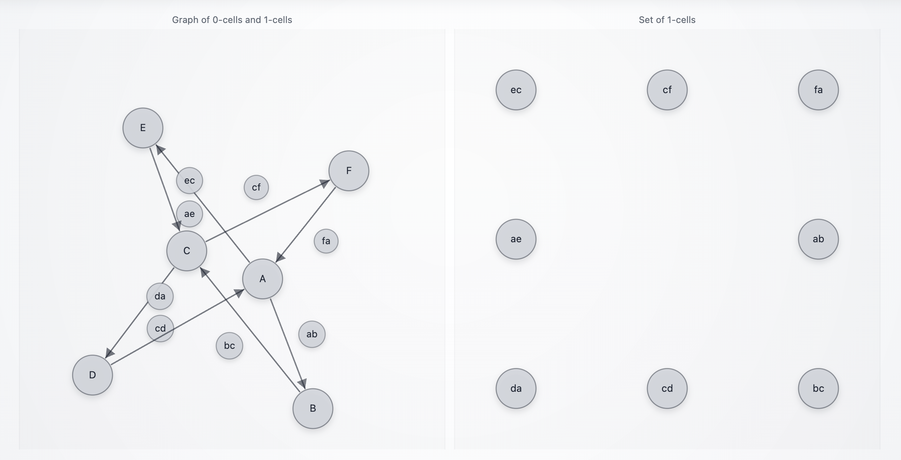
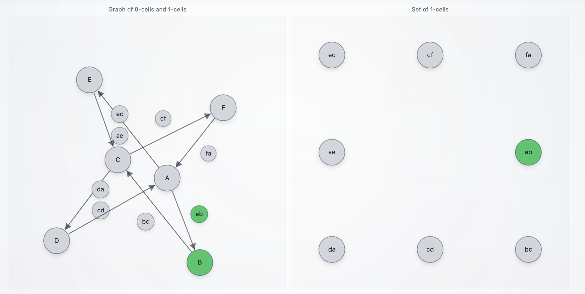
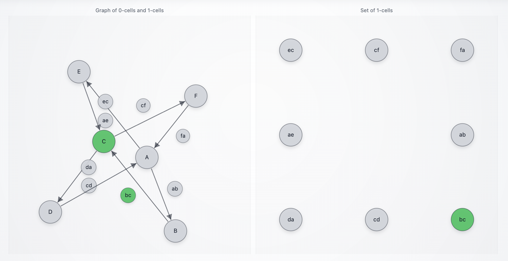
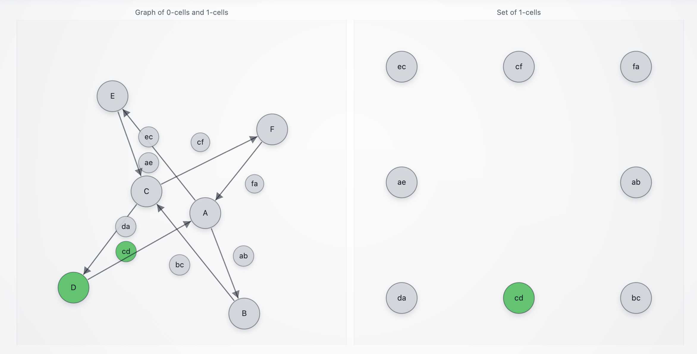
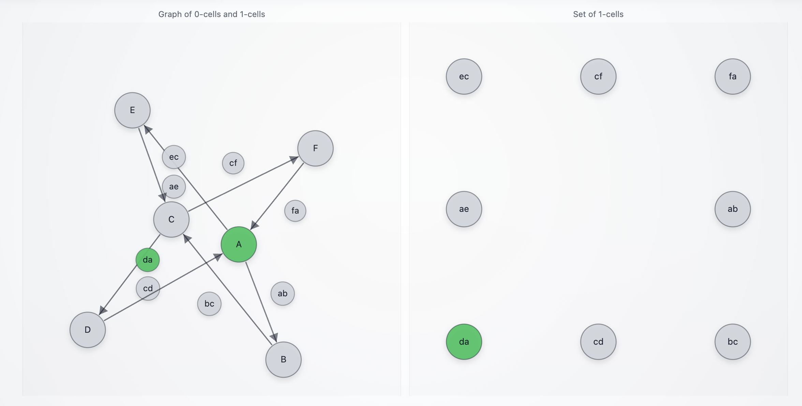
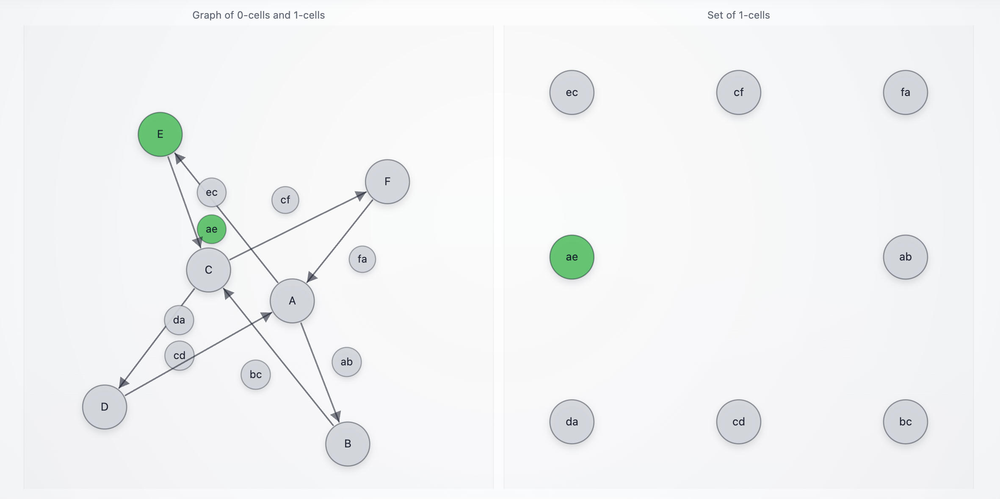
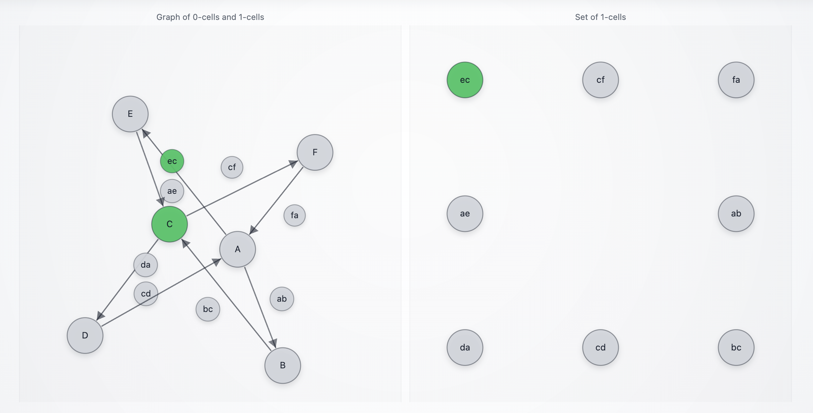
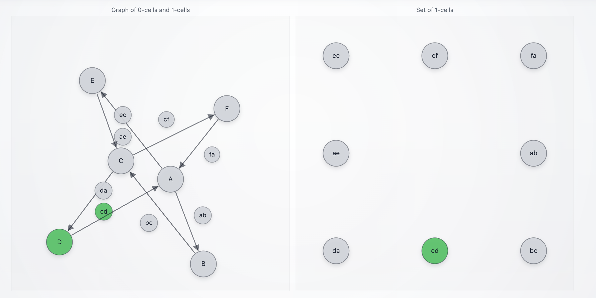
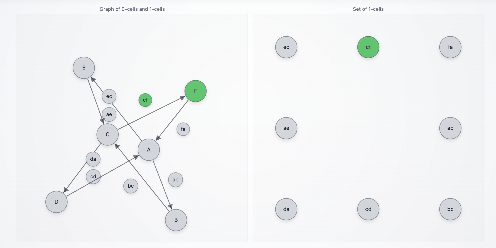

# `DNACloneAgent_0`

A minimal Summoner client that **clones an agent from DNA** into a fresh `SummonerClient` instance, without importing the original agent module. The cloned agent exposes object/cell/arrow routes (two 4-cycles that share nodes) and renders tape occupancy in a browser window where **objects are nodes**, **arrows are directed edges**, and **arrow labels are circled bubbles attached to edges** (see [`summoner_web_viz.py`](./summoner_web_viz.py)). Occupied tokens in tape `states` are colored **green**; non-occupied tokens are **gray**.

### DNA

This example is also a concrete illustration of **agent DNA** (Summoner’s portable behavior snapshot).

In Summoner, "DNA" is **not biology** and it is not a magic opaque string. It is a **structured JSON document** that records the parts of a client that matter for behavior:

* which handlers exist (`upload_states`, `download_states`, `receive`, `send`, `hook`)
* which routes/triggers/actions they are attached to
* and the exact Python source text of each handler (so it can be recreated later)

You can think of it as a **handler registry export**. Each handler entry is like a "gene": it is one unit of behavior that can be re-registered onto a client.

#### What the "DNA string" looks like

<details><summary><b>(Click to expand)</b> <code>client.dna()</code> returns a JSON string. 
</summary>

When pretty-printed, it looks like a list of records:

```json
[
  { "type": "__context__", "imports": [...], "globals": {...}, "recipes": {...}, "missing": [...] },

  { 
    "type": "upload_states",
    "fn_name": "upload_states", 
    "source": "@..."
  },

  { 
    "type": "download_states", 
    "fn_name": "download_states", 
    "source": "@..." 
  },

  { 
    "type": "receive", 
    "route": "A --[ ab ]--> B", 
    "fn_name": "ab", 
    "source": "@..." 
  },

  { 
    "type": "send", 
    "route": "A --[ ab ]--> B", 
    "fn_name": "send_ab_move", 
    "on_actions": ["Move"], 
    "on_triggers": ["ok"], 
    "source": "@..." 
  },

  { 
    "type": "hook", 
    "direction": "IN", 
    "priority": [...], 
    "fn_name": "...", 
    "source": "@..." 
  }
]
```

So the "DNA" has a real structure:

* the optional `__context__` header is the minimal execution environment (imports + simple globals)
* each handler entry is one behavior unit: "this function is registered on this route with these conditions"

</details>

#### Why it matters

Because DNA is structured, Summoner can do two useful things with it:

* **Introspect it** (`client.dna(...)`) to build tools like visualization (the graph is derived from the `route` fields).
* **Replay it** (via `ClientMerger` or `ClientTranslation`) to reconstruct the same behavior on a new client instance, without re-importing the original agent module.

### Main components

The main components of this example are:

* **DNA** (`agent_origin_dna.json`) captures handlers and a lightweight execution context.
* **Translation** (`ClientTranslation(dna_list, ...)`) compiles handler source into a sandbox module and registers it onto a brand-new client.
* **Global rebinding** (`rebind_globals={...}`) injects runtime objects (non-JSON, non-hashable) into the translated execution environment.
* **One-shot wiring** (`client.initiate_all()`) replays upload/download/receive/send/hooks into the cloned client.

Relevant files:

* [`agent_origin.py`](./agent_origin.py) (the "producer" agent; exports `agent_origin_dna.json`)
* [`agent_origin_dna.json`](./agent_origin_dna.json) (DNA dump produced by the origin agent)
* [`agent.py`](./agent.py) (the cloned client built from DNA via `ClientTranslation`)
* [`dna.json`](./dna.json) (DNA dump produced by the clone via `client.dna(include_context=True)`)
* [`summoner_web_viz.py`](./summoner_web_viz.py) (graph reconstruction + browser UI)

## Behavior

<details>
<summary><b>(Click to expand)</b> The agent goes through these steps:</summary>
<br>

1. The origin agent (`agent_origin.py`) is a normal `SummonerClient` that registers:

   * arrow routes for two 4-cycles:

     ```
     A --[ ab ]--> B --[ bc ]--> C --[ cd ]--> D --[ da ]--> A
     A --[ ae ]--> E --[ ec ]--> C --[ cf ]--> F --[ fa ]--> A
     ```

   * object receives on `A`, `B`, `C`, `D`

   * `upload_states` / `download_states` for visual tape state

   * senders that emit MOVE/STAY/TEST traces

2. When you run the origin agent once, it exports DNA to:

   * [`agent_origin_dna.json`](./agent_origin_dna.json)

   via:

   ```python
   json.dump(json.loads(client.dna(include_context=True)), Path(.../"agent_origin_dna.json").open("w"), indent=2)
   ```

3. The clone agent (`agent.py`) constructs a visualizer and runtime dependencies:

   ```python
   viz = WebGraphVisualizer(title=f"{AGENT_ID} Graph", port=8765)
   Trigger = load_triggers()

   OBJECTS = {Node(x) for x in ["A","B","C","D","E","F"]}

   def _content(msg):
       return msg.get("content") if isinstance(msg, dict) else msg
   ```

4. The clone agent loads the origin DNA and reconstructs a brand-new client:

   ```python
   client = ClientTranslation(
       json.load((Path(__file__).resolve().parent / "agent_origin_dna.json").open("r", encoding="utf-8")),
       name=AGENT_ID,
       allow_context_imports=True,
       verbose_context_imports=False,
       rebind_globals={
           "viz": viz,
           "_content": _content,
           "Event": Event,
           "Trigger": Trigger,
           "OBJECTS": OBJECTS,
       },
   )
   ```

   What is special here:

   * `ClientTranslation` compiles function bodies from DNA into a sandbox module and registers them onto the new client.
   * The DNA context header lists symbols that cannot be reconstructed from JSON (`"missing": ["Trigger", "_content", "viz"]`), so `rebind_globals` supplies them.
   * `allow_context_imports=True` executes the import lines stored inside the DNA `__context__` header (trusted DNA only).

5. The clone agent configures its flow and arrow syntax, then replays all handlers:

   ```python
   client_flow = client.flow().activate()
   client_flow.add_arrow_style(stem="-", brackets=("[", "]"), separator=",", tip=">")
   client.initiate_all()
   ```

6. At runtime, incoming messages (strings or dicts) are interpreted as commands for arrow traversal:

   * `"ab"` triggers `A --[ab]--> B`
   * `"ae"` triggers `A --[ae]--> E`
   * etc.

   Each arrow receive returns either:

   * `Move(Trigger.ok)` if the command matches the arrow label
   * `Stay(Trigger.ok)` otherwise

7. Tape state is pushed into the visualizer from `upload_states` and `download_states`, just like in the origin agent.

</details>

## What "clone" means here

This demo is a **behavioral clone**, not a module clone:

* The clone **does not import** `agent_origin.py`.
* The clone runs handler code compiled from the DNA `source` strings inside a translation sandbox.
* Module-level state from the origin (for example `state = "A"`) is reconstructed via the DNA context `globals` and executes inside the sandbox namespace.

A practical consequence is that the cloned agent’s runtime environment is defined by:

* the DNA `__context__` imports/globals/recipes, plus
* whatever you inject via `rebind_globals`.

## SDK Features Used

| Feature                                | Description                                                                                 |
| -------------------------------------- | ------------------------------------------------------------------------------------------- |
| `SummonerClient(name=...)`             | Creates the origin client (`agent_origin.py`)                                               |
| `client.dna(include_context=True)`     | Exports handlers + execution context to a portable JSON form (`agent_origin_dna.json`)      |
| `ClientTranslation(dna_list, ...)`     | Reconstructs a fresh client from DNA by compiling source into a sandbox                     |
| `allow_context_imports=True`           | Executes import lines stored in the DNA `__context__` header (trusted DNA only)             |
| `rebind_globals={...}`                 | Injects runtime globals required by compiled DNA handlers (`viz`, `Trigger`, `_content`, …) |
| `client.flow().activate()`             | Enables flow parsing/dispatch                                                               |
| `flow.add_arrow_style(...)`            | Defines route syntax like `A --[ ab ]--> B`                                                 |
| `client.initiate_all()`                | Replays everything (upload/download/hooks/receivers/senders) into the translated client     |
| `viz.set_graph_from_dna(client.dna())` | Rebuilds the display graph from the cloned agent’s DNA                                      |

## How to Run

### Step 1: Produce the DNA once (origin agent)

Start the Summoner server:

```bash
python server.py
```

Run the origin agent once to generate [`agent_origin_dna.json`](./agent_origin_dna.json):

```bash
python agents/agent_DNACloneAgent_origin/agent_origin.py
```

You can shut it down right after it writes the DNA file (Ctrl+C is fine).

### Step 2: Run the clone (translation) agent

```bash
python agents/agent_DNACloneAgent_0/agent.py
```

A browser window should open automatically at:

```
http://127.0.0.1:8765/
```

Optional CLI flag:

* `--config <path>`: Summoner **client** config path (defaults to `configs/client_config.json`).

Example:

```bash
python agents/agent_DNACloneAgent_0/agent.py --config configs/client_config.json
```

## Simulation Scenarios

These scenarios run a minimal loop with a server, this **cloned agent** (reconstructed from `agent_origin_dna.json`), and an input-presenting agent.

```bash
# Terminal 1
python server.py

# Terminal 2
python agents/agent_DNACloneAgent_0/agent.py

# Terminal 3
python agents/agent_InputAgent/agent.py
```

> [!NOTE]
> The visualizer builds the graph from **DNA** at startup:
>
> ```python
> viz.set_graph_from_dna(json.loads(client.dna()), parse_route=client_flow.parse_route)
> ```
>
> The picture in the browser is derived from the same structure you can export to [`dna.json`](./dna.json). In this project, that structure is a **clone** of [`agent_origin.py`](./agent_origin.py): the clone is reconstructed by compiling the handler source stored in [`agent_origin_dna.json`](./agent_origin_dna.json) and registering it onto a fresh client (via `ClientTranslation`).

<p align="center">
  
</p>

### Scenario A — Cloned traversal (single agent copied from `agent_origin.py`)

The point of this scenario is that **a client reconstructed from DNA behaves like the original agent**. Here, `DNACloneAgent_0` is a behavioral copy of `agent_origin.py`, including both cycles and the shared node `C`.

<p align="center">
  
</p>

#### Step 1: `ab`

In Terminal 3:

```
> ab
[Received] {'from': 'A', 'to': 'B', 'via': 'ab', 'action': 'MOVE', 'agent': 'DNACloneAgent_origin'}
[Received] {'node': 'A', 'action': 'TEST', 'agent': 'DNACloneAgent_origin'}
[Received] {'from': 'A', 'to': 'E', 'via': 'ae', 'action': 'STAY', 'agent': 'DNACloneAgent_origin'}
```

What this means:

* The cloned agent contains **both** outgoing arrows from `A` that exist in `agent_origin.py`:

  * `A --[ab]--> B` (cycle 1)
  * `A --[ae]--> E` (cycle 2)

* Your single input `ab` is dispatched through the cloned agent’s handlers:

  * the `ab` arrow handler matches and emits a **MOVE** trace (`A → B via ab`)
  * the object handler for `"A"` emits a **TEST** trace
  * the `ae` arrow handler sees a non-matching command and emits **STAY** on `A → E via ae`

In the browser:

<p align="center">
  
</p>

#### Step 2: `bc`

```
> bc
[Received] {'node': 'B', 'action': 'TEST', 'agent': 'DNACloneAgent_origin'}
[Received] {'from': 'B', 'to': 'C', 'via': 'bc', 'action': 'MOVE', 'agent': 'DNACloneAgent_origin'}
```

What this means:

* The cloned agent recognizes `bc` as the arrow label for `B --[bc]--> C`.
* You also see the object handler for `"B"` emit a TEST trace.

In the browser:

<p align="center">
  
</p>

#### Step 3: `cd`

```
> cd
[Received] {'from': 'C', 'to': 'D', 'via': 'cd', 'action': 'MOVE', 'agent': 'DNACloneAgent_origin'}
[Received] {'node': 'C', 'action': 'TEST', 'agent': 'DNACloneAgent_origin'}
[Received] {'from': 'C', 'to': 'F', 'via': 'cf', 'action': 'STAY', 'agent': 'DNACloneAgent_origin'}
```

What this means:

* This step shows the "shared object" effect inside `agent_origin.py`: **C participates in both cycles**.
* You typed `cd`, so:

  * the `cd` handler moves `C → D`
  * the object handler for `"C"` emits TEST
  * the `cf` handler (also defined in `agent_origin.py`) emits STAY because `cd != "cf"`

In the browser:

<p align="center">
  
</p>

#### Step 4: `da`

```
> da
[Received] {'node': 'D', 'action': 'TEST', 'agent': 'DNACloneAgent_origin'}
[Received] {'from': 'D', 'to': 'A', 'via': 'da', 'action': 'MOVE', 'agent': 'DNACloneAgent_origin'}
```

What this means:

* You complete the cycle-1 edge `D → A` via `da`.
* The object handler for `"D"` emits TEST.

In the browser:

<p align="center">
  
</p>

### Scenario B — Cycle 2 traversal (cycle 1 stays still visible)

This scenario emphasizes that the cloned agent includes **multiple outgoing arrows** at certain nodes. When you run a command that matches one arrow, the other arrow handlers can still emit **STAY** traces.

#### Step 5: `ae`

```
> ae
[Received] {'from': 'A', 'to': 'B', 'via': 'ab', 'action': 'STAY', 'agent': 'DNACloneAgent_origin'}
[Received] {'node': 'A', 'action': 'TEST', 'agent': 'DNACloneAgent_origin'}
[Received] {'from': 'A', 'to': 'E', 'via': 'ae', 'action': 'MOVE', 'agent': 'DNACloneAgent_origin'}
```

What this means:

* This is the cleanest "clone behaves like origin" explanation:

  * `ae` matches `A --[ae]--> E`, so you get MOVE on that edge.
  * `ab` is also a valid outgoing arrow from `A` in `agent_origin.py`, but does not match, so it emits STAY.
  * the object handler for `"A"` emits TEST.

In the browser:

<p align="center">
  
</p>

#### Step 6: `ec`

```
> ec
[Received] {'from': 'E', 'to': 'C', 'via': 'ec', 'action': 'MOVE', 'agent': 'DNACloneAgent_origin'}
```

What this means:

* `ec` matches `E --[ec]--> C`, so the cloned agent moves `E → C`.

In the browser:

<p align="center">
  
</p>

#### Step 7: `cf`

```
> cf
[Received] {'from': 'C', 'to': 'D', 'via': 'cd', 'action': 'STAY', 'agent': 'DNACloneAgent_origin'}
[Received] {'node': 'C', 'action': 'TEST', 'agent': 'DNACloneAgent_origin'}
[Received] {'from': 'C', 'to': 'F', 'via': 'cf', 'action': 'MOVE', 'agent': 'DNACloneAgent_origin'}
```

What this means:

* At `C`, the origin agent defines both `cd` and `cf`.
* You typed `cf`, so:

  * MOVE on `C → F via cf`
  * STAY on `C → D via cd` (since you did not type `cd`)
  * TEST on object `C`

In the browser:

<p align="center">
  
</p>

#### Step 8: `fa`

```
> fa
[Received] {'from': 'F', 'to': 'A', 'via': 'fa', 'action': 'MOVE', 'agent': 'DNACloneAgent_origin'}
```

What this means:

* `fa` matches `F --[fa]--> A`, so you move back to `A`.

In the browser:

<p align="center">
  
</p>

### Scenario C — Non-matching input showing fallback behavior in the cloned agent

#### Step 9: `hello`

```
> hello
[Received] {'node': 'A', 'action': 'TEST', 'agent': 'DNACloneAgent_origin'}
[Received] {'from': 'A', 'to': 'B', 'via': 'ab', 'action': 'STAY', 'agent': 'DNACloneAgent_origin'}
[Received] {'from': 'A', 'to': 'E', 'via': 'ae', 'action': 'STAY', 'agent': 'DNACloneAgent_origin'}
```

What this means:

* The cloned agent reacts to an irrelevant command by:

  * testing the current object `"A"`
  * emitting STAY on `A --[ab]--> B` and `A --[ae]--> E` because `hello` matches neither arrow label

In the browser:

<p align="center">
  
</p>
