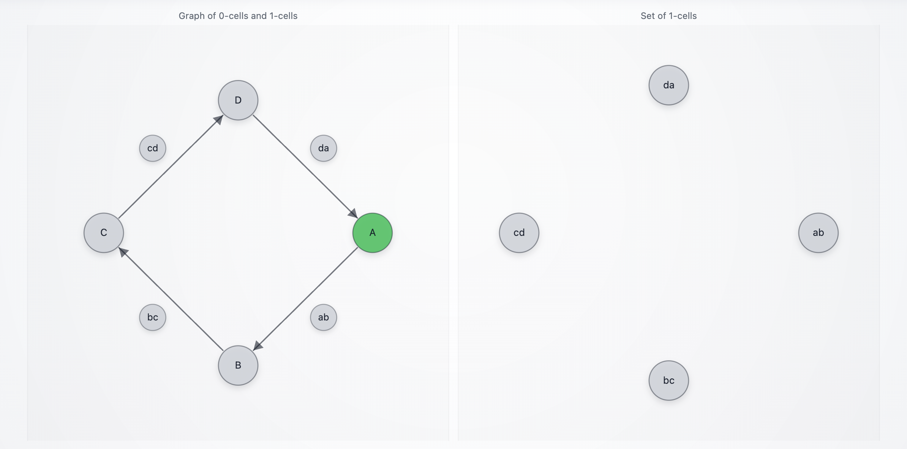
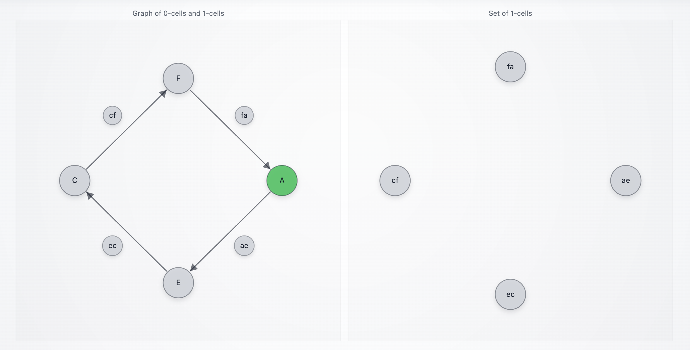

# `DNAMergeAgent_0`

A minimal Summoner client that **merges two independently runnable agents** into a single client, while preserving their original handler code and module-level state. The merged agent exposes multiple object/cell/arrow routes (two 4-cycles that share nodes) and renders tape occupancy in a browser window where **objects are nodes**, **arrows are directed edges**, and **arrow labels are circled bubbles attached to edges** (see [`summoner_web_viz.py`](./summoner_web_viz.py)). Occupied tokens in tape `states` are colored **green**; non-occupied tokens are **gray**.

### DNA

This example is also a concrete illustration of **agent DNA** (Summoner’s portable behavior snapshot).

In Summoner, "DNA" is **not biology** and it is not a magic opaque string. It is a **structured JSON document** that records the parts of a client that matter for behavior:

* which handlers exist (`upload_states`, `download_states`, `receive`, `send`, `hook`)
* which routes/triggers/actions they are attached to
* and the exact Python source text of each handler (so it can be recreated later)

You can think of it as a **handler registry export**. Each handler entry is like a "gene": it is one unit of behavior that can be re-registered onto a client.

#### What the "DNA string" looks like

<details><summary><b>(Click to expand)</b> <code>client.dna()</code> returns a JSON string. 
</summary>

When pretty-printed, it looks like a list of records:

```json
[
  { "type": "__context__", "imports": [...], "globals": {...}, "recipes": {...}, "missing": [...] },

  { 
    "type": "upload_states",
    "fn_name": "upload_states", 
    "source": "@..."
  },

  { 
    "type": "download_states", 
    "fn_name": "download_states", 
    "source": "@..." 
  },

  { 
    "type": "receive", 
    "route": "A --[ ab ]--> B", 
    "fn_name": "ab", 
    "source": "@..." 
  },

  { 
    "type": "send", 
    "route": "A --[ ab ]--> B", 
    "fn_name": "send_ab_move", 
    "on_actions": ["Move"], 
    "on_triggers": ["ok"], 
    "source": "@..." 
  },

  { 
    "type": "hook", 
    "direction": "IN", 
    "priority": [...], 
    "fn_name": "...", 
    "source": "@..." 
  }
]
```

So the "DNA" has a real structure:

* the optional `__context__` header is the minimal execution environment (imports + simple globals)
* each handler entry is one behavior unit: "this function is registered on this route with these conditions"

</details>

#### Why it matters

Because DNA is structured, Summoner can do two useful things with it:

* **Introspect it** (`client.dna(...)`) to build tools like visualization (the graph is derived from the `route` fields).
* **Replay it** (via `ClientMerger` or `ClientTranslation`) to reconstruct the same behavior on a new client instance, without re-importing the original agent module.

### Main components

The main components of this example are:

* **DNA** (`dna.json`) captures handlers and a lightweight execution context.
* **Merge** (`ClientMerger([...])`) replays handlers from multiple clients into one client.
* **Global rebinding** (`rebind_globals={"viz": viz}`) injects runtime objects (non-JSON, non-hashable) into the merged execution environment.
* **One-shot wiring** (`client.initiate_all()`) replays upload/download/receive/send/hooks into the merged client.

Relevant files:

* [`agent.py`](./agent.py) (merged client)
* [`agent_p1.py`](./agent_p1.py) (cycle `A → B → C → D → A`)
* [`agent_p2.py`](./agent_p2.py) (cycle `A → E → C → F → A`)
* [`dna.json`](./dna.json) (DNA dump produced by `client.dna(include_context=True)`)
* [`summoner_web_viz.py`](./summoner_web_viz.py) (graph reconstruction + browser UI)

## Behavior

<details>
<summary><b>(Click to expand)</b> The agent goes through these steps:</summary>
<br>

1. The two partial agents define their own routes and state handling:

   * [`agent_p1.py`](./agent_p1.py) registers arrow routes:

     ```
     A --[ ab ]--> B --[ bc ]--> C --[ cd ]--> D --[ da ]--> A
     ```

   * [`agent_p2.py`](./agent_p2.py) registers arrow routes:

     ```
     A --[ ae ]--> E --[ ec ]--> C --[ cf ]--> F --[ fa ]--> A
     ```

   Both agents also define `upload_states` / `download_states` so the tape lifecycle is visible in the visualizer.

2. The merged agent creates a **single** visualizer instance:

   ```python
   viz = WebGraphVisualizer(title=f"{AGENT_ID} Graph", port=8765)
   ```

3. The merged agent constructs the merger and **injects the visualizer into the merged runtime**:

   ```python
   client = ClientMerger([agent_1, agent_2], name=AGENT_ID, rebind_globals={"viz": viz})
   ```

   Here, `agent_1` is imported from `agent_p1` and `agent_2` is imported from `agent_p2`:

   ```python
   from agent_p1 import client as agent_1
   from agent_p2 import client as agent_2
   ```

   This is the critical point: each partial agent’s handlers were written against a module-global `viz`.
   When replaying those handlers into a merged client, the merger must ensure that `viz` resolves to
   the merged agent’s `viz` object.

4. The merged agent configures its flow and arrow syntax:

   ```python
   client_flow = client.flow().activate()
   client_flow.add_arrow_style(stem="-", brackets=("[", "]"), separator=",", tip=">")
   ```

5. The merged agent replays everything it imported/loaded:

   ```python
   client.initiate_all()
   ```

   This is a convenience method that replays:

   * `upload_states`
   * `download_states`
   * hooks (if any)
   * receivers
   * senders

   into the merged client instance.

6. At startup, the visualizer graph is built from the merged client DNA:

   ```python
   viz.set_graph_from_dna(json.loads(client.dna()), parse_route=client_flow.parse_route)
   ```

   The same script also dumps a richer DNA file (including context) into [`dna.json`](./dna.json):

   ```python
   json.dump(
       json.loads(client.dna(include_context=True)),
       (Path(__file__).resolve().parent / "dna.json").open("w", encoding="utf-8"),
       indent=2,
       ensure_ascii=False
   )
   ```

7. At runtime, incoming messages (strings or dicts) are interpreted as **commands** for arrow traversal:

   * `"ab"` triggers `A --[ab]--> B`
   * `"ae"` triggers `A --[ae]--> E`
   * etc.

   Each arrow receive returns either:

   * `Move(Trigger.ok)` if the command matches the arrow label
   * `Stay(Trigger.ok)` otherwise

8. Tape state is pushed into the visualizer from `upload_states` and `download_states`:

   * object tokens (`A`, `B`, `C`, `D`, `E`, `F`) appear as nodes
   * arrow-label tokens (`ab`, `bc`, ...) appear as bubbles on edges
   * whichever tokens are currently in tape `states` become **green**

</details>

## SDK Features Used

| Feature                            | Description                                                                         |
| ---------------------------------- | ----------------------------------------------------------------------------------- |
| `SummonerClient(name=...)`         | Creates each partial client (`agent_p1`, `agent_p2`)                                |
| `ClientMerger([...])`              | Merges multiple clients into a single client instance                               |
| `rebind_globals={...}`             | Injects runtime globals (example: `viz`) into replayed handlers                     |
| `client.flow().activate()`         | Enables flow parsing/dispatch                                                       |
| `flow.add_arrow_style(...)`        | Defines route syntax like `A --[ ab ]--> B`                                         |
| `@client.upload_states()`          | Supplies current state tokens to Summoner’s tape                                    |
| `@client.download_states()`        | Receives tape updates and syncs local state                                         |
| `@client.receive(route=...)`       | Defines handlers for arrow/object routes                                            |
| `@client.send(...)`                | Emits event traces back to the server                                               |
| `client.initiate_all()`            | Replays everything (upload/download/hooks/receivers/senders) into the merged client |
| `client.dna(include_context=True)` | Exports merged routes + execution context into a portable JSON form                 |

## How to Run

First, start the Summoner server:

```bash
python server.py
```

Then start the merged agent using its full path:

```bash
python agents/agent_DNAMergeAgent_0/agent.py
```

A browser window should open automatically at:

```
http://127.0.0.1:8765/
```

Optional CLI flag:

* `--config <path>`: Summoner **client** config path (defaults to `configs/client_config.json`).

Example:

```bash
python agents/agent_DNAMergeAgent_0/agent.py --config configs/client_config.json
```

## Simulation Scenarios

These scenarios run a minimal loop with a server, this merged agent, and an input-presenting agent.

```bash
# Terminal 1
python server.py

# Terminal 2
python agents/agent_DNAMergeAgent_0/agent.py

# Terminal 3
python agents/agent_InputAgent/agent.py
```

> [!NOTE]
> The visualizer builds the graph from **DNA** at startup:
>
> ```python
> viz.set_graph_from_dna(json.loads(client.dna()), parse_route=client_flow.parse_route)
> ```
>
> The picture in the browser is derived from the same structure you can export to [`dna.json`](./dna.json), and that DNA is itself the merged union of the two partial agents ([`agent_p1.py`](./agent_p1.py), [`agent_p2.py`](./agent_p2.py)).

<p align="center">
  
  <span style="vertical-align: middle;">+</span>
  
  <span style="vertical-align: middle;">&rarr;</span>
  
</p>

### Scenario A — Merged traversal, showing "both parts react" on the same input

The point of this scenario is not "one clean cycle." The point is that a **single input** can trigger **multiple handlers** coming from the two original agents, because the merged client contains the union of their routes.

<p align="center">
  
</p>

#### Step 1: `ab`

In Terminal 3:

```
> ab
[Received] {'from': 'A', 'to': 'B', 'via': 'ab', 'action': 'MOVE', 'agent': 'DNAMergeAgent_p1'}
[Received] {'node': 'A', 'action': 'TEST', 'agent': 'DNAMergeAgent_p1'}
[Received] {'from': 'A', 'to': 'E', 'via': 'ae', 'action': 'STAY', 'agent': 'DNAMergeAgent_p2'}
```

What this means:

* The merged agent is effectively running two sub-machines:

  * `agent_p1`: cycle `A → B → C → D → A`
  * `agent_p2`: cycle `A → E → C → F → A`
* Your single input `ab` is broadcast into the merged dispatch. In this run:

  * `agent_p1`’s arrow handler for `A --[ab]--> B` matched and emitted a **MOVE** trace (`A → B via ab`).
  * `agent_p1`’s object handler for `"A"` emitted a **TEST** trace (`node A`).
  * You also see `agent_p2` emit `A → E via ae` as **STAY**. This is the merged behavior: the second subgraph is present and can react in the same round. In terms of "links to the original parts," this third line is a direct fingerprint of code that lives in [`agent_p2.py`](./agent_p2.py).

In the browser:

<p align="center">
  
</p>

#### Step 2: `bc`

```
> bc
[Received] {'node': 'B', 'action': 'TEST', 'agent': 'DNAMergeAgent_p1'}
[Received] {'from': 'B', 'to': 'C', 'via': 'bc', 'action': 'MOVE', 'agent': 'DNAMergeAgent_p1'}
```

What this means:

* These are purely `agent_p1` fingerprints.
* `agent_p1` recognizes `bc` as the arrow label for `B --[bc]--> C`, so it moves to **C**, and also tests object **B**.

In the browser:

<p align="center">
  
</p>

#### Step 3: `cd`

```
> cd
[Received] {'from': 'C', 'to': 'D', 'via': 'cd', 'action': 'MOVE', 'agent': 'DNAMergeAgent_p1'}
[Received] {'node': 'C', 'action': 'TEST', 'agent': 'DNAMergeAgent_p1'}
[Received] {'from': 'C', 'to': 'F', 'via': 'cf', 'action': 'STAY', 'agent': 'DNAMergeAgent_p2'}
```

What this means:

* This step shows the "shared object" effect: **C is shared by both subgraphs**.
* You type `cd` (a cycle-1 command), and you see:

  * `agent_p1` moves `C → D via cd` and tests `C`.
  * `agent_p2` also emits `C → F via cf` as a stay trace (a direct fingerprint of code from [`agent_p2.py`](./agent_p2.py)).

In the browser:

<p align="center">
  
</p>

#### Step 4: `da`

```
> da
[Received] {'node': 'D', 'action': 'TEST', 'agent': 'DNAMergeAgent_p1'}
[Received] {'from': 'D', 'to': 'A', 'via': 'da', 'action': 'MOVE', 'agent': 'DNAMergeAgent_p1'}
```

What this means:

* Back to pure `agent_p1` fingerprints.
* You complete `D → A` via `da`, and also test object `D`.

In the browser:

<p align="center">
  
</p>

### Scenario B — Cycle 2 traversal with "cycle 1 stays" visible

This scenario emphasizes a different kind of linkage: when you run a command that belongs to one subgraph, the other subgraph can still "react" by producing **STAY** traces on its own outgoing arrows.

#### Step 5: `ae`

```
> ae
[Received] {'from': 'A', 'to': 'B', 'via': 'ab', 'action': 'STAY', 'agent': 'DNAMergeAgent_p1'}
[Received] {'node': 'A', 'action': 'TEST', 'agent': 'DNAMergeAgent_p1'}
[Received] {'from': 'A', 'to': 'E', 'via': 'ae', 'action': 'MOVE', 'agent': 'DNAMergeAgent_p2'}
```

What this means:

* This is the cleanest "merged vs parts" explanation:

  * `agent_p2` sees `ae` and moves `A → E` via `ae`.
  * `agent_p1` sees the same message but does not match its own arrow label `ab`, so it emits **STAY** on `A --[ab]--> B`.
  * `agent_p1` also runs the object handler for `"A"` (TEST trace).
* This exactly corresponds to having both arrow receive handlers present in the merged DNA (you can point to them in [`dna.json`](./dna.json): `A --[ ab ]--> B` and `A --[ ae ]--> E`).

In the browser:

<p align="center">
  
</p>

#### Step 6: `ec`

```
> ec
[Received] {'from': 'E', 'to': 'C', 'via': 'ec', 'action': 'MOVE', 'agent': 'DNAMergeAgent_p2'}
```

What this means:

* Pure `agent_p2` fingerprint: `E → C` via `ec`.

In the browser:

<p align="center">
  
</p>

#### Step 7: `cf`

```
> cf
[Received] {'from': 'C', 'to': 'D', 'via': 'cd', 'action': 'STAY', 'agent': 'DNAMergeAgent_p1'}
[Received] {'node': 'C', 'action': 'TEST', 'agent': 'DNAMergeAgent_p1'}
[Received] {'from': 'C', 'to': 'F', 'via': 'cf', 'action': 'MOVE', 'agent': 'DNAMergeAgent_p2'}
```

What this means:

* You typed a cycle-2 command (`cf`), so you see:

  * `agent_p2` does the real move `C → F` via `cf`.
* But because you are at **C**, `agent_p1` also has relevant structure around **C**:

  * it emits **STAY** on `C --[cd]--> D` (since you didn’t type `cd`)
  * it tests object `C`

In the browser:

<p align="center">
  
</p>

#### Step 8: `fa`

```
> fa
[Received] {'from': 'F', 'to': 'A', 'via': 'fa', 'action': 'MOVE', 'agent': 'DNAMergeAgent_p2'}
```

What this means:

* Pure `agent_p2` fingerprint: `F → A` via `fa`.

In the browser:

<p align="center">
  
</p>

### Scenario C — Non-matching input showing "fallback behavior" in both parts

#### Step 9: `hello`

```
> hello
[Received] {'node': 'A', 'action': 'TEST', 'agent': 'DNAMergeAgent_p1'}
[Received] {'from': 'A', 'to': 'B', 'via': 'ab', 'action': 'STAY', 'agent': 'DNAMergeAgent_p1'}
[Received] {'from': 'A', 'to': 'E', 'via': 'ae', 'action': 'STAY', 'agent': 'DNAMergeAgent_p2'}
```

What this means:

* `agent_p1` reacts to an irrelevant command by:

  * testing the current object `"A"`
  * emitting **STAY** on its `ab` arrow (because `hello != "ab"`)
* `agent_p2` reacts analogously by emitting **STAY** on its `ae` arrow (because `hello != "ae"`).

In the browser:

<p align="center">
  
</p>

> [!NOTE]
> When you want to connect any specific output line back to the composition mechanism, the easiest method is:
>
> 1. Identify the `agent` field (`DNAMergeAgent_p1` vs `DNAMergeAgent_p2`) in the log line.
> 2. Locate the corresponding `receive`/`send` entry in [`dna.json`](./dna.json) by route (for example `A --[ ab ]--> B`).
> 3. That entry points back to the original module (`"module": "agent_p1"` or `"module": "agent_p2"`), which is exactly what the merger replayed into the merged client.
